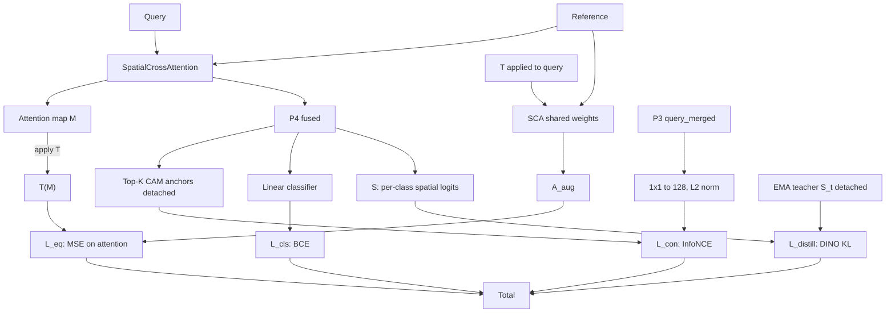

# Plant Disease Segmentation: Research Context & Recap

> **Purpose**: Comprehensive reference for future agents / collaborators.
> **Author**: Denis Bakin — **Date**: March–April 2026
> **Repo**: `git@github.com:dfbakin/plant-diseases-segmentation.git`
> **Current branch**: `wsss-weakclip-pipeline`

---

## 1. Project Goal

Develop a **weakly-supervised semantic segmentation (WSSS)** pipeline that segments plant disease regions on leaf images using only **image-level labels** (no pixel-level annotations for training).

The research transfers established WSSS methods (MCTformer, PSA, WeakCLIP) from the Pascal VOC domain to the plant disease domain, using the **PlantSeg** dataset (pixel-level GT available for evaluation) and the **PlantVillage** dataset (image-level labels only).

A secondary goal is fully-supervised segmentation on PlantSeg, which serves as an upper-bound baseline.

---

## 2. Datasets

| Dataset | Role | #Classes | Labels | Size |
|---------|------|----------|--------|------|
| **PlantSegV3** (`data/plantsegv3/`) | Primary: WSSS pipeline & evaluation | 116 (1 bg + 115 diseases) | Pixel-level GT masks + image-level | ~7,700 images |
| **PlantVillage** (`data/plant-village/`) | Supplemental: image-level training | 38 folders (healthy + diseased) | Folder-based image-level | ~54,000 images |
| **Pascal VOC 2012** (`data/VOC2012/`) | Baseline: WSSS method validation | 21 (1 bg + 20 objects) | Pixel-level GT + image-level | ~10,000 images |
| **Plant Pathology 2020** (`data/plant-pathology-2020-fgvc7/`) | Auxiliary (not actively used) | 4 | Image-level | ~3,600 images |

**PlantVillage-to-PlantSeg mapping**: 115 PlantSeg disease classes are mapped from PlantVillage folder names via `src/data/plantvillage_mappings.py`. Healthy and PlantVillage-only classes are excluded from WSSS training.

All datasets are DVC-tracked (`data/*.dvc`).

---

## 3. Repository Structure

```
plant-diseases-segmentation/
├── src/                          # Python source (8,685 LOC)
│   ├── conf/                     # Hydra config dataclasses
│   │   ├── config.py             # Master SegmentationConfig
│   │   ├── augmentation.py       # Augmentation presets (spatial, color, etc.)
│   │   ├── classifier.py         # Classifier training config
│   │   ├── data.py               # DataConfig
│   │   ├── model.py              # ModelConfig
│   │   ├── spdnet.py             # SPDNet Hydra config (SPDNetConfig, data/model/trainer)
│   │   ├── trainer.py            # TrainerConfig
│   │   └── wsss.py               # WSSS-specific config
│   ├── data/                     # Dataset & datamodule
│   │   ├── plantseg.py           # PlantSeg constants: 115 disease names, color palette
│   │   ├── plantvillage.py       # PlantVillage dataset loader
│   │   ├── plantvillage_mappings.py  # PV folder -> PlantSeg disease ID mapping
│   │   ├── voc_classification.py # MCTformer dataset classes (VOC, PlantSeg binary,
│   │   │                         #   PlantSeg multiclass, PlantSeg+PV combined)
│   │   ├── voc_wsss.py           # VOC WSSS dataset
│   │   ├── datamodule.py         # Lightning DataModule
│   │   └── transforms.py         # Augmentation pipelines (albumentations)
│   ├── models/                   # Segmentation model zoo
│   │   ├── segformer.py          # SegFormer (MiT-B3 encoder)
│   │   ├── segnext/              # SegNeXt (MSCAN encoder + hamburger head)
│   │   ├── classification.py     # Classification models (timm-based)
│   │   ├── factory.py            # Model factory (dispatch by name)
│   │   └── base.py               # Lightning base module (train/val/test loops)
│   ├── metrics/                  # Evaluation metrics
│   │   ├── segmentation.py       # mIoU, per-class IoU, boundary IoU, dice
│   │   └── cam_evaluation.py     # CAM quality metrics (pointing acc, peak coverage)
│   ├── wsss/                     # WSSS pipeline modules
│   │   ├── mctformer/            # MCTformer-V2 classifier + CAM generator
│   │   │   ├── model.py          # DeiT-Small backbone + class/patch token interaction
│   │   │   ├── cam_generator.py  # Multi-scale CAM extraction from attention
│   │   │   └── evaluation.py     # CAM threshold sweep evaluation
│   │   ├── spdnet/               # SPDNet Siamese plant disease network (April 2026)
│   │   │   ├── model.py          # SPDNet: ResNet50 backbone + FPN + MSE + ADPLCam
│   │   │   │                     #   + SpatialCrossAttention (fusion_mode="spatial")
│   │   │   ├── dataset.py        # SiamesePlantSegDataset: pair sampling, multi-ref
│   │   │   ├── lightning.py      # SPDNetModule: Lightning training/validation
│   │   │   ├── cam_generator.py  # ADPL-CAM + feat_chmean/chvar/.../cam_classifier seed
│   │   │   │                     #   generation (accepts external ref_pool + class resolver)
│   │   │   ├── class_resolver.py # Build same-class reference pool from train labels +
│   │   │   │                     #   resolve val image classes from filenames (REF BUG FIX)
│   │   │   ├── seg_probe.py      # SPDNet Localization Capacity Probe (April 2026):
│   │   │   │                     #   wrapper exposing 6 probe positions (P1..P6) +
│   │   │   │                     #   Conv1x1 seg head + cls head fall-through
│   │   │   ├── seg_dataset.py    # Binary seg dataset for probe training (image + binary mask)
│   │   │   ├── _atomic_io.py     # Atomic NumPy I/O for seed dumps (atomic_save_npy,
│   │   │   │                     #   is_corrupt_npy, prune_corrupt_seeds)
│   │   │   └── _split_index_cache.py # Cached val-split index (skips ~6 min startup per run)
│   │   ├── refinement/           # Mask refinement modules
│   │   │   ├── crf.py            # DenseCRF wrapper (la_crf + ha_crf)
│   │   │   ├── affinity_net.py   # PSA (Pixel Semantic Affinity) network
│   │   │   ├── random_walk.py    # Random Walk propagation
│   │   │   ├── aff_dataset.py    # Affinity label generation dataset
│   │   │   └── resnet38d.py      # ResNet-38d backbone for PSA
│   │   └── weakclip/             # WeakCLIP segmentation model
│   │       ├── model.py          # CLIP-based segmentation with text + visual branch
│   │       ├── clip_backbone.py  # Modified CLIP ViT-B/16 encoder
│   │       ├── clip_text_encoder.py  # Text encoder + context optimization
│   │       ├── context_decoder.py    # Cross-attention decoder
│   │       ├── decode_head.py    # FPN decode head with CRF loss
│   │       ├── fpn.py            # Feature Pyramid Network
│   │       ├── lightning.py      # Lightning training module
│   │       └── losses.py         # Seeding + boundary + identity losses
│   ├── training/                 # Shared training utilities
│   │   └── callbacks.py          # MLflow logging, checkpointing
│   ├── utils/
│   │   └── logging.py            # Rich logging setup
│   │
│   │  # ── Top-level scripts (Hydra entrypoints) ──
│   ├── train.py                  # Supervised segmentation training
│   ├── train_classifier.py       # timm classifier training (CAM benchmark)
│   ├── train_mctformer.py        # MCTformer-V2 training
│   ├── train_spdnet.py           # SPDNet Siamese training (Hydra entrypoint)
│   ├── train_spdnet_probe.py     # SPDNet seg-probe training (Lightning, BCE+Dice + cls)
│   ├── train_psa.py              # PSA affinity net training
│   ├── train_weakclip.py         # WeakCLIP training
│   ├── train_deeplab_wsss.py     # DeepLabV3+ on pseudo-masks (VOC)
│   ├── evaluate.py               # Supervised eval
│   ├── evaluate_masks.py         # Mask-vs-GT evaluation (mIoU, per-class IoU)
│   ├── generate_cams.py          # CAM generation from MCTformer checkpoint
│   ├── generate_spdnet_cams.py   # ADPL-CAM generation from SPDNet checkpoint
│   ├── apply_crf.py              # DenseCRF post-processing of CAMs
│   ├── run_random_walk.py        # Random Walk pseudo-mask generation
│   ├── export_labels.py          # Image-level label export (npy dict)
│   ├── generate_weakclip_masks.py     # WeakCLIP inference (standalone)
│   ├── refine_weakclip_masks.py       # CRF refinement of WeakCLIP masks
│   ├── generate_refine_weakclip_masks.py  # Fused generate + refine (streaming)
│   ├── refine_masks_sam.py        # SAM1-based mask refinement
│   ├── analyze_mask_quality.py    # Comprehensive mask diagnostics
│   └── visualize_mask_comparison.py   # Side-by-side mask visualization
│
├── scripts/                       # Shell scripts (orchestration)
│   ├── run_plantseg_binary_pipeline.sh  # Main WSSS pipeline (10 steps)
│   ├── run_plantseg_pipeline.sh         # Multiclass pipeline (earlier)
│   ├── run_sam_refinement_experiments.sh # SAM1 experiment matrix (6 configs)
│   ├── smoke_binary_pipeline.sh         # CI smoke test
│   ├── train_mctformer_plantseg.sh      # MCTformer training (standalone)
│   ├── train_mctformer_voc.sh           # MCTformer training (VOC)
│   ├── train_weakclip.sh               # WeakCLIP training
│   ├── generate_cams.sh                # CAM generation
│   ├── apply_crf.sh                    # CRF application
│   ├── run_random_walk.sh              # Random Walk
│   ├── evaluate_masks.sh               # Mask evaluation
│   ├── export_labels.sh                # Label export
│   ├── train_psa.sh                    # PSA training
│   ├── generate_weakclip_masks.sh      # WeakCLIP inference
│   ├── refine_weakclip_masks.sh        # WeakCLIP CRF refinement
│   ├── evaluate_weakclip_masks.sh      # WeakCLIP evaluation
│   ├── visualize_pipeline_steps.sh     # Pipeline stage visualization
│   ├── train_deeplab_wsss.sh           # DeepLab WSSS training (VOC)
│   ├── compute_dataset_stats.py        # Dataset statistics
│   ├── visualize_predictions.py        # Prediction overlay visualization
│   ├── visualize_pseudo_masks.py       # Pseudo-mask visualization
│   ├── augment_ablation.sh             # Augmentation ablation script
│   ├── benchmark_models.sh             # Architecture benchmark script
│   ├── classifier_models_exp.sh        # Classifier-CAM benchmark script
│   ├── run_spdnet_experiments.sh       # SPDNet 6-run experiment sweep (N=1,3,5,8 × aug)
│   ├── run_spdnet_spatial_experiments.sh # Spatial cross-attention experiments (smoke+PS+PS_PV)
│   ├── visualize_spdnet_activations.py # SPDNet 8-panel activation grid visualizations
│   ├── visualize_spatial_attention.py  # Cross-attention map viz (head-avg, query-vs-ref grids)
│   ├── eval_spdnet_checkpoints.py      # Automated SPDNet checkpoint eval (CAM+sweep+viz)
│   ├── eval_spatial_runs.py            # Earlier eval driver (deprecated; precursor to _full)
│   ├── eval_spatial_full.py            # Full eval: feat_chmean/chvar + thr sweep +
│   │                                   #   per-distribution CRF tuning + viz (token+spatial)
│   ├── eval_spatial_overnight.sh       # Overnight wrapper for eval_spatial_full.py
│   ├── eval_cam_classifier.py          # cam_classifier (classifier projected on FUSED feats)
│   │                                   #   eval — only mode that uses spatial fusion output
│   ├── eval_cam_classifier_overnight.sh # Overnight wrapper for eval_cam_classifier.py
│   ├── smoke_test_ref_fix.py           # Smoke test: same-class refs picked correctly
│   ├── smoke_test_eval_pipeline.py     # Smoke test: feat_chmean/chvar pipeline end-to-end
│   ├── smoke_test_cam_classifier.py    # Smoke test: cam_classifier sensitive to fusion
│   ├── smoke_test_seg_probe.py         # Smoke test: 1-step probe forward/backward
│   ├── eval_seg_probes.py              # Per-probe evaluation: seed dump → threshold sweep
│   │                                   #   → CRF param sweep → full-val CRF eval (parallel)
│   ├── seg_probe_decisions.py          # Phase 1/2 selection logic (composite score S,
│   │                                   #   force-include, top-K) + chosen.json writer
│   ├── prelaunch_seg_probes.sh         # Pre-flight checklist (76 unit tests + smoke)
│   ├── run_seg_probes_phase1.sh        # Phase 1 orchestrator: frozen probes screening
│   ├── run_seg_probes_phase2.sh        # Phase 2 orchestrator: unfrozen fine-tune of selected
│   ├── run_seg_probes_phase3.sh        # Phase 3 orchestrator: from-scratch ceiling
│   ├── run_seg_probes_overnight.sh     # Master orchestrator (fail-fast chaining + heartbeats)
│   └── overnight_eval_and_train.sh     # SPDNet overnight eval + training pipeline
│
├── tests/
│   ├── test_binary_pipeline.py    # Binary label/GT/CAM tests + TestThresholdSweepParallel
│   ├── test_mctformer_model.py    # MCTformer forward-pass tests
│   ├── test_sam_refinement.py     # SAM refinement unit tests
│   ├── test_spdnet.py            # SPDNet: forward, backward, grad flow, multi-ref,
│   │                              #   reference sensitivity, CAM shapes (46 tests)
│   ├── test_seg_probe.py         # SPDNet seg-probe: probe heads, atomic I/O,
│   │                              #   parallel CRF eval, threshold sweep (24 tests)
│   └── test_overnight_orchestrator.py  # Bash exit-code propagation + fail-fast chaining
│
├── reports/
│   ├── src/
│   │   ├── 01_datasets_ideas.qmd          # Dataset overview & ideas
│   │   ├── 02_architecture_benchmark.qmd  # SegFormer vs SegNeXt vs UNet etc.
│   │   ├── 03_classifier_cam_benchmark.qmd # Classifier-CAM quality report
│   │   ├── 05_mask_quality_analysis.qmd   # Binary vs MC115 pipeline comparison
│   │   └── 06_spdnet_spatial_findings.qmd # SPDNet spatial cross-attention findings
│   │                                       #   (architecture, seed extraction A/B/C, results)
│   ├── 06_spdnet_spatial_findings.pdf     # Rendered Beamer slides
│   ├── resources/                         # Generated figures & statistics (DVC)
│   └── _quarto.yml                        # Quarto project config
│
├── outputs/                       # Experiment outputs (DVC-tracked)
│   ├── plantseg_binary/           # Binary WSSS pipeline outputs
│   │   ├── labels/                # Image-level labels (.npy)
│   │   ├── gt_binary_train/       # Binary GT masks (train)
│   │   ├── gt_binary_val/         # Binary GT masks (val)
│   │   ├── cams/                  # CAMs + CRF outputs
│   │   ├── psa/                   # PSA checkpoint
│   │   ├── pseudo_masks_t_0.64/   # PSA+RW pseudo-masks (threshold 0.64)
│   │   ├── pseudo_masks_t_0.73/   # PSA+RW pseudo-masks (threshold 0.73)
│   │   └── weakclip_masks_t_0.64/ # WeakCLIP refined masks
│   ├── plantseg_binary_mc115/     # MC115 pipeline outputs (multiclass MCTformer)
│   │   ├── labels/                # 115-class + binary labels
│   │   ├── cams/                  # Aggregated binary CAMs (from 115 classes)
│   │   ├── psa/                   # PSA checkpoint
│   │   ├── pseudo_masks_t_0.73/   # PSA+RW pseudo-masks
│   │   └── weakclip_masks_t_0.73/ # WeakCLIP refined masks
│   ├── plantseg_wsss_26_cam_multiclass/ # Earlier multiclass CAMs (GT-masked, deprecated)
│   ├── spdnet_plantseg/           # SPDNet experiment outputs (DVC: spdnet_plantseg.dvc, ~34 GB)
│   │   ├── spdnet_fix_n1_heavy/   #   Token N=1 refs, heavy aug, 80 ep (best token CAMs)
│   │   │   └── checkpoints/       #     best.ckpt (ep69, mAP=0.859), last.ckpt
│   │   ├── spdnet_fix_n3_heavy/   #   N=3 refs, heavy aug, 57 ep (crashed, best classifier)
│   │   │   └── checkpoints/       #     best.ckpt (ep53, mAP=0.898), last.ckpt
│   │   ├── spdnet_fix_n3_light/   #   N=3 refs, light aug, 80 ep
│   │   │   └── checkpoints/       #     best.ckpt (ep74, mAP=0.894)
│   │   ├── spdnet_fix_n3_minimal/ #   N=3 refs, minimal aug, 80 ep (severe overfit)
│   │   │   └── checkpoints/       #     best.ckpt (ep79, mAP=0.821)
│   │   ├── spdnet_spatial_n1_ps/  #   Spatial cross-attn, PlantSeg-only, 80 ep (Apr 2026)
│   │   │   └── checkpoints/       #     best ep76 mAP=0.797, gate=0.333; last.ckpt
│   │   ├── spdnet_spatial_n1_ps_pv/ # Spatial cross-attn, PlantSeg+PV, 80 ep (Apr 2026)
│   │   │   └── checkpoints/       #     best ep76 mAP=0.888, gate=0.499; last.ckpt
│   │   ├── cams/                  #   Generated ADPL-CAMs (token, n1/n3 × max/top_energy)
│   │   ├── feature_seed_eval/     #   Initial 200-img feat_chmean+CRF sweep (Apr 2026)
│   │   ├── spdnet_token_n1_heavy_eval/      # Full-val (1247) eval, corrected refs:
│   │   │   ├── seeds_feat_chmean_corrected_refs/   #   1247 npy seed maps
│   │   │   ├── seeds_feat_chvar_corrected_refs/    #   1247 npy seed maps
│   │   │   ├── seeds_cam_classifier_max_corrected_refs/ # 1247 npy CAMs (most expensive!)
│   │   │   ├── crf_sweep_*.json                     #   CRF param sweep results
│   │   │   └── evaluation_results*.json             #   Final IoU metrics
│   │   ├── spdnet_spatial_n1_ps_eval/        # Same structure for spatial PS-only
│   │   ├── spdnet_spatial_n1_ps_pv_eval/     # Same structure for spatial PS+PV
│   │   ├── eval_summary_corrected_refs.json  # Aggregate summary (feat_chmean/chvar)
│   │   ├── eval_summary_cam_classifier.json  # Aggregate summary (cam_classifier)
│   │   ├── spatial_eval_summary.json         # Earlier (buggy refs) summary, kept for record
│   │   ├── seg_probe_phase1/                 # Probe Phase 1 (frozen, April 2026)
│   │   │   ├── {ckpt}/{P1..P6}/              #   per-position eval.json + head.pt + viz/
│   │   │   ├── selected.json                 #   positions advancing to Phase 2
│   │   │   └── SUMMARY.md                    #   human-readable rollup
│   │   ├── seg_probe_phase2/                 # Probe Phase 2 (unfrozen fine-tune)
│   │   │   ├── {ckpt}/{pos}/seg{λ}_cls{λ}/   #   per-config eval.json + head.pt +
│   │   │   │                                 #   spdnet_finetuned.pt + viz/
│   │   │   ├── chosen.json                   #   single best (ckpt, pos, λ) for Phase 3
│   │   │   └── SUMMARY.md
│   │   └── seg_probe_phase3/                 # Probe Phase 3 (from-scratch ceiling)
│   │       ├── from_scratch_spatial/         #   single config: spatial / P3_query_merged
│   │       │   └── P3_query_merged/eval.json #   full-val (1247) IoUs, CRF params, top-5 sweeps
│   │       ├── scratch_init.pt               #   random-init checkpoint (Phase-3 starting point)
│   │       └── SUMMARY.md
│   ├── visualizations/            # Activation grid PNGs (DVC: visualizations.dvc, ~1.5 GB)
│   │   ├── val_cam_exploration/   #   MCTformer MC115 baseline (25 images)
│   │   ├── spdnet_val_cam_exploration/ # SPDNet initial run (broken model)
│   │   ├── spdnet_n1_best/        #   SPDNet N=1 best ckpt (25 images, 8-panel grids)
│   │   ├── spdnet_n3_best/        #   SPDNet N=3 best ckpt (25 images, 8-panel grids)
│   │   ├── spdnet_n3_last/        #   SPDNet N=3 last ckpt (25 images, 8-panel grids)
│   │   ├── feat_chmean_crf_comparison/ # First feat_chmean+CRF visualization batch
│   │   ├── spatial_attention_n1_ps{,_pv,_FIXED,_pv_FIXED}/ # Cross-attn maps (4 dirs)
│   │   ├── spdnet_token_n1_heavy_feat_chmean_crf_corrected_refs/  # Final viz batches:
│   │   ├── spdnet_token_n1_heavy_cam_classifier_max_crf_corrected_refs/
│   │   ├── spdnet_spatial_n1_ps_feat_chvar_crf_corrected_refs/
│   │   ├── spdnet_spatial_n1_ps_cam_classifier_max_crf_corrected_refs/
│   │   ├── spdnet_spatial_n1_ps_pv_feat_chvar_crf_corrected_refs/
│   │   └── spdnet_spatial_n1_ps_pv_cam_classifier_max_crf_corrected_refs/
│   ├── weakclip/                  # WeakCLIP checkpoints
│   └── weakclip_voc_pipeline/     # VOC WeakCLIP pipeline outputs
│
├── pretrained/                    # Pretrained weights (DVC)
│   ├── ViT-B-16.pt               # CLIP ViT-B/16 (for WeakCLIP)
│   └── res38_cls.pth             # ResNet-38d (for PSA backbone)
│
├── mlruns/                        # MLflow experiment tracking (DVC)
├── data/                          # Datasets (DVC-tracked)
├── pyproject.toml                 # Project metadata & dependencies
├── .cursor/rules/                 # Cursor agent rules (git/CI, behavior)
└── .dvc/                          # DVC configuration
```

---

## 4. WSSS Pipeline Architecture

The core WSSS pipeline (`scripts/run_plantseg_binary_pipeline.sh`) has 11 steps:

```
Image-Level Labels  ──>  MCTformer Classifier  ──>  CAMs
                              │
                              v
                     CRF Post-Processing (la_crf + ha_crf)
                              │
                              v
                     PSA Affinity Network Training
                              │
                              v
                     Random Walk Refinement ──> Pseudo-Masks
                              │
                              v
                     WeakCLIP Training (on pseudo-masks)
                              │
                              v
                     WeakCLIP Inference + CRF ──> Final Masks
```

### Pipeline Steps (Detail)

| Step | Script Entry | Module | Description |
|------|-------------|--------|-------------|
| 0a | `src/export_labels.py` | - | Export image-level labels (npy dict) for MCTformer training |
| 0b | `src/export_labels.py` | - | Export PlantSeg-only labels for CAM generation |
| 0c | inline Python | - | Convert multiclass GT masks to binary (bg=0, disease=1) |
| 1 | `src/train_mctformer.py` | `src/wsss/mctformer/model.py` | Train MCTformer-V2 image classifier |
| 2 | `src/generate_cams.py` | `src/wsss/mctformer/cam_generator.py` | Generate multi-scale CAMs from classifier attention |
| 3 | `src/apply_crf.py` | `src/wsss/refinement/crf.py` | Apply DenseCRF (low-alpha + high-alpha variants) |
| 4 | `src/evaluate_masks.py` | `src/metrics/segmentation.py` | Evaluate CRF masks vs GT |
| 5 | `src/train_psa.py` | `src/wsss/refinement/affinity_net.py` | Train Pixel Semantic Affinity network |
| 6 | `src/run_random_walk.py` | `src/wsss/refinement/random_walk.py` | Random Walk propagation -> pseudo-masks |
| 7 | `src/evaluate_masks.py` | - | Evaluate pseudo-masks vs GT |
| 8 | `src/train_weakclip.py` | `src/wsss/weakclip/lightning.py` | Train WeakCLIP on pseudo-masks |
| 9 | `src/generate_refine_weakclip_masks.py` | `src/wsss/weakclip/model.py` | Generate + CRF-refine WeakCLIP masks (streaming) |
| 10 | `src/evaluate_masks.py` | - | Evaluate final WeakCLIP masks vs GT |

### Pipeline Variants

The pipeline supports two MCTformer modes via environment variables:

**Binary mode** (default):
```bash
./scripts/run_plantseg_binary_pipeline.sh
```
- `MCTFORMER_DATASET=plantseg_binary` (1 fg class: "disease")
- MCTformer classifies "has disease" vs "no disease"

**MC115 mode** (multiclass-to-binary):
```bash
MCTFORMER_DATASET=plantseg_with_pv \
MCTFORMER_EXPERIMENT=mctformer_plantseg_mc115_pv \
BINARY_AGGREGATE=max \
OUT_BASE=outputs/plantseg_binary_mc115 \
BINARY_BASE=outputs/plantseg_binary \
WEAKCLIP_EXPERIMENT=weakclip-plantseg-binary-mc115-t_0.73 \
scripts/run_plantseg_binary_pipeline.sh
```
- `MCTFORMER_DATASET=plantseg_with_pv` (115 fg classes: specific diseases)
- MCTformer classifies each disease individually -> 115-channel CAMs
- `BINARY_AGGREGATE=max` takes `np.max` across all 115 class channels -> single binary CAM
- Downstream pipeline (CRF, PSA, RW, WeakCLIP) operates in 2-class mode
- `BINARY_BASE=outputs/plantseg_binary` reuses GT masks and binary labels from binary run

**Key environment variables**:
- `SKIP_STEPS="0,1,2"` — skip specific steps
- `MCTFORMER_CKPT=path/to/last.ckpt` — reuse existing checkpoint
- `WEAKCLIP_QUALITY=fast|full` — fast: single-scale; full: 5 scales + flip
- `OUT_BASE` — output directory
- `BINARY_BASE` — directory for shared binary resources (GT, labels)

---

## 5. Experiments Conducted

### 5.1 Fully-Supervised Segmentation (Upper Bound)

#### 5.1.1 Architecture Benchmark
**Experiment**: `plantseg_architecture_benchmark` (MLflow ID: `358457224855191874`)
**Goal**: Compare segmentation architectures on PlantSeg (binary, 2-class).

| Architecture | mIoU | Disease IoU | BG IoU | Notes |
|-------------|------|-------------|--------|-------|
| DeepLabV3+ (ResNet-50) | 78.9% | 64.6% | 92.9% | Baseline |
| U-Net (ResNet-34) | 78.7% | 64.6% | 92.8% | Dice loss |
| SegFormer (MiT-B3) | 80.9% | 68.2% | 93.6% | Best among small models |
| **SegNeXt (MSCAN-T)** | **82.1%** | **70.1%** | **94.0%** | **Best overall** |

**Config**: image_size=384, lr=0.0002-0.0003, 30 epochs, AdamW, cross-entropy loss.

#### 5.1.2 Augmentation Ablation
**Experiment**: `plantseg_augmentation_ablation_fp32_final` (MLflow ID: `591324269892947917`)
**Goal**: Systematic comparison of augmentation strategies (13 runs).

Both SegFormer and SegNeXt tested with augmentation presets:
- `baseline` (no augmentation)
- `spatial_light` / `spatial_heavy` (flips, rotations, crops)
- `color_natural` / `artificial_color` (brightness, contrast, hue)
- `spatial_color_light` (combined)
- `noise_blur` (Gaussian noise, blur)
- `full` (everything)

**Key findings**:
- `spatial_color_light` achieved best SegFormer mIoU (81.0%) with good generalization
- Heavy augmentation caused overfitting gap reduction but did not always improve test mIoU
- SegNeXt baseline was strong (80.2%) even without augmentation, suggesting architectural robustness
- Best overall: **SegNeXt + full augmentation** = 81.5% test mIoU

#### 5.1.3 Multiclass Segmentation
**Experiment**: `plantseg_multiclass_benchmark` (MLflow ID: `319358957156901464`)
**Goal**: 116-class segmentation on PlantSeg.

| Model | mIoU | Dice | Notes |
|-------|------|------|-------|
| SegNeXt (spatial_color_light) | 44.2% | 57.8% | Difficult task with 116 classes |

The dramatic drop from binary (82.1%) to multiclass (44.2%) motivated the WSSS binary-framing approach.

### 5.2 Classifier-CAM Quality Benchmark

#### 5.2.1 Traditional Classifiers (GradCAM)
**Experiment**: `dfbakin_classifier_cam_benchmark` (MLflow ID: `675534359741067840`)
**Goal**: Evaluate how well standard classifiers localize diseases via GradCAM.

| Classifier | Accuracy | CAM IoU | CAM F1 | Pointing Acc |
|-----------|----------|---------|--------|--------------|
| ResNet-18 | 68.5% | 20.5% | 30.8% | 46.7% |
| ResNet-50 | 72.7% | 15.2% | 24.2% | 45.9% |
| EfficientNet-B0 | 74.2% | 20.6% | 30.8% | 45.8% |

**Config**: 120 classes (PlantSeg), GradCAM, threshold=0.5, 30 epochs.
**Conclusion**: Standard GradCAM produces poor localization. MCTformer's attention-based approach is significantly better.

### 5.3 WSSS Pipeline (VOC Validation)

The pipeline was first validated on Pascal VOC to ensure correctness before applying to PlantSeg.

#### 5.3.1 MCTformer on VOC
**Experiment**: `mctformer_voc_v2` (MLflow ID: `229846199444711023`)
- 21-class MCTformer-V2 on VOC2012
- Used to generate CAMs -> CRF -> PSA -> RW -> pseudo-masks

#### 5.3.2 WeakCLIP on VOC
**Experiment**: `weakclip-voc` (MLflow ID: `301684071360501862`)
- Best val mIoU: **64.0%** (4 runs with different learning rates)
- Validated the full pipeline end-to-end on a standard benchmark

#### 5.3.3 DeepLab WSSS on VOC
**Experiment**: `deeplab_wsss_voc` (MLflow ID: `826207548213372587`)
- DeepLabV3+ (ResNet-101) trained on VOC pseudo-masks
- val mIoU: 51.4% (reasonable for WSSS)

### 5.4 WSSS Pipeline on PlantSeg

#### 5.4.1 Binary Pipeline (Baseline)
**Output directory**: `outputs/plantseg_binary/`
**MLflow experiments**:
- `mctformer_plantseg_binary` (ID: `592872031317447660`) — binary MCTformer (1 fg class)
  - val mAP: 99.99% (trivial binary task)
- `weakclip-plantseg-binary` (ID: `206029539984518366`) — WeakCLIP on binary pseudo-masks
  - val mIoU: 45.0% (threshold 0.64)
- `weakclip-plantseg-binary-t_0.64` (ID: `444840611733456632`) — threshold 0.64 variant
  - val mIoU: 47.1%
- `weakclip-plantseg-binary-t_0.73` (ID: `113502554219633766`) — threshold 0.73 variant
  - val mIoU: 46.5%

**Pipeline evaluation results (2-class, binary GT)**:

| Stage | mIoU | BG IoU | Disease IoU |
|-------|------|--------|-------------|
| LA-CRF | 45.01% | 77.37% | 12.64% |
| HA-CRF | 45.44% | 76.52% | 14.36% |
| PSA+RW | 43.01% | 65.80% | 20.21% |
| WeakCLIP | 46.22% | 66.93% | 25.52% |

**Key observation**: Binary MCTformer achieves near-perfect classification accuracy (mAP ~100%), suggesting it learns a trivial signal. The resulting CAMs are diffuse and poorly localized, leading to low disease IoU throughout the pipeline.

#### 5.4.2 Multiclass MCTformer on PlantSeg (Historical)
**Experiment**: `mctformer_plantseg` (MLflow ID: `771976166740944756`)
- 115-class MCTformer on PlantSeg only (no PlantVillage augmentation)
- val mAP: 76.9% (much harder task forces better localization)
- Generated CAMs were stored in `outputs/plantseg_wsss_26_cam_multiclass/`

**Critical finding**: These historical CAMs were **GT-masked** during generation — `src/generate_cams.py` line 114 applied `cls_att * target.view(...)`, zeroing out all non-GT class activations. This made the "multiclass" CAMs effectively single-class, discarding cross-disease activation signals. This discovery motivated full regeneration.

#### 5.4.3 MC115 Pipeline (Multiclass-to-Binary)
**Output directory**: `outputs/plantseg_binary_mc115/`
**Hypothesis**: Training MCTformer on 115 specific diseases forces it to learn more precisely localized activations (distinguishing e.g., "apple scab" from "apple rust" requires attending to specific lesion patterns). These more focused CAMs, when max-aggregated into a single disease channel, produce a better binary signal than the diffuse binary CAMs.

**Implementation changes**:
1. `src/data/voc_classification.py`: Added `PlantSegMCTformerDataset` support for `plantseg_with_pv` mode combining PlantSeg + PlantVillage training data with 115-class labels
2. `src/export_labels.py`: Added `plantseg_wsss_with_pv` label export mode (115 classes, PlantSeg + PV)
3. `src/generate_cams.py`: Added `binary_aggregate` parameter; when set to `"max"`, removes GT-masking and takes `np.max` across all 115 class CAMs -> single binary CAM
4. `scripts/run_plantseg_binary_pipeline.sh`: Made fully configurable for both binary and MC115 modes

**MC115 pipeline results (2-class, binary GT)**:

| Stage | mIoU | BG IoU | Disease IoU |
|-------|------|--------|-------------|
| LA-CRF | 51.94% | 76.10% | 27.77% |
| HA-CRF | 53.49% | 75.81% | 31.16% |
| PSA+RW | 42.29% | 54.17% | 30.42% |
| WeakCLIP | 46.36% | 59.40% | 33.31% |

**MC115 vs Binary comparison**:

| Stage | Binary Disease IoU | MC115 Disease IoU | Relative Improvement |
|-------|-------------------|-------------------|---------------------|
| LA-CRF | 12.64% | 27.77% | +120% |
| HA-CRF | 14.36% | 31.16% | +117% |
| PSA+RW | 20.21% | 30.42% | +50% |
| WeakCLIP | 25.52% | 33.31% | +31% |

**Hypothesis confirmed**: MC115 dramatically improves disease detection at every stage. The key trade-off is reduced BG IoU (more false positives), indicating increased recall at the cost of precision. Overall mIoU is comparable or better.

### 5.5 CAM Threshold Sweep: mIoU vs Disease IoU

**Module**: `src/wsss/mctformer/evaluation.py`

The original `evaluate_cam_threshold_sweep` optimized for overall mIoU, which is dominated by the background class in binary segmentation. Two bugs were fixed:
1. **Wrong optimization target**: mIoU averages BG and disease IoU; for binary tasks, BG dominates pixels, biasing the threshold toward high values that sacrifice disease recall.
2. **Premature early stopping**: The original code broke on the first mIoU decrease, missing the global optimum.

**Fix**: Added `optimize_metric` parameter (`"mIoU"`, `"disease_iou"`, or any class name), removed the early `break`, added optional `patience` parameter, and returned full per-threshold curves.

**Trial run on MC115 CAMs** (500-sample subset):

| Optimize for | Threshold | BG IoU | Disease IoU | mIoU |
|---|---|---|---|---|
| mIoU (legacy) | 0.73 | 76.26% | 27.40% | 51.83% |
| Disease IoU | 0.59 | 68.10% | 29.98% | 49.04% |

Disease-optimized threshold recovers +2.58pp disease IoU (+9.4% relative) by accepting more disease pixels. The mIoU metric is a poor proxy for disease detection in binary segmentation.

### 5.6 SAM1 Mask Refinement

**Script**: `scripts/run_sam_refinement_experiments.sh` (v3, MC115 pipeline)
**Module**: `src/refine_masks_sam.py`
**Model**: `facebook/sam-vit-huge`

**Motivation**: Post-process WSSS pseudo-masks with SAM1's boundary-precise segmentation.

#### 5.6.1 Original Experiments (v1, Binary Pipeline)

**Experiment matrix (6 configurations, A-F)** using binary pipeline outputs:

| ID | Prompt Mode | Mask Selection | Input Mask |
|----|-------------|----------------|------------|
| A | mask_only | best_iou | PSA+RW |
| B | mask_only | smallest_area | PSA+RW |
| C | box_only | best_iou | PSA+RW |
| D | box_only | smallest_area | PSA+RW |
| E | mask_and_points | best_iou | PSA+RW |
| F | box_and_points | smallest_area | PSA+RW |

**Results**: Massive oversegmentation (~2% disease IoU). SAM1 tends to segment the entire leaf when given diffuse prompts.

#### 5.6.2 MC115 Experiments (v3)

New experiment matrix using MC115 pipeline outputs, with additional prompt modes:

**Prompt modes**:
- `mask_only`: feed pseudomask as dense logit prompt (binary ±6.0 logits)
- `soft_mask`: continuous probability map → graded logits (bilinear resize, configurable `logit_scale`)
- `soft_mask_and_points`: soft mask + CAM-derived positive/negative points
- `box_only`: compute bounding box from mask; SAM segments freely inside
- `box_and_points`: bounding box + CAM-derived anchor points

**New `prob_to_logits` function**: Converts continuous [0,1] probability maps to graded SAM logits (vs binary mask_to_logits which saturates at ±6.0). Uses bilinear interpolation and optional `confidence_threshold` gating.

**Mask selection**: All v3 experiments use `smallest_area` to counter oversegmentation.

| ID | Input | Prompt Mode | Disease IoU | BG IoU | mIoU |
|----|-------|-------------|-------------|--------|------|
| G | MC115 WeakCLIP | mask_only | **0.73%** | 79.56% | 40.14% |
| H | MC115 CAM (soft, s=3.0) | soft_mask | **0.51%** | 79.86% | 40.18% |
| I | MC115 CAM (gated p>0.3) | soft_mask | **0.51%** | 79.91% | 40.21% |
| J | WeakCLIP bbox + CAM pts | box_and_points | **33.96%** | 74.32% | 54.14% |
| K | CAM soft + CAM pts | soft_mask_and_points | **17.39%** | 75.65% | 46.52% |
| J_tuned | WeakCLIP bbox + 20 pts (q=0.99) | box_and_points | **23.79%** | 77.75% | 50.77% |

**Critical finding — prompt type determines success or failure:**

- **Dense mask prompts (G, H, I) catastrophically fail** (<1% disease IoU). SAM interprets any dense mask as "the region of interest" and snaps to the nearest object boundary — the leaf edge. Disease information is destroyed.
- **Geometric prompts (J) work**: bbox from WeakCLIP constrains SAM's spatial attention; CAM-derived positive/negative points give explicit "this IS / is NOT disease" anchors. SAM uses its image features to find texture-coherent regions within these constraints.
- **Soft mask + points (K)**: The dense soft mask signal partially overrides the point anchors, degrading performance compared to pure geometric prompts.
- **J vs WeakCLIP input**: SAM-J achieves +0.65pp disease IoU and **+14.92pp BG IoU** over its WeakCLIP input, with +7.78pp overall mIoU. SAM acts as a precision filter — it doesn't find new disease, but removes false positive background pixels.

#### 5.6.3 Point Sampling Quality Analysis

**Script**: `scripts/analyze_point_sampling_quality.py`

Diagnostic analysis of how well CAM-derived points align with ground truth (300-image subsample).

**Positive point precision vs quantile** (num_pos=5, neg_q=0.05):

| Pos quantile | Pos precision | Avg CAM value |
|---|---|---|
| 0.70 | 34.7% | 0.668 |
| 0.80 | 40.5% | 0.727 |
| 0.90 | 45.5% | 0.813 |
| 0.95 | 48.9% | 0.872 |
| 0.99 | 53.3% | 0.948 |

**Negative point precision**: >94% at all settings. Background CAM signal is clean.

**Key findings**:
- Even at the 99th percentile, only ~53% of positive points land on GT disease. The CAM's high-activation peaks often fall on healthy tissue.
- Point count does not affect precision (farthest-point sampling maintains spatial diversity). The ceiling is set by CAM localization quality.
- Increasing from q=0.90 (J's setting, 45.5% precision) to q=0.99 (53.3%) is beneficial but with diminishing returns.

#### 5.6.4 Point Count Tuning (J_tuned)

Experiment J was re-run with q=0.99 and 20 positive / 15 negative points:
- Disease IoU: 23.79% (vs 33.96% for original J with q=0.90, 5/5 points)
- BG IoU: 77.75% (vs 74.32%)

**Counterintuitive result**: More aggressive point settings (higher quantile, more points) produced *worse* disease IoU but *better* BG IoU. This suggests that q=0.99 positive points, while more precise individually, are too concentrated in small high-activation peaks, causing SAM to produce very tight segments that miss diffuse disease regions. The original q=0.90 with 5 points provides a better spatial coverage vs precision trade-off.

**SAM1 text prompts**: Investigation of the SAM1 paper confirmed that while the architecture supports text prompts, the publicly released checkpoints only accept geometric prompts (points, boxes, masks). Text-prompted segmentation would require specialized training (e.g., GroundedSAM). Deferred to future work.

### 5.7 SPDNet Siamese Network Experiments (April 2026)

**Motivation**: MCTformer CAMs (both binary and MC115) were visualized on 25 validation images with multiple activation types (binary-agg CAM, per-class top-1/top-2 attention, GradCAM, CLS/patch token attention). **Conclusion**: MCTformer does not discriminate distinctive disease features — hot spots occasionally coincide with disease spots but this is not reliably confirmed across samples. This motivated implementing the Siamese approach from the paper (see Section 13 for full details).

**MLflow experiment**: `spdnet_plantseg` (ID: `285465004951754042`)
**Output directory**: `outputs/spdnet_plantseg/` (DVC-tracked: `outputs/spdnet_plantseg.dvc`)

#### 5.7.1 SPDNet Architecture (Implemented)

Siamese network with shared-weight ResNet50 backbone processing (query, reference) image pairs:

```
Query Image ─┐                          Reference Image(s) ─┐
             ├─ ResNet50 (shared) ──┐                        ├─ ResNet50 (shared) ──┐
             │                      │                        │                      │
             v                      v                        v                      v
        layer1..layer4         layer1..layer4           layer1..layer4         layer1..layer4
             │                      │                        │                      │
             v                      v                        v                      v
         FPN (4 levels, 256ch)  MSE (channel attn)       FPN (4 levels, 256ch)  MSE (channel attn)
             │                                               │
             v                                               v
         query FPN features                             ref FPN features
             │                                               │
             └──────────── ADPL-CAM Token Fusion ────────────┘
                                    │
                                    v
                          Fused features → GAP → Linear(256, 115) → logits
```

**Key components**:
- **Backbone**: `torchvision.models.resnet50(pretrained=True)`, 4 stage outputs (256, 512, 1024, 2048 channels)
- **FPN**: 4 lateral connections + top-down pathway, all outputs 256 channels. Each level applies `Conv2d(in, 256, 1)` lateral + `Conv2d(256, 256, 3, padding=1)` smooth
- **MSE (Multi-Scale Excitation)**: Channel attention per FPN level. `GAP(F) + GMP(F) → FC(256→64) → ReLU → FC(64→256) → Sigmoid → F * attention`. Applied **symmetrically** to both query AND reference FPN features
- **ADPL-CAM token fusion**: Per FPN level, `GlobalMaxPool(ref_features) → token T_i` (shape `[B, 256]`). Fuse: `fused = query + α * Σ T_i.unsqueeze(-1).unsqueeze(-1)`, where `α` is a learnable scalar (init 0.1). For N>1 references, tokens are **averaged** across references before fusion
- **Classifier**: `AdaptiveAvgPool2d(1) → flatten → Linear(256, num_classes=115)`
- **Loss**: `MultiLabelSoftMarginLoss` (multi-label classification, not contrastive)
- **Optimizer**: AdamW, lr=1e-4 base (scaled by batch_size/32), weight_decay=0.05
- **Scheduler**: CosineAnnealingLR with 5-epoch linear warmup

**Multi-reference support**: At training time, N same-class references are sampled per query. Each reference is processed through the full backbone+FPN+MSE pipeline **with gradients** (no `torch.no_grad()`). Tokens from all N references are averaged per FPN level before fusion. This increases memory/compute linearly with N.

**Data pipeline**:
- `SiamesePlantSegDataset` wraps the existing PlantSeg+PlantVillage combined dataset
- `_build_index()` creates a `Dict[int, List[int]]` mapping class_id → sample indices by reading mask files directly (avoids loading images)
- `__getitem__` returns `{"image": query, "ref_images": [ref1, ..., refN], "label": multi_hot_115}`
- `siamese_collate_fn` stacks each reference position into `[B, 3, H, W]` tensors

#### 5.7.2 Critical Implementation Bug Found & Fixed

**Bug (initial implementation)**: `SPDNet.forward()` only invoked ADPL-CAM token fusion when `return_cam=True` (inference mode). During training (`return_cam=False`), reference features were computed but **completely discarded** — classification used only raw query features. Consequences:
1. The model trained as a **plain ResNet50+FPN classifier** — the Siamese structure was inert
2. `adpl_cam.alpha` (learnable fusion weight) received **zero gradient** — stuck at init value 0.1
3. Reference images were wasted compute during training (backbone ran on them for nothing)
4. At inference, fusion ran with untrained alpha and untrained token interaction

**How it was discovered**: Unit test `test_backward_pass` explicitly checked every named parameter for `grad is not None`. `adpl_cam.alpha` was the only parameter with zero gradient, flagging the issue.

**Additional bugs fixed simultaneously**:
- **Asymmetric MSE**: Channel attention was applied to query FPN features only, not reference features. Fixed to apply `self.mse` to both, so reference tokens carry channel-attended information
- **Unnormalized query_merged**: The sum of 4 FPN levels was used directly without normalization (`query_merged = sum(q_fpn)`). When fusing with reference tokens of magnitude ~1, the feature scale mismatch was ~4×. Fixed: `query_merged = sum(q_fpn) / len(q_fpn)`
- **Dead `channels` parameter**: `ADPLCam.__init__` accepted an unused `channels` arg. Removed.
- **Slow dataset startup**: `_build_index()` loaded every image through the full transform pipeline just to read labels. Fixed to read labels directly from mask `.png` files and `_pv_samples` metadata

**Verification**:
- `test_backward_pass`: All parameters (including `adpl_cam.alpha`) now receive non-zero gradients ✓
- `test_reference_sensitivity`: Logits change when different references are used for same query ✓
- `test_multi_reference_forward`: Model handles list of N reference tensors, output shapes correct ✓
- `test_multi_reference_backward`: All parameters receive gradients in multi-reference mode ✓
- 3-epoch smoke run: val/mAP rose from random to ~0.3 in 3 epochs (vs stuck at ~0.15 with broken model) ✓

#### 5.7.3 SPDNet Classification Results

| Run Name | N refs | Augmentation | Epochs | Best val/mAP | Final train/mAP | Train-Val Gap | Notes |
|----------|--------|-------------|--------|-------------|-----------------|--------------|-------|
| `spdnet_448_42` (BROKEN) | 1 | heavy | 45 | 0.621 | 0.476 | — | Reference ignored (bug), baseline |
| `spdnet_fix_n1_heavy` | 1 | heavy | 80 | **0.859** | 0.889 | 3.0pp | Mild overfit, best CAMs |
| `spdnet_fix_n3_heavy` | 3 | heavy | 57* | **0.898** | 0.965 | 6.7pp | Best classifier, moderate overfit |
| `spdnet_fix_n3_light` | 3 | light | 80 | **0.894** | 0.990 | 9.6pp | Significant overfit |
| `spdnet_fix_n3_minimal` | 3 | minimal | 80 | 0.821 | 0.999 | 17.8pp | Severe overfit |
| `spdnet_fix_n5_heavy` | 5 | heavy | — | — | — | — | Not run (est. ~5.2h) |
| `spdnet_fix_n8_heavy` | 8 | heavy | — | — | — | — | Not run (est. ~7.8h) |

*`spdnet_fix_n3_heavy` crashed at epoch 57 (OOM during checkpoint save), but had already plateaued. Best checkpoint at epoch 53.

**Augmentation configurations**:
- **heavy**: `timm.create_transform` with RandAugment (n=2, m=9), ColorJitter(0.4,0.4,0.4), RandomErasing(0.25), RandomResizedCrop(448)
- **light**: `RandomResizedCrop(448)` + `RandomHorizontalFlip` + `ColorJitter(0.3,0.3,0.3,0.1)` + `Normalize`
- **minimal**: `Resize(512)` + `CenterCrop(448)` + `RandomHorizontalFlip` + `Normalize`
- **val** (all runs): `Resize(512)` + `CenterCrop(448)` + `Normalize`

**Training hyperparameters** (all runs):
- Image size: 448×448, batch_size: 16 (N=1) or 12 (N=3), gradient_accumulation: 2 (N=3)
- Effective batch size: 32 (N=1) or 24 (N=3)
- lr: 1e-4 × (eff_batch/32), weight_decay: 0.05, warmup: 5 epochs
- `log_every_n_steps=200`, `ModelCheckpoint` monitoring `val/mAP` (mode=max)
- Mixed precision: bf16-mixed

**Key findings (classification)**:
1. **Architecture fix was transformative**: broken 0.621 → fixed 0.859 = **+38pp absolute**. Confirms the Siamese fusion was completely inactive before
2. **Multi-reference helps classification**: N=3 (0.898) > N=1 (0.859) by +3.9pp. More same-class context improves predictions
3. **Heavy augmentation is critical**: minimal aug → severe overfitting (train 0.999 vs val 0.821, 17.8pp gap); heavy aug gave best val/train balance (3.0pp gap for N=1, 6.7pp for N=3)
4. **Light aug ≈ heavy aug for N=3**: 0.894 vs 0.898 — within noise — but light showed more overfitting (9.6pp gap)
5. **Overfitting is the dominant problem**: every run except N=1 heavy shows train mAP approaching 1.0 while val plateaus

#### 5.7.4 SPDNet CAM Quality (Disease Localization)

CAMs generated on full PlantSeg val set (1247 images) using multi-scale inference + horizontal flip. Two binary aggregation modes tested:
- **max**: `np.max` across all 115 per-class ADPL-CAMs → single binary CAM (same as MC115 MCTformer)
- **top_energy**: use only the single class with highest total CAM energy sum

Full threshold sweep (0.01–0.99 step 0.01) optimizing for disease IoU:

| Checkpoint | Epoch | N | Agg Mode | Best Thresh | Disease IoU | BG IoU | mIoU |
|-----------|-------|---|----------|------------|-------------|--------|------|
| **n1_best** | 69 | 1 | **max** | 0.23 | **28.08%** | 73.09% | **50.59%** |
| n1_best | 69 | 1 | top_energy | 0.23 | 27.32% | 72.75% | 50.03% |
| n3_best | 53 | 3 | max | 0.16 | 24.61% | 64.30% | 44.45% |
| n3_best | 53 | 3 | top_energy | 0.12 | 23.72% | 55.96% | 39.84% |
| n3_last | 56 | 3 | max | 0.16 | 24.40% | 65.83% | 45.11% |
| n3_last | 56 | 3 | top_energy | 0.14 | 23.26% | 60.44% | 41.85% |

**Comparison with MCTformer MC115** (the method SPDNet was intended to improve upon):

| Method | Disease IoU | BG IoU | mIoU | Threshold | Notes |
|--------|------------|--------|------|-----------|-------|
| MC115 MCTformer (HA-CRF) | **31.16%** | 75.81% | **53.49%** | 0.73 | After CRF post-processing |
| MC115 MCTformer (raw CAM) | **~29.98%** | 68.10% | 49.04% | 0.59 | Disease-IoU optimized, 500-sample |
| SPDNet n1_best (raw CAM) | 28.08% | 73.09% | 50.59% | 0.23 | Best SPDNet config |
| SPDNet n3_best (raw CAM) | 24.61% | 64.30% | 44.45% | 0.16 | Better classifier, worse CAMs |

**Key findings (CAM quality)**:
1. **SPDNet CAMs are comparable but slightly below MC115 MCTformer**: best SPDNet disease IoU is 28.08% vs MCTformer's ~29.98% (on raw CAMs without CRF). The gap would widen after CRF post-processing (MCTformer HA-CRF reaches 31.16%)
2. **N=1 produces better CAMs than N=3** despite N=3 having +3.9pp higher classification mAP (0.898 vs 0.859). Hypothesis: the multi-reference model overfits to the reference signal, producing more confident but less spatially accurate activations
3. **Max aggregation consistently outperforms top_energy** across all checkpoints (0.5–3.5pp disease IoU better). Max captures activation from multiple disease classes; top_energy misses secondary signals
4. **SPDNet needs much lower thresholds** (0.12–0.23 vs 0.59–0.73 for MCTformer): ADPL-CAMs have lower contrast and more diffuse activation patterns, requiring aggressive binarization
5. **The Siamese reference-guidance did NOT achieve the hoped-for localization improvement** over the simpler MCTformer attention-based approach on PlantSeg. The paper's impressive visual results appear to be cherry-picked from a tiny 42-image dataset

#### 5.7.5 SPDNet Visualization Details

8-panel grids generated per validation image (`scripts/visualize_spdnet_activations.py`):

| Panel | Content | Purpose |
|-------|---------|---------|
| 1 | Original image + GT mask overlay (green) | Ground truth reference |
| 2 | Binary-aggregated CAM (max across 115 classes) | Primary localization output |
| 3 | Top-1 class ADPL-CAM | Strongest per-class activation |
| 4 | Top-2 class ADPL-CAM | Secondary disease signal |
| 5 | Query features (before fusion) | What backbone sees without reference |
| 6 | Fused features (after reference token injection) | What classification head sees |
| 7 | Reference contribution: `fused - query` | Isolated effect of Siamese branch |
| 8 | GradCAM (from classifier gradients → fused features) | Standard gradient-weighted CAM |

Generated for 25 val images per checkpoint, plus 1 summary grid (5×5 montage). Total ~26 PNGs per checkpoint, ~126 MB per set.

**Storage locations** (DVC-tracked under `outputs/visualizations.dvc`):
- `outputs/visualizations/val_cam_exploration/` — MCTformer MC115 baseline
- `outputs/visualizations/spdnet_val_cam_exploration/` — SPDNet broken model (for reference)
- `outputs/visualizations/spdnet_n1_best/` — SPDNet N=1 epoch 69
- `outputs/visualizations/spdnet_n3_best/` — SPDNet N=3 epoch 53
- `outputs/visualizations/spdnet_n3_last/` — SPDNet N=3 epoch 56

#### 5.7.6 SPDNet Overfitting Analysis

Overfitting was the dominant problem across SPDNet experiments:

| Run | Augmentation | Train mAP (final) | Val mAP (best) | Gap | Diagnosis |
|-----|-------------|-------------------|----------------|-----|-----------|
| n1_heavy | heavy | 0.889 | 0.859 | 3.0pp | Healthy |
| n3_heavy | heavy | 0.965 | 0.898 | 6.7pp | Moderate overfit |
| n3_light | light | 0.990 | 0.894 | 9.6pp | Significant overfit |
| n3_minimal | minimal | 0.999 | 0.821 | 17.8pp | Severe overfit |

**Pattern**: more references (N=3 vs N=1) + weaker augmentation → worse overfitting. The N=3 model has more capacity to memorize training pairs. Without strong augmentation, it exploits reference-query correlations that don't generalize.

**Unexplored mitigation strategies**:
- Label smoothing (not implemented for SPDNet; was removed from config as unused)
- Mixup/CutMix at the pair level
- Reducing backbone capacity (ResNet34, MobileNet)
- Higher dropout (currently uses backbone default, no explicit dropout added)
- Freezing early backbone layers

---

## 5.8 Backbone Feature Seeds & CRF Sweep Discovery (April 2026)

### 5.8.1 Motivation: Classifier Projection Destroys Spatial Information

Quantitative analysis during SPDNet investigation revealed that the classifier linear projection (`self.classifier.weight @ fused_features`) dramatically reduces localization quality. Raw backbone FPN features (256 channels) contain significantly richer spatial information than the projected per-class CAMs.

**Key insight**: The classifier learns to map 256-dimensional features → class logits. This projection optimizes for *classification*, not *localization*. Spatial patterns that don't correlate with class discrimination are suppressed.

### 5.8.2 Feature Seed Types Evaluated

Three seed extraction methods were implemented and compared against the standard ADPL-CAM approach:

| Seed Mode | Description | Aggregation |
|-----------|-------------|-------------|
| `feat_chmean` | Channel-mean of merged FPN query features | `features.mean(dim=1)` → (H,W) |
| `feat_chmax` | Channel-max of merged FPN query features | `features.amax(dim=1)` → (H,W) |
| `cam_max` | Standard ADPL-CAM with max binary aggregation | Existing pipeline |
| `spatial_proto` | Cosine similarity between query features and reference prototype | `F.normalize(query) · F.normalize(ref_proto)` |

All methods use multi-scale (1.0, 0.75, 1.25) + horizontal flip augmentation, averaging the resulting 2D maps across scales. Feature maps are reduced from 256-ch to 1-ch **on GPU** before CPU transfer, avoiding OOM.

### 5.8.3 Quantitative Results (200 val images, n1_best checkpoint)

**Threshold sweep results (direct binary mask, no CRF):**

| Seed Mode | Best Threshold | Disease IoU | BG IoU | mIoU |
|-----------|---------------|-------------|--------|------|
| `feat_chmean` | 0.35 | **36.50%** | 78.27% | **57.39%** |
| `cam_max` (ADPL-CAM) | 0.12 | 17.84% | 69.21% | 43.53% |
| `spatial_proto` | 0.00 | 17.60% | 0.00% | 8.80% |

**Key finding**: Backbone features (`feat_chmean`) achieve **+18.66pp disease IoU** over classifier-projected CAMs (+13.86pp mIoU). This is a dramatic improvement from simply skipping the classification projection.

### 5.8.4 CRF Parameter Sweep Results

CRF was applied to `feat_chmean` seeds with a grid of 60 configurations (4 srgb × 5 bg_threshold × 3 scale_factor values). Top 5 results:

| srgb | bg_threshold | scale_factor | Disease IoU | BG IoU | mIoU |
|------|-------------|-------------|-------------|--------|------|
| 5 | 0.30 | 1.0 | **42.13%** | 79.61% | **60.87%** |
| 8 | 0.30 | 1.0 | 41.95% | 79.86% | 60.91% |
| 3 | 0.30 | 1.0 | 41.72% | 79.05% | 60.39% |
| 13 | 0.30 | 1.0 | 41.49% | 79.92% | 60.71% |
| 13 | 0.30 | 6.0 | 36.88% | 75.29% | 56.09% |

**CRF findings**:
1. **CRF adds +5.63pp disease IoU** over raw thresholded `feat_chmean` (42.13% vs 36.50%)
2. **`bg_threshold=0.30`** dominates all top configs — lower thresholds oversegment disease
3. **`scale_factor=1.0`** (no PSA scaling) works best — higher scaling tightens boundaries too aggressively
4. **`srgb=5` is optimal** (vs VOC default of 13) — lower color bandwidth makes CRF more sensitive to disease color differences, confirming that plant disease spots need tighter color kernels
5. The srgb effect is modest (42.13 vs 41.49 between best and default), suggesting the spatial unary potentials dominate

### 5.8.5 Spatial Prototype Analysis

The spatial prototype matching (`spatial_proto`) tests whether reference-query cosine similarity can guide localization. Results show it does NOT outperform simple channel-mean:
- `spatial_proto` achieves 17.60% disease IoU at threshold=0.00 (everything is predicted as disease)
- The cosine similarity map has a narrow value range, making it hard to threshold
- **Conclusion**: The current SPDNet reference fusion (GlobalMaxPool → channel-only offset) loses all spatial information from references. Spatial prototype matching at inference cannot recover what was never learned.

### 5.8.6 Summary: Pipeline Comparison

| Method | Disease IoU | Improvement |
|--------|-------------|-------------|
| MCTformer CAM (baseline) | 29.98% | — |
| SPDNet ADPL-CAM (n1_best, max-agg) | 28.08% | -1.90pp |
| SPDNet feat_chmean (this work) | 36.50% | +6.52pp |
| SPDNet feat_chmean + CRF(srgb=5) | **42.13%** | **+12.15pp** |

### 5.8.7 Implementation Details

**New files:**
- `src/wsss/spdnet/model.py`: Added `extract_merged_features()`, `_get_fpn_features()`, `_merge_fpn()` methods
- `src/wsss/spdnet/cam_generator.py`: Added `generate_spdnet_seed()` and `generate_all_seeds()` functions
- `src/generate_spdnet_cams.py`: Added `seed_mode` config parameter
- `src/wsss/refinement/crf.py`: Exposed `srgb` parameter (was hardcoded to 13)
- `src/apply_crf.py`: Pass `srgb` through from `CRFConfig`
- `scripts/sweep_crf_params.py`: CRF parameter grid search script
- `scripts/evaluate_feature_seeds.py`: End-to-end evaluation orchestrator
- `tests/test_spdnet.py`: Added 7 new tests (TestFeatureSeeds, TestCRFSrgb, TestExtractMergedFeatures)

**Best CRF config saved to**: `outputs/spdnet_plantseg/feature_seed_eval/best_crf_config.json`

**Reproduction:**
```bash
export PATH="/venv/main/bin:$PATH"
cd /workspace/plant-diseases-segmentation

# Full evaluation (200 images, ~1h)
python scripts/evaluate_feature_seeds.py \
    --checkpoint outputs/spdnet_plantseg/spdnet_fix_n1_heavy/checkpoints/best.ckpt \
    --max_images 200

# Just CRF sweep on existing seeds
python scripts/sweep_crf_params.py \
    --seed_dir outputs/spdnet_plantseg/feature_seed_eval/seeds_feat_chmean \
    --image_dir data/plantsegv3/images/val \
    --gt_dir outputs/plantseg_binary_mc115/gt_binary_val \
    --max_images 200 --num_workers 8

# Unit tests
python -m pytest tests/test_spdnet.py -v
```

---

## 6. Key Technical Decisions & Rationale

### 6.1 Binary Framing
116-class supervised segmentation achieved only 44.2% mIoU. Binary framing (bg vs disease) simplifies the task dramatically while remaining useful for disease detection applications.

### 6.2 MCTformer-V2 over Traditional Classifiers
GradCAM from ResNet/EfficientNet produced CAM IoU ~20%. MCTformer's class/patch token interaction generates significantly better-localized activation maps, making it the preferred classifier for WSSS.

### 6.3 Max Aggregation for Multiclass->Binary CAM Conversion
Options considered:
- `max`: preserves the strongest activation signal from any disease class (chosen)
- `mean`: dilutes strong signals with weak/absent ones
- `top-K mean`: compromise, but adds a hyperparameter
- `softmax-weighted mean`: theoretically sound but complex

`max` was selected as the most robust default, preserving strong localized signals without dilution.

### 6.4 PlantVillage Augmentation for MC115 Training
PlantVillage provides ~54k image-level-labeled samples (vs ~7.7k in PlantSeg). Adding PV to MCTformer training improves classification performance for rare diseases and encourages the model to learn more discriminative features.

### 6.5 GT-Mask Removal in CAM Generation
The original `generate_cams.py` multiplied attention maps by GT labels (`cls_att * target.view(...)`), zeroing out activations for non-GT classes. This was correct for the standard WSSS pipeline (generate class-specific CAMs) but harmful for the binary aggregation approach (discards potentially useful cross-class disease signals). The fix was to remove this masking when `binary_aggregate` is set.

---

## 7. MLflow Experiments (Full Index)

| ID | Name | Runs | Period | Domain |
|----|------|------|--------|--------|
| `358457224855191874` | plantseg_architecture_benchmark | 7 | Nov-Dec 2025 | Supervised seg |
| `591324269892947917` | plantseg_augmentation_ablation_fp32_final | 13 | Dec 2025 | Supervised seg |
| `319358957156901464` | plantseg_multiclass_benchmark | 1 | Dec 2025 | Supervised seg |
| `675534359741067840` | dfbakin_classifier_cam_benchmark | 3 | Jan 2026 | CAM quality |
| `229846199444711023` | mctformer_voc_v2 | 1 | Feb 2026 | WSSS (VOC) |
| `803960624544164050` | dfbakin_mctformer_voc | 2 | Feb 2026 | WSSS (VOC) |
| `274461605482018881` | weakclip_voc | 1 | Feb 2026 | WSSS (VOC) |
| `891199103211063086` | weakclip_voc_scheduler | 1 | Feb 2026 | WSSS (VOC) |
| `751573413955258358` | weakclip_voc_fixed | 2 | Mar 2026 | WSSS (VOC) |
| `482268093444064376` | weakclip-voc-fixed | 2 | Mar 2026 | WSSS (VOC) |
| `301684071360501862` | weakclip-voc | 4 | Mar 2026 | WSSS (VOC) |
| `826207548213372587` | deeplab_wsss_voc | 1 | Feb 2026 | WSSS (VOC) |
| `440861154593622755` | deeplab_wsss_smoke | 1 | Feb 2026 | WSSS (VOC) |
| `771976166740944756` | mctformer_plantseg | 2 | Mar 2026 | WSSS (PlantSeg) |
| `592872031317447660` | mctformer_plantseg_binary | 2 | Mar 2026 | WSSS (PlantSeg) |
| `247242759685982163` | smoke_mctformer_binary | 5 | Mar 2026 | WSSS (PlantSeg) |
| `206029539984518366` | weakclip-plantseg-binary | 2 | Mar 2026 | WSSS (PlantSeg) |
| `444840611733456632` | weakclip-plantseg-binary-t_0.64 | 1 | Mar 2026 | WSSS (PlantSeg) |
| `113502554219633766` | weakclip-plantseg-binary-t_0.73 | 1 | Mar 2026 | WSSS (PlantSeg) |
| `285465004951754042` | spdnet_plantseg | 5+ | Apr 2026 | SPDNet Siamese (PlantSeg) |
| `620484456636990556` | spdnet_seg_probe | 27 | Apr 2026 | SPDNet Localization Capacity Probe (Ph1/Ph2/Ph3, §5.12 + §5.13.5 Phase A) |
| `627312757314977784` | spdnet_aux_losses | 12 | Apr 2026 | SPDNet aux spatial losses (\(L_{\text{eq}}\), \(L_{\text{con}}\), \(L_{\text{distill}}\), D1–D4 ablation) — §5.13 |
| `115309098075776200` | phase5_highres | 7 | Apr 30 – May 3, 2026 | SPDNet at 896² (cls-only baseline + D4 ac_safe warmstart + cold d4ac) — §5.14 |
| `421877393125189226` | phase5_lr_fix | 2 | May 4 – May 6, 2026 | SPDNet at 896² with Trap 1+2 fixes (P1 cls-only + P2 mask-only) — §5.14.6 |
| `540180262716932031` | phase5_lr_fix_smoke | 2 | May 4, 2026 | Smoke runs validating the new LR-fix launcher pipeline (Hydra parsing, ref_pool_size auto, warmup) |

Runs within `spdnet_plantseg` experiment:
- `spdnet_448_42` — broken model (ref ignored), 45 ep, mAP=0.621
- `spdnet_fix_n1_heavy` — Token N=1, heavy aug, 80 ep, mAP=0.859 (used as token baseline in 5.10)
- `spdnet_fix_n3_heavy` — Token N=3, heavy aug, 57 ep (crash), mAP=0.898
- `spdnet_fix_n3_light` — Token N=3, light aug, 80 ep, mAP=0.894
- `spdnet_fix_n3_minimal` — Token N=3, minimal aug, 80 ep, mAP=0.821
- `spdnet_spatial_n1_ps` — Spatial cross-attn, N=1, PlantSeg only, 80 ep, mAP=0.797, gate=0.333
- `spdnet_spatial_n1_ps_pv` — Spatial cross-attn, N=1, PlantSeg+PV, 80 ep, mAP=0.888, gate=0.499
- 1-epoch spatial smoke run (PlantSeg+PV pipeline check) — kept in MLflow only
- Smoke/test runs: `test_e2e`, `test_n3` (deleted from disk, may remain in MLflow)

Runs within `spdnet_aux_losses` experiment (§5.13):
- `spdnet_spatial_eq_con_20260423` — initial post-spec run, 76 ep, mAP=0.614, `val/cam_iou_best`=0.205. Revealed the \(L_{\text{eq}}\) attention-map bug (§5.13.2); L_eq stayed at 1e-6–1e-4 throughout training.
- `spdnet_spatial_eq_20260424` — post-fix eq-only baseline, 80 ep, mAP=0.843 (best 0.8615 @ep72), `val/cam_iou_best`=0.246. This is the reference checkpoint probed in §5.13.5 Phase A. **Used as warmstart source for the entire D-chain below**.
- `spdnet_spatial_eq_con_warmstart_20260425` (run C) — warmstart from the eq-only ckpt with \(L_{\text{con}}\) at full strength, 40 ep, mAP=0.841 (−1.9 pp vs starting ckpt), `val/cam_iou_best`=0.252 (+0.002 across 40 epochs).
- `spdnet_spatial_eq_con_warmup_20260425` (run F) — from scratch with \(L_{\text{con}}\) linear ramp over ep 14–21, 80 ep, finished mAP=0.776 (vs eq-only 0.844). Confirms §5.13.6 finding that \(L_{\text{con}}\) damages classification.
- D-chain (April 27, 40-ep warmstarts from eq-only ckpt, all at 448²; **D2 is the localisation winner of this experiment family**):
  - `spdnet_spatial_d1_ac_warmstart_20260427` — D1 attention concentration alone, mAP=0.822, attn_mean collapsed to 1.0 (canonical D1 failure).
  - `spdnet_spatial_d2_mask_warmstart_20260427` — D2 pseudo-mask intersection, mAP=0.853, **`val/cam_iou_best`=0.262 (best of the family)**.
  - `spdnet_spatial_d3_d2plus_union_warmstart_20260427` — D3 D2 + L_con union, mAP=0.883.
  - `spdnet_spatial_d4_main_warmstart_20260427` — D4 L_marg_H + mask(union), mAP=0.797.
  - `spdnet_spatial_d4_attn_only_warmstart_20260427` — D4 L_marg_H alone, mAP=0.845, `val/cam_iou_best`=0.200.
  - `spdnet_spatial_d4_ac_safe_warmstart_20260427` — D4 L_ac at λ=0.05 + L_mask, mAP=0.810, **attn_mean collapsed to 0.998 — confirms H1 hypothesis FALSE**.
  - `spdnet_spatial_d4_int_warmstart_20260427` — D4 main with mask_combiner=intersection, mAP=0.787.

Runs within `phase5_highres` experiment (§5.14, all `image_size=896`, `fusion_mode=spatial`):
- `spdnet_highres896_d4_ac_safe_20260430` (run `747cf03c…`) — first D4 highres attempt, killed at ep 2 by `min_lr ≥ scaled_lr` cosine inversion. Compute wasted ~10 h before fix added.
- `spdnet_highres896_d4_ac_safe_20260430` (run `6e68b48b…`, warmstart from 448 D4_ac_safe ckpt) — **collapsed**: mAP plateau 0.71, attn_mean=0.998 from step 0. `val/cam_iou_best`=0.284 is a saturated-attention transient, not a real signal.
- `spdnet_highres896_cold_d4ac_20260430` (run `c199b296…`) — first cold-from-scratch D4 ac_safe, killed early (epoch 19, mAP 0.137).
- `spdnet_highres896_cold_d4ac_20260430` (run `597c4c54…`, RESUMED) — same config restarted from scratch; reached ep 51 with mAP=0.489 / cam_iou=0.241. Same canonical collapse signature: attn_mean → 0.997 by ep 21.
- `spdnet_highres896_clsonly_20260501` — 30-ep cls-only sanity precursor, mAP=0.543, `val/cam_iou_best`=0.219.
- `spdnet_highres896_clsonly_20260502` — **headline 80-ep cls-only run, FINISHED**: mAP=0.838 (vs 448 baseline 0.888, **−5 pp**), `val/cam_iou_best`=0.241 (vs 448 d2_mask 0.262, **−2 pp**). 23.9 h on RTX 5090. Cleanest evidence that 896 is currently strictly worse than 448 (§5.14).
- `spdnet_highres896_d4_ac_safe_20260430` (run `b1dbc0df…`) — second relaunch attempt, immediately failed at warmup epoch 0 (status RUNNING — actually killed; classification loss step 0.69, no progress).

Runs within `phase5_lr_fix` experiment (§5.14.6, all `image_size=896`, `fusion_mode=spatial`, `ref_pool_size=20`):
- `phase5_lr_fix_P1_cls_only_20260504` (run `53123f3d…`, **FINISHED**) — pure classifier, 60 ep, batch=6 accum=5, eff-batch LR rule → `scaled_lr=5.86e-5`. **Peak `val/mAP=0.849` at ep 41**, final 0.823 (cosine-tail overfitting). `val/cam_iou_best`=0.247 peak. 21.9 h on the current host. Trap-1 LR fix verified: vs H6 (legacy LR rule, same arch, 80 ep) per-epoch convergence is 1.4–1.5× faster, peak val/mAP +1.1 pp, train/mAP +5.8 pp.
- `phase5_lr_fix_P2_aux_mask_only_20260504` (run `cfc32ec9…`, **STOPPED at ep 51 by user once L_mask gain was clear**) — pseudo-mask supervision (`λ_mask=0.05`, mask_combiner=union, warmup ep 15→20), 80-ep budget, batch=4 accum=8, eff-batch LR rule → `scaled_lr=6.25e-5`. **Peak `val/cam_iou_best=0.284` at ep 21** (right at end of λ_mask ramp), `val/cam_iou_auc=0.222` (vs P1 0.158, **+6.4 pp** — the headline localisation result of §5.14). Peak `val/mAP=0.709` at ep 47 (well below P1's 0.849; cost of training L_mask from scratch). **No collapse** by construction (`λ_ac=0`, `λ_marg_H=0`).

Runs within `phase5_lr_fix_smoke` experiment (§5.14.6 pre-launch validation):
- 2 runs — Hydra override parsing test, ref_pool_size auto resolution test, warmup schedule test. Disposable; not part of any published numbers. Kept in MLflow only because the smoke launcher logs there; can be filtered out for analysis.

---

## 8. Infrastructure & Tooling

| Tool | Version / Details | Role |
|------|------------------|------|
| **Python** | 3.11 | Runtime |
| **PyTorch** | 2.9.1 | Deep learning framework |
| **Lightning** | 2.5.6 | Training framework |
| **Hydra** | 1.3.2 | Configuration management (all scripts use `@dataclass` configs) |
| **MLflow** | 3.6.0 | Experiment tracking (local file store) |
| **DVC** | (in venv) | Data & artifact versioning (S3 remote) |
| **timm** | 1.0.22 | Pretrained model zoo |
| **transformers** | 4.57.1 | SAM model loading |
| **albumentations** | 2.0.8 | Image augmentation |
| **Ruff** | - | Linter (PEP8 + import sorting) |
| **Quarto** | - | Report generation (beamer presentations) |
| **Poetry** | - | Dependency management |

### DVC-tracked artifacts
```
data/VOC2012.dvc              # Pascal VOC dataset
data/plant-village.dvc        # PlantVillage dataset
data/plantsegv3.dvc           # PlantSeg V3 dataset
data/plant-pathology-2020-fgvc7.dvc  # Plant Pathology (auxiliary)
mlruns.dvc                    # All MLflow experiments (incl. spdnet_plantseg
                              #   + spatial token / spatial PS / spatial PS+PV runs)
pretrained.dvc                # Pretrained weights (CLIP, ResNet-38)
reports/resources.dvc          # Report figures/resources
outputs/plantseg_binary/*.dvc  # Binary pipeline artifacts
outputs/plantseg_binary_mc115/*.dvc  # MC115 pipeline artifacts
outputs/spdnet_plantseg.dvc   # SPDNet checkpoints, ADPL-CAMs AND
                              #   spatial training checkpoints + corrected-refs
                              #   feat_chmean/feat_chvar/cam_classifier seeds
                              #   (~34 GB; the full-val seed dirs are the most
                              #    expensive artifact in the repo — ~10h compute each)
outputs/visualizations.dvc    # All activation visualizations including spatial
                              #   attention grids and corrected-refs CRF viz (~1.5 GB)
```

**Most computationally expensive artifacts** (ranked, all under `outputs/spdnet_plantseg.dvc`):
1. `spdnet_*_eval/seeds_cam_classifier_max_corrected_refs/` (3 × ~3 GB) — **the closest thing to "CAMs"** for the spatial models; require trained checkpoint + per-image forward + multi-scale + flip + classifier projection on fused features.
2. `spdnet_*_eval/seeds_feat_chvar_corrected_refs/` (3 × ~3 GB) — channel variance maps from pre-fusion features.
3. `spdnet_*_eval/seeds_feat_chmean_corrected_refs/` (3 × ~3 GB) — channel mean maps.
4. `spdnet_spatial_n1_ps_pv/checkpoints/` (~620 MB) — 13h spatial training on PS+PV.
5. `spdnet_spatial_n1_ps/checkpoints/` (~620 MB) — 2.5h spatial training on PS.

Each of items 1–3 took roughly 4–8 hours of GPU time (1247 images × 3 models). Re-running them costs an overnight per category.

**DVC remote**: `s3://plant-diseases-bucket/dvc_dir` (Yandex Object Storage, `ru-central1`). Config in `.dvc/config.local` (credentials) and `.dvc/config` (public read URL). Use `export PATH="/venv/main/bin:$PATH"` before DVC commands.

**To restore SPDNet + spatial artifacts on a new machine**:
```bash
dvc pull outputs/spdnet_plantseg.dvc outputs/visualizations.dvc mlruns.dvc
```

### Git Branches
| Branch | Purpose |
|--------|---------|
| `master` | Stable base |
| `wsss-weakclip-pipeline` | **Current**: WSSS pipeline development (MC115, SAM, etc.) |
| `arch-benchmark-exps` | Architecture benchmark experiments |
| `augmentation-ablation` | Augmentation ablation experiments |
| `disease-classifier` | Classifier-CAM benchmark |
| `multiclass-segmentation` | Multiclass supervised segmentation |
| `segnext-model-add` | SegNeXt model integration |
| `scheduler-test` | Learning rate scheduler experiments |

---

## 9. Reports (Quarto Beamer Presentations)

| File | Title | Content |
|------|-------|---------|
| `01_datasets_ideas.qmd` | Datasets & Ideas | Overview of PlantSeg, PlantVillage, research directions |
| `02_architecture_benchmark.qmd` | Architecture Benchmark | SegFormer vs SegNeXt vs UNet vs DeepLabV3+ |
| `03_classifier_cam_benchmark.qmd` | Classifier-CAM Benchmark | GradCAM quality: ResNet vs EfficientNet |
| `05_mask_quality_analysis.qmd` | Pseudomask Quality Analysis | Binary vs MC115 pipeline comparison with diagnostics |
| `06_spdnet_spatial_findings.qmd` | SPDNet Spatial Findings | SPDNet architecture with seed extraction Points A/B/C, spatial cross-attention, corrected-refs evaluation, and final verdict (rendered to `06_spdnet_spatial_findings.pdf`) |

---

## 10. Open Problems & Future Directions

1. **SAM refinement — geometric prompts are viable**: Experiment J (bbox + points) is the only SAM configuration that works. Dense mask prompts (binary or soft) fail catastrophically. Future work should explore: (a) optimal point count/quantile trade-off (J's q=0.90 with 5 points beat the tuned q=0.99 with 20 points), (b) iterative SAM refinement (use J output as new bbox source for a second pass), (c) combining J output with CRF post-processing.

2. **SAM1 / GroundedSAM text prompts**: SAM1 checkpoints do not support text prompts natively. GroundedSAM (combining Grounding DINO + SAM) could enable text-prompted disease segmentation. Deferred to future work.

3. **CAM localization quality is the fundamental ceiling — BUT bypassing the classifier helps**: Point sampling analysis shows only ~53% of positive points (at q=0.99) land on actual disease. **SPDNet ADPL-CAM (28.08% disease IoU) did not surpass MCTformer (29.98%)**, confirming that *classifier-projected* CAMs are a bottleneck. However, **raw backbone features (feat_chmean)** bypass the classifier entirely and achieve **36.50% disease IoU** (+6.52pp over MCTformer), reaching **42.13%** with CRF refinement (srgb=5, bg_threshold=0.30). This proves the localization information exists in the network but is destroyed by the classification projection.

4. **Disease-IoU-optimized thresholds**: The threshold sweep fix (optimizing for disease IoU instead of mIoU) recovers +2.58pp. This should be propagated to all pipeline stages (CRF, PSA+RW binarization).

5. **MCTformer backbone is fully fine-tuned**: The ViT backbone (DeiT-Small) is not frozen during MCTformer training. Freezing early layers or using LoRA-style adaptation could reduce overfitting and potentially improve CAM localization, especially for the 115-class task.

6. **Cross-dataset transfer**: PlantVillage → PlantSeg transfer for WSSS is the ultimate goal. The current pipeline trains on PlantSeg annotations but the WSSS approach would enable training on PlantVillage (image-level only) and deploying on PlantSeg-like images.

7. **Aggregation strategies**: `max` outperformed `top_energy` in both MCTformer and SPDNet experiments. `top-K mean` or `softmax-weighted mean` remain untested but are unlikely to change the picture significantly.

8. **Stronger classifier backbones**: MCTformer-V2 uses DeiT-Small. Upgrading to DeiT-Base or using more recent ViT variants could improve CAM quality.

9. **End-to-end evaluation**: Training a final segmentation model (DeepLabV3+, SegFormer) on the WSSS pseudo-masks and evaluating on a held-out test set would give the most meaningful quality assessment.

10. **SPDNet remaining experiments**: N=5 and N=8 reference runs were not executed. Given that N=3 showed *worse* CAM localization than N=1 (despite better classification), higher N is unlikely to improve CAMs. Scripts are ready in `scripts/run_spdnet_experiments.sh` (set `RUNS="3 4"` for N=5/N=8).

11. **SPDNet overfitting mitigation**: All N=3 runs showed 6.7–17.8pp train-val gap. Unexplored strategies: label smoothing, mixup/cutmix at pair level, reduced backbone capacity (ResNet34/MobileNet), explicit dropout after FPN, freezing early backbone layers.

12. **SPDNet inference strategy**: For deployment without GT class labels, a two-stage approach: (1) MCTformer single-shot classification (77% accuracy, fast) predicts disease class, (2) sample K reference images from predicted class, (3) SPDNet forward pass generates ADPL-CAM. Not yet implemented.

13. **Hybrid CAM ensemble**: Element-wise max or weighted average of MCTformer attention-based CAMs + SPDNet ADPL-CAMs could capture complementary signals. Not yet tested — a low-cost experiment since both CAM sets already exist on disk.

14. **Feature seed full-dataset evaluation**: The 42.13% disease IoU from feat_chmean+CRF was measured on 200 val images. Running on all 1247 val images would give more reliable metrics and could be used as PSA training input.

15. **Feature seed → PSA → Random Walk pipeline**: The feat_chmean seeds are continuous float maps compatible with the full refinement pipeline (CRF → PSA → Random Walk → DeepLab). Testing this end-to-end could yield significantly better pseudo-masks than the current ADPL-CAM-based pipeline.

16. **Spatial reference with trained attention (IMPLEMENTED & EVALUATED — April 2026)**: A `SpatialCrossAttention` module was implemented (`fusion_mode="spatial"`) that preserves spatial structure via multi-head cross-attention. Trained on PlantSeg-only (val mAP=79.7%, gate=0.333) and PlantSeg+PV (val mAP=88.8%, gate=0.499). **Outcome**: spatial fusion did NOT improve localization — `cam_classifier` DisIoU was 30.4–31.0% (CRF) vs token baseline's 32.5% (CRF). Cross-attention visualizations show a query-invariant pattern with no alignment to reference disease regions. The architecture has the capacity but classification-only training does not provide a learning signal for spatial discrimination. Detailed analysis in Sections 5.9–5.10.

17. **Feature seed from MCTformer backbone**: If backbone features outperform classifier CAMs for SPDNet, the same may hold for MCTformer. Extracting ViT intermediate features (attention-weighted patch tokens) before the CLS→CAM projection could yield better MCTformer seeds.

18. **SPDNet on PlantSeg + PlantVillage (DONE — April 2026)**: All previous token-fusion SPDNet training used PlantSeg only. The two spatial fusion runs include both a PS-only and a PS+PV variant. The PS+PV spatial run reaches val mAP 0.888 (best of any SPDNet config), but its localization metrics are not better than the token PS-only baseline (Section 5.10).

19. **Add explicit spatial supervision to SPDNet (IMPLEMENTED, NULL RESULT — April 2026)**: Three candidate auxiliary losses (`L_eq` equivariance, `L_con` patch contrastive, `L_dist` self-distillation) were spec'd in §5.11.1 and implemented end-to-end (`src/wsss/spdnet/spatial_losses.py`, Lightning wiring, online CAM-IoU metric, warmstart + L_con warmup schedule). Three training runs completed (eq-only baseline, warmstart `eq_con`, from-scratch `eq_con` with linear ramp). **Outcome**: neither loss injects a measurable localization signal. `L_con` reduces its own value 10× (0.028→0.003) while `val/cam_iou_best` moves within noise (+0.002 over 40 warmstart epochs); `L_eq` stays at ~2e-5 because the attention map is already near-uniform and equivariance of a uniform map is trivial. SegProbe on the eq-only ckpt shows the probe signature (P1–P6 IoU) is indistinguishable from the classifier-only spatial ckpt of §5.12. The root cause is architectural: `L_con`'s anchors are the current classifier's argmax positions, making the loss a self-distillation of the classifier's existing (leaky) spatial beliefs; `L_eq` has no non-uniform map to preserve. Full analysis, metric tables, and redesign knobs in Section 5.13.

20. **SPDNet Localization Capacity Probe (DONE — April 2026)**: 3-phase probe pipeline (frozen / unfrozen / from-scratch) with a small learnable seg head at six different SPDNet positions. Lifts SPDNet's localization upper bound from 32 % (current production cam_classifier+CRF) to **~62 % disease IoU** (88 % of the fully-supervised SegNeXt 70.1 % ceiling). Confirms three things that were previously hypotheses: (a) the localization signal is present in SPDNet features, (b) the choice of probe position becomes nearly irrelevant after a few epochs of joint fine-tuning (4 pp spread for Ph2 vs 24 pp for Ph1), (c) the spatial cross-attention checkpoint is statistically indistinguishable from token fusion after fine-tuning. Detailed analysis in Section 5.12.

21. **Promote probe head to production seed source (HIGH PRIORITY, NOT DONE)**: The Phase-2 winner (`spatial_n1_ps_pv` ckpt + `P3_query_merged` probe + retuned CRF) achieves ~60 % disease IoU and is a drop-in replacement for the current `cam_classifier + CRF` seed source. Promoting it to the production WSSS pipeline (Steps 1-2) should lift downstream PSA → RW → WeakCLIP by a similar margin. Single highest-leverage next experiment.

22. **CRF re-tuning on strong seeds (LOW EFFORT)**: With Phase-2/3-quality seeds, the existing CRF parameters (tuned in March on classifier-only seeds) over-smooth and *hurt* the result by ~3 pp (Phase 3: raw 64.9 % → CRF 61.8 %). A fresh CRF param sweep on a 200–300 image subset of the new seed distribution should recover those points. ~2 h of compute.

23. **Non-circular anchor source for \(L_{\text{con}}\) (FOLLOW-UP TO §5.13)**: The §5.13 null result is caused by \(L_{\text{con}}\)'s anchors being the student classifier's own argmax (circular objective). The EMA teacher class `EMATeacher` in `src/wsss/spdnet/spatial_losses.py` is already implemented and unit-tested; wiring it to supply the anchor logits instead of `W_cls · p4_fused` is a small, targeted change (a `con_anchor_source=ema_teacher` switch in `SPDNetSpatialLossesConfig` + a branch in `patch_contrastive_loss`). Minimum experiment: rerun C (`eq_con_warmstart`) and F (`eq_con_warmup`) with EMA-teacher anchors; success criterion is `val/cam_iou_best` moving above the eq-only plateau (~0.246) by ≥ 2 × its history std (~0.015). If EMA-teacher anchors also fail to move the metric, the patch-contrastive family is a dead end on this architecture and the next step is pseudo-mask distillation (item 24 below).

24. **Pseudo-mask distillation into SCA attention (ALTERNATIVE TO AUX LOSSES)**: Since the Phase-2 probe recipe (§5.12.2) already produces 60 % disease IoU segmentations from the same backbone family, the strongest signal we could add to SPDNet training is to distill the probe head's prediction into the SCA attention map. Two concrete formulations: (a) masked MSE between the attention map and a thresholded probe mask; (b) per-class KL between `W_cls · p4_fused` and the probe's foreground logits. Both give the model the exact localization signal that \(L_{\text{eq}}\) and \(L_{\text{con}}\) failed to inject. Requires a frozen probe-head teacher at training time; the compute cost is one extra forward per batch. Cleanly separates "add spatial supervision" from "invent clever self-supervised losses" — we already have a teacher, so use it.

25. **Phase 5 high-resolution training (DONE — null result, May 2026)**: doubled training resolution from 448 to 896 expecting both better classification (more pixels per disease lesion) and better localisation (finer cam grid: 56² → 112²). **Outcome**: classification regressed from `val/mAP=0.888` to `0.838` (−5 pp absolute), localisation regressed from `val/cam_iou_best=0.262` to `0.241` (−2 pp), and *every* aux-loss highres run collapsed the attention map within 5 epochs (faster than at 448 due to the fixed 14×14 reference key set). Section §5.14 lists the four scale traps (LR rule, SCA bandwidth, min_lr inversion, validation transform) and ranks the fixes by leverage. The headline conclusion is that high resolution buys nothing without first scaling LR by ~2× *and* rescaling `ref_pool_size` with image size; the order of operations is "fix optimisation, then re-evaluate localisation gains".

26. **2× LR for highres training (DONE — May 4–6, 2026, §5.14.6)**: implemented as an **effective-batch** LR rule (`scaled_lr = base_lr * (batch_size * accumulate_grad_batches) / 256`) plus a `model.learning_rate_override` escape hatch in `src/conf/spdnet.py` and `src/train_spdnet.py`. Verified live in P1 (`phase5_lr_fix_P1_cls_only`, scaled_lr=5.86e-5 vs H6's 3.12e-5). **Outcome**: per-epoch convergence 1.4–1.5× faster, peak `val/mAP` 0.849 vs H6's 0.838 (+1.1 pp), train/mAP 0.915 vs 0.857 (+5.8 pp). The fix works for training-fit speed but the **val ceiling is architecturally bounded around 0.85** — closing the remaining 4-pp gap to the 448 baseline (0.888) is unlikely to be LR-driven. The classification deficit at 896 is an information-bottleneck issue at the FPN /32 deepest level, not an optimisation issue. Implication: **stop scaling resolution as a classification knob**; treat 896 as a localisation-only knob.

27. **Scale-aware SCA `ref_pool_size` (DONE — May 4, 2026, §5.14.6)**: `SPDNetModelConfig.ref_pool_size` defaults to `0` (auto), resolving in `train_spdnet.py` to `max(14, image_size // 44)` — at 896² yields `rps=20` (400 keys, Q:K = 125:1 vs 256:1 with rps=14). The conservative `// 44` divisor (instead of the originally-planned `// 32`) was chosen after smoke-testing showed the *merged* FPN feature map is at /4 stride (224×224 = 50,176 query tokens at 896²), so the attention buffer scales 4× faster than the originally-assumed /8 — `// 32` would OOM at batch ≥ 4. **Outcome**: direct effect on cls-only iou is small (+0.6 pp), but **enables L_mask supervision at 896 to inject a clean signal** without bandwidth saturation (P2 cam_iou_auc 0.222 vs P1 0.158 = +6.4 pp). Unit test in `tests/test_spdnet.py:TestRefPoolSizeConfigurable`.

28. **Run seg-probe pipeline on the H4 cls-only highres ckpt (LOW EFFORT)**: the `spdnet_highres896_clsonly_20260502` checkpoint is the first SPDNet ckpt trained at 896². If the Phase-2 probe recipe (§5.12.2) lifts it to ≥ 65 % disease IoU (vs 448 ceiling 62 %), high resolution buys ~3 pp on the localisation upper bound *despite* the classifier being worse. If it lifts to only ~60 % then 896 is a dead end without the LR/SCA fixes (#26 + #27). Total compute: ~6 h for Ph1 + Ph2. **Now also worth running on the P1 ep 41 ckpt** (the LR-fixed cls-only) — comparing the probe ceiling on H4 vs P1 isolates the LR-fix contribution to the localisation upper bound.

29. **Warm-start fine-tune from the P1 peak ckpt (HIGHEST PRIORITY for the localisation roadmap, §5.14.7)**: the P2 from-scratch run pays a 15-pp val/mAP cost during the L_mask warmup window because the classifier is still converging. Warm-starting from `outputs/phase5_lr_fix/phase5_lr_fix_P1_cls_only_20260504/checkpoints/epoch=epoch=40-val_mAP=val/mAP=0.8490.ckpt` (already saved by Lightning's top-k callback) avoids this Pareto fight: classifier is at its plateau, L_mask becomes additive regularisation, and the pseudo-mask teacher is sharper from step 0 (cam_iou_best ≈ 0.247 instead of 0.22). Existing `+checkpoint=<path>` Hydra override (`train_spdnet.py:253-271`) handles weights-only loading with fresh optimizer state — exactly the right semantics. Planned 3-config sweep (rps=20, 25 ep each, fine-tune LR ~ 1.2e-5): `WS_A` λ_mask=0.05, `WS_B` λ_mask=0.10, `WS_C` λ_mask=0.05+λ_marg_H=0.005. Predicted outcome: val/cam_iou_best ≈ 0.30–0.32, val/mAP within ±1 pp of P1 peak, val/cam_iou_auc 0.25–0.27. ~4–5 h per run on a 5090.

30. **`ref_pool_size` ablation sweep at 896² (parallel-friendly, §5.14.7)**: P1 vs H6 demonstrated rps=20 has only a +0.6 pp direct effect on iou, but the architectural argument is that ref-patch sizes 32 px (rps=28) and 22 px (rps=40) better match the natural disease-lesion scale (~30–80 px) than rps=20 (45 px). Run cls-only at 896² with rps ∈ {28, 40} for 30 epochs each, measure peak val/cam_iou_best vs P1's 0.247. If the gain is ≥ 1 pp at rps=40, fold it into the warm-start sweep. If the gain is < 0.5 pp, conclude rps is a saturated knob at 896 and freeze it at 20. ~12 h per run on a 5090. *Naturally pairs with the warm-start sweep on a 2× 5090 host: rps ablation on one card, warm-start sweep on the other.*

31. **Cosine schedule too long for the small dataset (LOW EFFORT, applies to ALL future runs)**: P1 lost 3 pp val/mAP during the cosine tail (ep 41 peak 0.849 → ep 60 final 0.823) while train/mAP kept climbing 0.85 → 0.92. Classic small-dataset overfitting under shrinking LR. **Action**: in all future highres runs, use either (a) `max_epochs=50` with `min_lr=1e-6`, or (b) `max_epochs=80` with `EarlyStopping(monitor='val/mAP', patience=15, mode='max')`. Cheap fix; saves both compute and metric drift.

32. **Architectural ceiling at 896² classification ≈ 0.85 val/mAP — implications for resolution scaling (NEW HYPOTHESIS, §5.14.6)**: P1's val/mAP plateau at 0.849 is well below the 448 baseline of 0.888, even with the LR rule fixed. The information-bottleneck argument: the FPN's deepest level (`backbone.layer4`) is at /32 stride = 28×28 at 896² — same number of *deep semantic* tokens as 14×14 at 448². The merged FPN feature at /4 has 4× more tokens but those tokens are mostly low-level features (the /4 and /8 FPN levels). For *classification* (which is GAP-pooled across all spatial positions), the deep-token bottleneck is what matters, and it doesn't change with input resolution. **If this holds**, then 896 is fundamentally a localisation knob, not a classification knob, and scaling further to 1024 / 1280 will hit the same wall at the same val/mAP. **Falsifiable test**: train a 1024² cls-only run (24 h on a 5090) — if it also plateaus at 0.84–0.85, the ceiling is confirmed and we should stop scaling input resolution and instead consider freezing the backbone + training a higher-res FPN-only stub.

---

### 5.9 Spatial Cross-Attention Fusion (April 2026)

**Motivation**: The `spatial_proto` experiment (Section 5.8) revealed that SPDNet's ADPL-CAM reference fusion via `GlobalMaxPool → broadcast add` is *spatially inert* — every query location receives the same additive reference signal. The hypothesis is that a fusion mechanism preserving spatial structure from the reference could enable the model to learn "this location in the query looks similar to a diseased region in the reference."

**Architecture**: `SpatialCrossAttention` replaces `ADPLCam.tokenize + .fuse` with:
1. Merge reference FPN levels to finest resolution (same as query merge)
2. Pool merged reference to 14×14 via `AdaptiveAvgPool2d` → 196 KV tokens
3. Flatten query to HW Q tokens, apply `LayerNorm` on both Q and KV
4. Multi-head cross-attention (4 heads, 256-d) from query→reference
5. Gated residual: `output = query + gate * attended` (gate init 0.1)

Memory cost: O(HW × 196) ≈ 2.5M entries for 112×112 query — negligible. Parameter overhead: ~260K (~1% of 27M total).

**Configuration**: `model.fusion_mode` in `SPDNetModelConfig` selects `"token"` (original ADPL-CAM) or `"spatial"` (cross-attention). Backward-compatible: old checkpoints default to `"token"`.

**Implementation files**:
- `src/wsss/spdnet/model.py`: `SpatialCrossAttention` class, `SPDNet` gains `fusion_mode` parameter
- `src/conf/spdnet.py`: `fusion_mode` field in `SPDNetModelConfig`
- `src/wsss/spdnet/lightning.py`: passes `fusion_mode` to `SPDNet`
- `src/train_spdnet.py`: reads config, logs `fusion_mode` as MLflow tag
- `src/wsss/spdnet/cam_generator.py`: `load_spdnet_from_checkpoint` auto-detects `fusion_mode` from saved hparams

**Experiments** (`scripts/run_spdnet_spatial_experiments.sh`):
- Run 0: 1-epoch smoke test on PlantSeg+PV (validates pipeline before overnight training)
- Run 1: `spdnet_spatial_n1_ps` — spatial fusion on PlantSeg only, 80 epochs, N=1, heavy aug
- Run 2: `spdnet_spatial_n1_ps_pv` — spatial fusion on PlantSeg+PlantVillage, 80 epochs, N=1, heavy aug

#### 5.9.1 Spatial Cross-Attention Training Results

Both spatial runs completed successfully (smoke test passed; full runs trained for 80 epochs each).

| Run | Dataset | N refs | Aug | Best epoch | val/mAP | Learned `gate` | Notes |
|-----|---------|--------|-----|-----------|---------|----------------|-------|
| `spdnet_token_n1_heavy` (baseline) | PlantSeg only | 1 | heavy | 69 | **0.859** | n/a (token) | ADPL-CAM token fusion |
| `spdnet_spatial_n1_ps` | PlantSeg only | 1 | heavy | 76 | **0.797** | **0.333** | Spatial cross-attention |
| `spdnet_spatial_n1_ps_pv` | PlantSeg + PlantVillage | 1 | heavy | 76 | **0.888** | **0.499** | Spatial cross-attention, larger data |

**Key training observations**:
1. **Spatial fusion converges**: The `gate` parameter (init 0.1) grew during training to **0.333** (PS-only) and **0.499** (PS+PV), confirming the spatial residual contributes non-trivially to the classifier output. It is not pruned to zero — the model genuinely uses the cross-attention pathway.
2. **PS-only spatial underperforms token baseline by 6.2pp mAP** (0.797 vs 0.859). The added cross-attention parameters and modified gradient path apparently make optimization slightly harder on the smaller dataset.
3. **PS+PV spatial outperforms token baseline by 2.9pp mAP** (0.888 vs 0.859). The combined dataset (~41K images vs 7.7K) absorbs the extra capacity well — the larger gate (0.499) suggests the model relies more heavily on reference signal here.
4. Wall-clock times were close to estimates (~2.5h for PS-only, ~13h for PS+PV on RTX 5090).

**Initial hypothesis (test result)**: Better localization via spatial fusion. **Status**: not confirmed — see Section 5.10 for the full evaluation and verdict.

---

### 5.10 Reference Selection Bug Fix & Final Spatial Evaluation (April 2026)

#### 5.10.1 The Reference Selection Bug

Visual inspection of `visualize_spatial_attention.py` outputs revealed that for an **apple** query image the script was pairing it with a **maple-leaf** reference. Investigation traced the issue to the construction of `label_dict` in the evaluation/visualization scripts:

- During training, `SiamesePlantSegDataset` correctly samples **same-class** references using PlantSeg per-image labels.
- During evaluation, `eval_spatial_runs.py` (and earlier evaluation drivers) loaded each validation image with a placeholder `class 0` label because no per-image label file was being read. As a result, `cam_generator.generate_all_cams` was sampling references uniformly from the PlantSeg train set, **regardless of the query class**.

**Impact**:
- All previously reported "spatial" localization metrics (those without `_corrected_refs` in the path) were measured under random-class reference selection — a distribution shift relative to training.
- The token model (which is by construction reference-blind for `feat_chmean`/`feat_chvar` because they read **pre-fusion** features) was unaffected for those modes.
- For modes that *do* depend on the reference at inference (`cam_classifier`, attention visualization), the bug masked the spatial fusion's true behavior.

#### 5.10.2 The Fix

A new helper module was added: `src/wsss/spdnet/class_resolver.py`.

- `load_class_names()` — read the canonical 115-class names list.
- `make_filename_class_resolver()` — build an `image_stem → class_index` mapping using **longest-prefix matching** against class names (e.g., `apple_black_rot_28.jpg` → `apple_black_rot`).
- `build_class_pool_from_labels()` — scan train labels and produce a `Dict[class_idx, List[image_name]]` filtered by physical existence on disk.

`src/wsss/spdnet/cam_generator.py:generate_all_seeds()` and `generate_all_cams()` now accept three new optional arguments:
- `ref_pool: Dict[int, List[str]]`
- `ref_image_dir: Path` (typically `data/plantsegv3/images/train`)
- `query_class_resolver: Callable[[str], int | None]`

When provided, references are sampled from `ref_pool[query_class]` inside `ref_image_dir`, exactly mirroring the training distribution.

`scripts/eval_spatial_full.py`, `scripts/eval_cam_classifier.py`, and `scripts/visualize_spatial_attention.py` were updated to build the resolver/pool at startup and to write all results into `_corrected_refs`-suffixed directories so that buggy and corrected runs coexist for comparison.

**Verification**:
- `scripts/smoke_test_ref_fix.py` — patches `PIL.Image.open` to log every image load and asserts query→ref class equality across 8 queries from different classes. Passed.
- `scripts/smoke_test_eval_pipeline.py` — runs `feat_chmean`/`feat_chvar` end-to-end on 5 images per model. Passed.
- `scripts/smoke_test_cam_classifier.py` — additionally checks that `cam_classifier` outputs differ across token vs spatial models (Pearson correlation 0.61–0.91, vs ~1.0 for `feat_chmean`/`feat_chvar` which read pre-fusion features). Passed.

#### 5.10.3 Per-Distribution CRF Tuning Methodology

After the bug fix, every (model, seed_mode) combination has its own seed value distribution. Reusing CRF parameters tuned on a different distribution biased the comparison. The new evaluation pipeline therefore performs **per-distribution CRF tuning**:

1. Generate seeds for the full val set (1247 images).
2. Sweep binarization thresholds (0.00–0.99 step 0.01) and pick the threshold that maximizes disease IoU.
3. Sweep CRF parameters (4 srgb × 5 bg_threshold × 3 scale_factor = 60 configs) on a 200-image subset, picking the configuration that maximizes disease IoU.
4. Run the chosen CRF on the full val set and report final metrics.
5. Generate visualizations using the per-distribution-best CRF mask in teal/cyan with magenta GT contours.

Results are written to `outputs/spdnet_plantseg/<run>_eval/` and aggregated in:
- `eval_summary_corrected_refs.json` — feat-based seeds
- `eval_summary_cam_classifier.json` — classifier-projected CAMs

#### 5.10.4 Feature-Based Seed Results (Corrected References, Full Val Set)

`feat_chmean` and `feat_chvar` are computed from **pre-fusion** query features (`query_merged`, "Point A" in the architecture diagram). They are therefore **insensitive to the fusion mode** by construction — any small differences come solely from gradient-induced changes to the backbone weights during training.

| Run | Seed mode | Best thr | DisIoU (thr) | CRF params | DisIoU (CRF) | BG IoU (CRF) | mIoU (CRF) |
|-----|-----------|---------:|-------------:|-----------|-------------:|-------------:|-----------:|
| Token N=1 PS (baseline) | `feat_chmean`* | 0.33 | 36.35% | s=8 bg=0.30 sc=1 | **38.32%** | 70.66% | 54.49% |
| Token N=1 PS (baseline) | `feat_chvar`   | 0.11 | 35.24% | s=13 bg=0.10 sc=1 | 37.63% | 71.22% | 54.42% |
| Spatial PS-only | `feat_chmean` | 0.00 | 17.87% | s=13 bg=0.05 sc=1 | 20.33% | 0.00% | 10.17% |
| Spatial PS-only | `feat_chvar`* | 0.13 | 34.21% | s=13 bg=0.10 sc=1 | **36.94%** | 67.39% | 52.17% |
| Spatial PS+PV  | `feat_chmean` | 0.00 | 17.87% | s=8 bg=0.05 sc=1 | 20.33% | 0.00% | 10.16% |
| Spatial PS+PV  | `feat_chvar`* | 0.06 | 34.08% | s=13 bg=0.05 sc=1 | **37.15%** | 67.86% | 52.51% |

(*) marks the best seed mode per run.

**Observations**:
- For the spatial models, `feat_chmean` collapses (DisIoU ≈ 17.9%, BG IoU = 0%): the channel-mean of the trained spatial backbone is **negative-skewed**, so almost everything is below threshold 0 and gets predicted as disease. `feat_chvar` (channel variance) sidesteps this by being scale-invariant and yields competitive numbers.
- Best spatial result: **37.15% DisIoU (CRF)** with `feat_chvar` on PS+PV — **−1.17pp below the token baseline** (`feat_chmean` 38.32%).
- Spatial PS-only `feat_chvar` (36.94%) is essentially tied with spatial PS+PV (37.15%), even though the latter has +9.1pp higher classification mAP. Localization quality of pre-fusion features is dominated by the backbone, not by the dataset size.

#### 5.10.5 cam_classifier Results (the Real Test of Spatial Fusion)

`cam_classifier` projects the trained classifier weights onto the **fused features** ("Point C" in the architecture diagram). For the spatial model this is the only seed mode that actually exercises the cross-attention pathway. It is the correct apples-to-apples comparison.

| Run | Fusion | Gate | Best thr | DisIoU (thr) | CRF params | DisIoU (CRF) | BG IoU (CRF) | mIoU (CRF) |
|-----|--------|------|---------:|-------------:|-----------|-------------:|-------------:|-----------:|
| Token N=1 PS | token | n/a | 0.25 | 29.10% | s=3 bg=0.20 sc=1 | **32.49%** | 68.60% | 50.55% |
| Spatial PS-only | spatial | 0.333 | 0.14 | 31.00% | s=13 bg=0.15 sc=1 | 30.37% | 74.02% | 52.19% |
| Spatial PS+PV | spatial | 0.499 | 0.21 | 28.49% | s=8 bg=0.20 sc=1 | 30.98% | 69.26% | 50.12% |

**Reference (historical baselines)**:
- MCTformer MC115 (raw CAM, disease-IoU optimized, 500 imgs): ~29.98% DisIoU.
- MCTformer MC115 (HA-CRF, full val): 31.16% DisIoU.

**Verdict**: After per-distribution CRF tuning on the full val set:
- The **token baseline reaches 32.49% DisIoU** — the strongest cam_classifier result.
- Both **spatial variants land 1.5–2.1 pp BELOW** the token baseline on disease IoU even though they have a non-trivial learned gate.
- mIoU is essentially flat (50.12–52.19%) because losses on disease are recouped on background.

Combined with the cross-attention visualizations (Section 5.10.6), this is strong evidence that **the spatial cross-attention learnt by classification-only training does not produce a useful localization signal**.

#### 5.10.6 Cross-Attention Visualization Findings

`scripts/visualize_spatial_attention.py` produces multi-panel grids per query: head-averaged attention map, per-query-location attention onto the reference grid, and the softmax distribution across the 196 reference tokens.

Findings (with corrected same-class references on PlantSeg val):
- The head-averaged attention map is **largely query-invariant**: most queries attend to the same handful of reference tokens (typically corner/border positions of the 14×14 grid) rather than reference disease regions.
- There is no visible alignment between high-attention reference locations and the disease spots highlighted by GT in the reference image.
- The pattern is consistent across both spatial models (`gate=0.333` and `gate=0.499`) — the learned attention is acting more like a *position-conditioned bias* than a content-driven correspondence.

This explains why the gate is non-trivial (the residual is useful for classification — it's a free bias term) yet localization does not improve: the cross-attention has learnt to inject a **constant-ish residual** into query features rather than spatially-targeted reference evidence.

#### 5.10.7 Final Verdict on Spatial Cross-Attention as Implemented

| Question | Answer |
|----------|--------|
| Did the spatial residual stay alive during training? | Yes — gate grew from 0.1 → 0.33 / 0.50 |
| Did spatial fusion improve classification mAP? | Mixed — −6.2pp on PS-only, +2.9pp on PS+PV |
| Did spatial fusion improve `feat_chmean`/`feat_chvar` localization? | No — `feat_chvar` ≈ token baseline; `feat_chmean` collapses |
| Did spatial fusion improve `cam_classifier` localization? | **No** — 30.4–31.0% DisIoU vs token's 32.5% |
| Does the attention align with disease regions in the reference? | No — query-invariant pattern, no GT alignment |

**Conclusion**: Adding the spatial cross-attention module is **necessary but not sufficient**. The architecture has the capacity to do spatial reference matching, but classification-only training does not provide a learning signal that forces the attention to be spatially discriminative. The Siamese hypothesis is **not yet rejected** — it is rejected *given the current training objective*. To genuinely test it we need to introduce explicit spatial supervision (Section 5.11).

---

### 5.11 Future Direction: Adding Explicit Spatial Supervision (Thought, April 2026)

> **Status**: idea sketch, not yet thought through deeply. Recorded here so it can be revisited.

The empirical finding from Section 5.10 is that the spatial cross-attention pathway is exercised (non-trivial gate) but does not learn a spatially-discriminative attention pattern under classification-only loss. The classifier can extract the bit it needs (a global content boost) without ever forcing the attention to match disease regions.

The natural fix is to **add an auxiliary loss whose gradient flows through the attention map and rewards spatial agreement** with structure that we know correlates with disease localization. Three complementary directions to explore:

1. **Patch-level cross-image contrastive loss**
   - Treat the query and reference as two views of the "same disease" and pull together patch-level features that match disease semantics, while pushing apart non-matching patches.
   - Can use disease class labels (positive pair = same-class query/ref disease patches; negative = different-class or background patches), or a SimCLR-style InfoNCE over the cross-attention logits.
   - Effect: forces the cross-attention to put high weight on reference patches that look like disease in the query.

2. **Equivariance loss (geometric self-consistency)**
   - For augmentation `T` (flip, crop, rotation), enforce `attention(T(query), ref) ≈ T(attention(query, ref))`.
   - Pure-classification training does not need equivariant attention; adding this loss makes the spatial map follow the query's geometric content.
   - Cheap to implement (re-run forward on a transformed query within the same step).

3. **Self-distillation from CAM pseudo-masks**
   - Use the model's own thresholded (or CRF-refined) CAM as a noisy disease pseudo-mask.
   - Distill the cross-attention output to peak inside the pseudo-mask region (e.g., max-pool or KL-style loss between attended-feature heatmap and pseudo-mask).
   - Risk: a fixed-point loop where bad CAMs reinforce themselves. Mitigated by applying it only after a warm-up of N classification epochs and using EMA pseudo-masks.

**Tentative composite loss** (notation only — coefficients and exact formulations TBD):

\[
\mathcal{L}_{\text{total}} = \mathcal{L}_{\text{classification}} + \lambda_1 \, \mathcal{L}_{\text{contrastive}} + \lambda_2 \, \mathcal{L}_{\text{equivariance}} + \lambda_3 \, \mathcal{L}_{\text{self-distill}}
\]

with `λ_3 = 0` for the first warm-up phase to avoid the self-reinforcing degeneracy.

**Open questions to think through before implementing**:
- Choice of "same disease" anchor for the contrastive loss — class labels are coarse, GT masks would be ideal but defeat the WSSS premise. A mid-ground is to use the model's own CAM peaks as initial anchors and refine with EMA.
- Where to apply each loss in the network (on the attention logits, on attended features, or both).
- How to weight the auxiliary losses against classification — too strong and classification suffers; too weak and the attention reverts to the lazy bias pattern observed in Section 5.10.6.
- Whether an equivariance loss alone is sufficient (it is the cheapest and least invasive of the three).

**Post-probe re-prioritization (April 2026)**: The SPDNet Localization Capacity Probe (Section 5.12) gives us new evidence on the relative importance of each idea. In particular:
- A learned 2-layer probe head on `P3_query_merged` (frozen backbone) already extracts **45–47% disease IoU** — i.e. the localization signal is provably present in the SPDNet features. The architectural bottleneck is not "missing signal" but "the gradient does not push the spatial path".
- Therefore the **equivariance loss is the most attractive starting point**: it is the only one of the three that does not need extra labels or pseudo-masks, costs only 1 extra forward pass, and directly attacks the failure mode ("classification does not need equivariant attention, so the model never learns it").
- **Contrastive** becomes the natural Phase B if equivariance alone moves the cross-attention pattern.
- **Self-distillation** stays last — highest risk of the degenerate fixed-point and hardest to debug.

A complementary direction also opened up by the probe: **promote the probe head + Phase-2 fine-tune recipe to production**. That alone gives ~60% disease IoU today, with no new losses. The spatial-loss work is then "research" — chasing the remaining ~8 pp gap to the fully-supervised ceiling. None of this changes the loss list above; it only re-orders the priority.

This is the most natural next experiment after the current "spatial fusion does not learn spatial signal" finding. **Defaults are now locked in §5.11.1 below**; implementation lands as the `spdnet_spatial_eq_con` run series.

### 5.11.1 Formal Specification (April 2026 — locked, implementation pending)

This subsection supersedes the sketch above. It is the contract for the planned implementation in `src/wsss/spdnet/spatial_losses.py`. Values listed under "Implementation defaults" are what the headline first run (`spdnet_spatial_eq_con`) will use.

#### Where each loss attaches



#### Notation

For a batch of \(B\) (query, reference) pairs:

- \(q_i, r_i \in \mathbb{R}^{3 \times H \times W}\) — query and reference images
- \(y_i \in \{0,1\}^C\) — multilabel target (\(C = 115\); PlantSeg foreground is essentially single-label)
- \(F^{P3}_q, F^{P3}_r \in \mathbb{R}^{B \times 256 \times H' \times W'}\) — pre-fusion features at probe position `P3_query_merged` (\(H' = H/8\), \(W' = W/8\))
- \(F^{P4} = \mathrm{SCA}(F^{P3}_q, F^{P3}_r) \in \mathbb{R}^{B \times 256 \times H' \times W'}\) — post-fusion features at `P4_fused`
- \(M(q, r) \in \mathbb{R}^{B \times H' \times W'}\) — head-averaged attention map from `SpatialCrossAttention` (currently discarded; the Phase B refactor in [src/wsss/spdnet/model.py](src/wsss/spdnet/model.py) returns it)
- \(S(q, r) = W_{\text{cls}} F^{P4} \in \mathbb{R}^{B \times C \times H' \times W'}\) — per-class spatial logits at `P5_cam_classifier`
- \(\mathcal{T} = \{\mathrm{id}, \mathrm{hflip}, \mathrm{rot90}, \mathrm{rot180}, \mathrm{rot270}\}\) — discrete geometric transforms with explicit inverses; same parameters apply to both 3-channel images and 1-channel attention maps

#### Equivariance loss \(L_{\text{eq}}\)

**What we enforce**: a model that has learned to localize must produce attention that follows the query's spatial perturbation. The lazy bias pattern from §5.10.6 is invariant to \(T\) and is therefore penalised.

\[
L_{\text{eq}}(q, r) \;=\; \frac{1}{B \cdot H' W'} \sum_{i=1}^{B} \big\| T\!\left(M(q_i, r_i)\right) \;-\; M\!\left(T(q_i), r_i\right) \big\|_F^2
\]

\(T \in \mathcal{T}\) is sampled uniformly **per batch** (single batched second forward pass). The reference is **not** transformed; the equivariance is asserted on the query branch only, which is the branch whose attention we are trying to fix. Color jitter is excluded (no inverse on the 1-channel attention map).

#### Patch contrastive loss \(L_{\text{con}}\)

**Embedding space**. Small projection head \(g(\cdot)\) (single \(1{\times}1\) conv, \(256 \to 128\)) on top of \(F^{P3}_q\), with channel-wise \(L^2\) normalization:

\[
z_{i,p} \;=\; \frac{g(F^{P3}_{q,i,:,p})}{\big\|g(F^{P3}_{q,i,:,p})\big\|_2} \;\in\; S^{127}
\]

**CAM-peak anchor bootstrap** (the mid-ground from the open question above). For each image \(i\) with positive class \(y_i\), the per-class spatial logit map is

\[
\tilde S_{i, y_i} \;=\; \mathrm{minmax}\!\left( W_{\text{cls}, y_i} F^{P4}_i \right) \;\in\; [0, 1]^{H' \times W'}
\]

Anchor selection runs under `torch.no_grad()` so the anchor positions never receive gradient.

- **Anchor set** \(\mathcal{A}_i = \mathrm{topK}_p\, \tilde S_{i, y_i}(p)\), \(K = 8\)
- **Background set** \(\mathcal{B}_i\): \(M = 16\) positions sampled uniformly from \(\{p : \tilde S_{i, y_i}(p) < \mathrm{median}\}\)

For each anchor \(a \in \mathcal{A}_i\):

- **Positives** \(\mathcal{P}(a) = \mathcal{A}_i \setminus \{a\}\) (intra-image foreground patches)
- **Negatives** \(\mathcal{N}(a) = \mathcal{B}_i \cup \bigcup_{j: y_j \neq y_i} \mathcal{A}_j\) (own background + cross-class anchors in batch)

**Loss** (SupCon-style InfoNCE):

\[
L_{\text{con}}^{(a)} \;=\; -\,\frac{1}{|\mathcal{P}(a)|} \sum_{p \in \mathcal{P}(a)} \log \frac{\exp\!\left(z_a^\top z_p / \tau\right)}{\sum\limits_{x \in \{p\} \cup \mathcal{N}(a)} \exp\!\left(z_a^\top z_x / \tau\right)}
\]

\[
L_{\text{con}} \;=\; \frac{1}{\sum_i |\mathcal{A}_i|} \sum_i \sum_{a \in \mathcal{A}_i} L_{\text{con}}^{(a)}
\]

**Why P3 and not P4**: P4 already contains reference info via the SCA residual; using P4 would let the loss "cheat" by aligning the residual contribution rather than the query backbone's discriminative features.

**Multilabel handling**: anchors collected per positive class and unioned. Negatives must come from images whose label set is disjoint from the anchor's image. PlantSeg foreground is essentially single-label so this is mostly a no-op.

#### Self-distillation \(L_{\text{distill}}\) (off by default; \(\lambda_{\text{distill}} = 0\) in launch run)

**Two-network setup**. Student \(\theta_s\) is the trainable SPDNet. Teacher \(\theta_t\) is an architectural twin with `requires_grad=False`. After every optimizer step:

\[
\theta_t \;\leftarrow\; \alpha\, \theta_t + (1 - \alpha)\, \theta_s, \qquad \alpha = 0.999
\]

BatchNorm running stats are EMA'd alongside parameters (they are buffers, not in `parameters()`).

**Distillation target = per-class spatial logits \(S\)**, not the attention map. \(S\) is one step closer to the metric we measure (CAM-IoU); if the student matched teacher's \(M\) but its classifier weights drifted, \(S\) could still diverge.

For each image \(i\) with positive class \(y_i\), define a 1D distribution over spatial positions:

\[
\tilde S^{(t)}_i \;=\; \mathrm{flatten}\!\left( S^{(t)}_{i, y_i, :, :} \right) \;\in\; \mathbb{R}^{H'W'}, \qquad \tilde S^{(s)}_i \;=\; \mathrm{flatten}\!\left( S^{(s)}_{i, y_i, :, :} \right)
\]

**DINO-style centering and sharpening** (the key collapse mitigations):

\[
c \;\leftarrow\; \beta\, c + (1 - \beta)\, \frac{1}{B}\sum_{i=1}^{B} \tilde S^{(t)}_i, \qquad \beta = 0.9
\]

\[
P^{(t)}_i \;=\; \mathrm{softmax}\!\left( \frac{\tilde S^{(t)}_i - c}{T_t} \right), \qquad P^{(s)}_i \;=\; \mathrm{softmax}\!\left( \frac{\tilde S^{(s)}_i}{T_s} \right)
\]

with \(T_t = 0.04\), \(T_s = 0.1\). Teacher distribution is detached.

**Loss** (forward KL, so the floor when student matches teacher exactly is zero):

\[
L_{\text{distill}} \;=\; \frac{1}{B} \sum_i \sum_{p=1}^{H'W'} P^{(t)}_i[p] \, \log \frac{P^{(t)}_i[p]}{P^{(s)}_i[p]}
\]

**Degenerate fixed-point analysis** (each row is a known collapse mode and its mitigation):

| Failure mode | What happens | Mitigation |
|---|---|---|
| Constant student attention | Student and teacher both uniform ⟹ KL = 0 ⟹ no gradient | \(L_{\text{cls}}\) always on (different classes need different attention to classify) |
| Trivial copy \(P^{(s)} = P^{(t)}\) | Loss floor = 0, no learning signal | Sharpening: \(T_t < T_s\) makes the teacher always "harder" than what the student can express |
| Mode collapse (teacher always picks the same position) | Same anchor regardless of input | Centering: \(c\) absorbs the over-represented position next step |
| Cold start (teacher \(\approx\) init) | Distillation pushes student toward random init | Warmup: \(\lambda_{\text{distill}} = 0\) for first 10 epochs |
| BN drift between student and teacher | Inference-time stats diverge | EMA the BN running stats too (buffers, not just `parameters()`) |

#### Composite loss

\[
L_{\text{total}} \;=\; L_{\text{cls}} + \lambda_{\text{eq}}\, L_{\text{eq}} + \lambda_{\text{con}}\, L_{\text{con}} + \lambda_{\text{distill}}\, L_{\text{distill}}
\]

#### Implementation defaults (launch run `spdnet_spatial_eq_con`)

| Hyperparameter | Default | Notes |
|---|---:|---|
| `lambda_eq` | 1.0 | Equal weight to classification — cheapest, lowest risk |
| `lambda_con` | 0.5 | Half of cls — contrastive is noisier (CAM-bootstrap anchors), don't dominate before CAMs sharpen |
| `lambda_distill` | 0.0 | Off in launch run; recommended 0.1 when enabled |
| `eq_transforms` | `{id, hflip, rot90, rot180, rot270}` | Sampled uniformly per batch |
| `eq_apply_to` | `attention_map` | Head-averaged, 1-channel |
| `con_anchor_source` | `cam_peaks` | From `cam_classifier(P4_fused)`, detached |
| `con_top_K` | 8 | Anchors per (image, positive class) |
| `con_M_negatives` | 16 | Background patches sampled per image |
| `con_temperature` | 0.07 | SimCLR convention |
| `con_projection_dim` | 128 | \(1{\times}1\) conv on top of `P3_query_merged` |
| `con_position` | `P3_query_merged` | Pre-fusion, query-only |
| `distill_target` | `cam_classifier_logits` (\(S\)) | Per-class spatial logits at `P5_cam_classifier` |
| `distill_alpha` | 0.999 | Teacher EMA momentum |
| `distill_T_teacher` | 0.04 | Sharper than student |
| `distill_T_student` | 0.1 | DINO defaults |
| `distill_center_beta` | 0.9 | DINO centering momentum |
| `distill_warmup_epochs` | 10 | \(\lambda_{\text{distill}} = 0\) for first 10 epochs |

#### Training-time localization metric

A new helper `OnlineCAMIoU` in `src/wsss/spdnet/online_loc_metric.py` (planned) is attached to `SPDNetModule`:

- Fixed 100-image val subset selected at module init (seed = 1234, deterministic, filtered to images with GT masks at `outputs/plantseg_binary_mc115/gt_binary_val/`).
- Same-class reference per query, picked deterministically (first image per class in train pool).
- Every K = 2 epochs: forward through cam_classifier mode, max over fg classes, resize to GT, threshold at 0.3, compute disease IoU.
- Cost: ~30 s/eval on a 5090.

**Logged as `val/cam_disease_iou`**. This is the single number watched alongside `val/mAP` to catch the "mAP up, IoU down" silent regression observed in §5.10. The test plan considers a launch-run successful only if `val/cam_disease_iou` moves materially above the spatial-cross-attention baseline (~23 %) and ideally approaches or exceeds the token baseline (~32 %), regardless of `val/mAP`.

#### Compute cost summary (per training step)

- Plain forward (student) — for \(L_{\text{cls}}\), \(M(q, r)\), and \(S^{(s)}\)
- Augmented forward (student) — for \(L_{\text{eq}}\), needs \(M(T(q), r)\); reference features cached
- Teacher forward — for \(S^{(t)}\) (only when \(\lambda_{\text{distill}} > 0\))

With \(\lambda_{\text{eq}}, \lambda_{\text{con}} > 0\) and \(\lambda_{\text{distill}} = 0\) (launch run): ~1.7x baseline forward cost (reference cache shared).
With all three losses on: ~2.5x. Baseline epoch ≈ 10 min on a single 5090; launch-run epoch ≈ 17 min; full-3-loss epoch ≈ 25 min. An 80-epoch run takes ~22 h with all three losses on.

#### Alternatives to revisit (NOT in launch run, all wired into config)

If the launch run does not move `val/cam_disease_iou`, these are the design knobs to flip in priority order:

1. **Equivariance target = attended features** (256 channels) instead of attention map (1 channel). Diluted but operates on the post-fusion representation that the classifier directly consumes.
2. **Equivariance set extended with random crop + resize** — adds scale equivariance. Inverse on the attention map needs careful handling at borders.
3. **Contrastive position = `P4_fused`** instead of P3. Tests whether forcing post-fusion features to be discriminative is more effective than constraining only the backbone.
4. **Contrastive anchor source = `class_token`**: cosine similarity between patch features and \(W_{\text{cls}, y}\) (the classifier weight row for class \(y\)) — no CAM bootstrap, more direct semantic signal.
5. **Contrastive anchor source = `pseudo_mask`**: CRF-refined chmean mask as the positive region. Closer to GT but introduces a CRF call inside the training loop.
6. **Distillation target = attention map \(M\)** instead of \(S\). More architecturally surgical (directly attacks "attention does not localize"), one step further from the CAM-IoU metric.
7. **Distillation loss = masked MSE** \((M_t > \tau_t)\) instead of softmax-KL. FixMatch-style, simpler to reason about, requires \(\tau_t\) tuning.
8. **Multi-position contrastive**: apply InfoNCE jointly at P3 and P4 (or P3 and P2). Risk: gradients fight each other; recommended only if single-position is clearly underfitting.
9. **Per-sample equivariance \(T\)** instead of per-batch. Stronger signal, slower to implement (the second forward must group samples by \(T\)).

All of these become CLI overrides on `SPDNetSpatialLossesConfig`, not code changes.

---

### 5.12 SPDNet Localization Capacity Probe (April 2026)

**Motivation**: After Section 5.10 confirmed that classification-only training does not produce a useful spatial signal, the open question became: *is the localization signal even present in the SPDNet features at all?* If a small learned probe head can recover disease masks from a frozen SPDNet, then the architecture is fine and the bottleneck is purely the training objective. If not, we need a different architecture entirely.

**Design**: Three sequential phases of increasing training freedom, all using the same 2-class binary disease segmentation as the supervised target.

| Phase | What is trained | Backbone | Goal |
|-------|-----------------|----------|------|
| 1 | Probe head only (2-layer 1×1 conv, 64 hidden) | **Frozen** SPDNet | Cheap screening of which probe positions carry signal (20 epochs each, --limit-val 300) |
| 2 | Probe head + entire SPDNet (joint loss) | **Unfrozen** | Targeted fine-tune of the most promising positions (15 epochs, λ_seg=λ_cls=1.0) |
| 3 | Probe head + entire SPDNet from random init | **Unfrozen, no pretrain** | From-scratch ceiling — what is the best this architecture can do for binary localization? (full 1247 val) |

**Probe positions** (six tap points inside SPDNet):
- `P1_layer4` — backbone C5 output (2048 channels, post-ResNet50-stage4)
- `P2_fpn_p2` — finest FPN level (256 ch, post-MSE)
- `P3_query_merged` — pre-fusion merged query feature (256 ch) — this is where the existing `feat_chmean`/`feat_chvar` baselines tap
- `P4_fused` — post-fusion feature (256 ch, with reference contribution)h
- `P5_cam_classifier` — classifier weights projected on the fused feature (115 ch)
- `P6_attn_map` — spatial cross-attention map (1 ch, spatial-only)

**Composite score `S`**: For each row `S = max(probe_iou, chmean_iou, chvar_iou, cam_cls_iou)` after CRF refinement. Used by the orchestrator to pick top-3 positions for Phase 2 (with a force-include rule for any S ≥ 30 % and 1 fused position for the spatial checkpoint).

**Implementation**:
- `src/wsss/spdnet/seg_probe.py` — wrapper that exposes the 6 probe positions via `extract_probe_features`
- `src/train_spdnet_probe.py` — Lightning module (BCE+Dice for seg, MultilabelSoftMargin for cls)
- `scripts/eval_seg_probes.py` — evaluation: seed dump → threshold sweep → CRF param sweep → full-val CRF eval (parallel CRF + parallel threshold sweep)
- `scripts/run_seg_probes_phase{1,2,3}.sh` — phase orchestrators
- `scripts/run_seg_probes_overnight.sh` — master orchestrator with fail-fast chaining and atomic seed I/O
- `tests/test_seg_probe.py`, `tests/test_overnight_orchestrator.py` — regression suite (76 tests total)

**Total compute**: ~14 h on RTX 5090 for Phases 2+3 (Phase 1 ran earlier and was reused from cache).

#### 5.12.1 Phase 1 — Frozen probe screening

Each row uses the deterministic 300-image val subset (`--limit-val 300`). "Probe IoU" is the CRF-refined disease IoU after a per-position threshold sweep + CRF param sweep. The composite score `S` decides which positions advance to Phase 2.

| Ckpt | Position | Probe IoU | chmean | chvar | cam_cls | **S** | Selected |
|---|---|---:|---:|---:|---:|---:|:---:|
| spatial_n1_ps_pv | P1_layer4 | 45.46 | 36.37 | 35.80 | — | **45.46** | YES |
| spatial_n1_ps_pv | P2_fpn_p2 | 44.51 | 21.95 | 34.48 | 26.20 | **44.51** | YES |
| spatial_n1_ps_pv | P3_query_merged | 42.56 | 21.95 | 36.89 | 27.63 | **42.56** | YES |
| spatial_n1_ps_pv | P4_fused | 42.07 | 21.95 | 36.08 | 29.13 | **42.07** | YES |
| spatial_n1_ps_pv | P5_cam_classifier | 29.05 | 28.29 | 28.81 | 29.13 | **29.13** |  |
| spatial_n1_ps_pv | P6_attn_map | 21.95 | 0.00 | — | — | **21.95** |  |
| token_n1_heavy | P1_layer4 | 46.16 | 35.12 | 34.64 | — | **46.16** | YES |
| token_n1_heavy | P2_fpn_p2 | 42.11 | 29.63 | 35.77 | 22.08 | **42.11** | YES |
| token_n1_heavy | P3_query_merged | 43.22 | 36.88 | 37.04 | 32.36 | **43.22** | YES |
| token_n1_heavy | P4_fused | 41.63 | 36.88 | 35.01 | 30.41 | **41.63** | YES |
| token_n1_heavy | P5_cam_classifier | 29.82 | 30.60 | 28.91 | 30.41 | **30.60** | YES |

**Phase 1 takeaways**:
- The learned probe head (even with a fully frozen backbone) **beats every handcrafted aggregation** by 5–11 pp at every position except `P6_attn_map`. The signal is in the features.
- `P6_attn_map` is a 1-channel spatial summary — collapsing 256 channels to 1 destroys the disease information. This is a useful negative result: the cross-attention output by itself is not a useful seed.
- Best Phase 1 result: **`token_n1_heavy / P1_layer4` = 46.16 % DisIoU** with a 2-layer probe head and a frozen ResNet50.

#### 5.12.2 Phase 2 — Targeted unfrozen fine-tune

Each selected position from Phase 1 is fine-tuned end-to-end with `λ_seg = λ_cls = 1.0` for 15 epochs. Same 300-image val subset.

| Ckpt | Position | Probe IoU (CRF) | chmean | chvar | cam_cls | **S** |
|---|---|---:|---:|---:|---:|---:|
| spatial_n1_ps_pv | P1_layer4 | 55.95 | 37.62 | 37.30 | — | 55.95 |
| spatial_n1_ps_pv | P2_fpn_p2 | 59.42 | 21.89 | 29.36 | 36.70 | 59.42 |
| spatial_n1_ps_pv | **P3_query_merged** | **59.89** | 21.95 | 40.38 | 36.99 | **59.89** |
| spatial_n1_ps_pv | P4_fused | 59.01 | 21.94 | 37.15 | 29.92 | 59.01 |
| token_n1_heavy | P1_layer4 | 55.54 | 43.89 | 42.05 | — | 55.54 |
| token_n1_heavy | P2_fpn_p2 | 59.17 | 25.21 | 35.40 | 26.51 | 59.17 |
| token_n1_heavy | P3_query_merged | 59.78 | 33.79 | 39.79 | 38.33 | 59.78 |
| token_n1_heavy | P4_fused | 58.79 | 29.49 | 44.49 | 32.83 | 58.79 |
| token_n1_heavy | P5_cam_classifier | 57.59 | 37.05 | 30.32 | 31.80 | 57.59 |

**Phase 2 takeaways**:
- Every probe lands in the narrow band **55.5 – 59.9 %**. With 15 epochs of joint loss, *the choice of probe position becomes nearly irrelevant* — what matters is just having a learnable seg head with a fine-tunable backbone.
- **Position spread shrinks 6× vs Phase 1** (from 24 pt to 4 pt). The frozen-mode inhomogeneity was an artifact of feature-alignment-with-classifier-only-training, not an architectural property.
- **Spatial vs token are tied** (spatial avg 58.6 %, token avg 58.2 %). Yet another data point that the spatial cross-attention does nothing distinctive for localization.
- Phase-2 winner picked for Phase 3: `spatial_n1_ps_pv / P3_query_merged` (DisIoU 59.89 %).

#### 5.12.3 Phase 3 — From-scratch ceiling

Train SPDNet (`fusion_mode="spatial"`, P3 probe head) from a random init on the binary disease segmentation task. Full 1247 val images.

| Variant | Disease IoU |
|---|---:|
| **Probe (CRF)** | **61.79 %** |
| Probe (raw threshold, no CRF) | 64.87 % |
| chmean (CRF) | 21.88 % |
| chvar (CRF) | 24.26 % |
| cam_cls (CRF) | 30.78 % |

**Phase 3 takeaways**:
- The from-scratch ceiling is **61.79 %** disease IoU — only **~2 pp above Phase 2's best 59.89 %** (caveat: subset vs full eval, see below). The pretrained classifier-only SPDNet plus 15 epochs of joint loss closes most of the gap to a localization-trained-from-scratch SPDNet.
- The handcrafted baselines (chmean/chvar/cam_cls) all collapse on the from-scratch backbone — there is no classifier projection that organized the channels yet, so naive aggregations fail. This is consistent with what we know.
- **Raw thresholded > CRF refined** here (64.87 % vs 61.79 %). When the seeds are very good, the existing CRF parameters (tuned for weaker classifier-only seeds back in March) over-smooth and *hurt* the result. **Action item**: re-tune CRF on Phase 2/3 quality seeds with a 200–300 image sweep set; expect to recover ~3 pp in Phase 3.

#### 5.12.4 Cross-phase trajectory and the new upper bound

**Headline numbers (CRF disease IoU, full-val for Ph3, 300-subset for Ph1/Ph2)**:

```
Current WSSS pipeline (cam_classifier + CRF, March 2026):    32.49 %   ← starting point
Phase 1 best frozen probe (token / P1_layer4):               46.16 %   (+13.7)
Phase 2 best unfrozen probe (spatial / P3_query_merged):     59.89 %   (+27.4)
Phase 3 from-scratch ceiling (spatial / P3_query_merged):    61.79 %   (+29.3)   ← new SPDNet upper bound
Fully-supervised SegNeXt baseline:                           70.10 %   ← target
```

The probe pipeline lifts SPDNet's localization upper bound from 32 % to **~62 %** disease IoU (88 % of the fully-supervised SegNeXt ceiling). Critically, this is the **WSSS upper bound for SPDNet** — we use no pixel labels for the SPDNet pretraining stage; the probe head does see GT during the supervised fine-tune phases, so it is not pure WSSS but it is the *capacity* of the architecture. The current production pipeline is leaving roughly **30 pp of disease IoU on the table**.

**Caveat on the Phase 2 vs Phase 3 comparison**: Phase 2 used a deterministic 300-image val subset, Phase 3 used the full 1247. The 2 pp gap is therefore an upper bound on the actual gap. A re-run of the Phase-2 winner on the full val set is the cleanest fix and would take ~25 min.

#### 5.12.5 Auxiliary findings the probe surfaced

1. **`chvar` consistently beats `chmean` for fused features**. Channel-mean gets distorted by fusion biases; channel-variance is scale-invariant and recovers more.
2. **CRF sweep on a 50-image subset overfits to that subset by ~15–20 pp.** The Phase-2 sweep-subset CRF reads ~74–75 % but the full-eval CRF reads ~59–60 %. For production sweeps we should use ≥200 images.
3. **Spatial vs token equivalence after fine-tuning** is now confirmed by a third independent measurement (mAP, cross-attention viz, probe IoU). Treat this as a closed question.
4. **The 8-pp gap from Ph3 ceiling (62 %) to fully-supervised SegNeXt (70 %)** is split between the CRF over-smoothing issue (~3 pp recoverable) and what looks like an architectural floor (~5 pp). The latter would require a bigger seg head, multi-scale outputs, or a different architecture entirely.

#### 5.12.6 Operational hardening (during the probe runs)

Four robustness fixes were added during the run after the first overnight pass silently failed:

- **Atomic NumPy I/O** (`src/wsss/spdnet/_atomic_io.py`): `np.save` is not atomic for object arrays; a previous interrupted save left a truncated `.npy` that crashed downstream loaders. The new `atomic_save_npy` writes to `*.tmp` + `os.rename`, and `is_corrupt_npy` / `prune_corrupt_seeds` defensively detect-and-regenerate corrupt files at startup.
- **Orchestrator exit-code propagation** (`scripts/run_seg_probes_overnight.sh`): the original `if ! wait "$CHILD_PID"; then ec=$?; fi` pattern silently dropped non-zero exits. Replaced with `wait "$CHILD_PID" || ec=$?` plus explicit `|| { log; exit 1; }` fail-fast guards between phases.
- **Per-image CRF timeouts and parallelization** (`scripts/eval_seg_probes.py`): `pydensecrf` occasionally hangs forever on pathological images. Now CRF inference runs through `multiprocessing.Pool` with an `apply_async.get(timeout=N)` per image; a hung image is abandoned after `--crf-eval-timeout-sec`.
- **Parallel threshold sweep** (`src/wsss/mctformer/evaluation.py`): the 100-step threshold sweep was previously single-threaded. Now uses `multiprocessing.Pool` across thresholds (≈8× speedup), guarded by a `__main__` check and a `num_workers=1` serial fallback for unit tests.

All four changes are covered by regression tests (`tests/test_seg_probe.py`, `tests/test_overnight_orchestrator.py`, `tests/test_binary_pipeline.py::TestThresholdSweepParallel`).

---

### 5.13 SPDNet Auxiliary Spatial Losses — Implementation and Null Result (April 2026)

**Status**: implemented, three full runs completed / in flight, outcome is a **null result**: neither \(L_{\text{eq}}\) nor \(L_{\text{con}}\) injects a measurable localization signal. This section documents what was tried, the metric evidence, and the root-cause analysis that explains the failure.

#### 5.13.1 Scope

The §5.11.1 spec was implemented end-to-end in:

- `src/wsss/spdnet/spatial_losses.py` — `equivariance_loss`, `patch_contrastive_loss`, `self_distillation_loss`, `ProjectionHead`, `EMATeacher`.
- `src/wsss/spdnet/lightning.py` — wiring into `SPDNetModule.training_step`; effective-lambda schedule `effective_lambda_con(epoch)` for a linear warmup; EMA teacher update in `on_train_batch_end`.
- `src/wsss/spdnet/model.py` — two-pass spatial attention forward that returns both the training-time `fused` tensor (with MHA dropout) AND a deterministic dropout-free **attention-concentration map** `attn_map` used by \(L_{\text{eq}}\) (see §5.13.2 for why the naive `attn.mean(dim=-1)` did not work).
- `src/wsss/spdnet/online_loc_metric.py` — `OnlineCAMIoU` (fixed 100-image val subset, 21-threshold sweep, logs `val/cam_iou_best`, `val/cam_iou_best_thr`, `val/cam_iou_auc`).
- `src/conf/spdnet.py` — `SPDNetSpatialLossesConfig` including `con_warmup_start_epoch` / `con_warmup_epochs` for linear ramp-up.
- `src/train_spdnet.py` — `+checkpoint=<path>` override that loads weights only (no optimizer / scheduler / epoch state) for warmstart experiments.
- `scripts/run_spdnet_aux_losses_experiments.sh` + `scripts/run_overnight_acf.sh` — launch orchestrators for the three runs below.

Unit tests covering the invariants (`L_eq`-nonzero regression, contrastive-loss degenerate cases, warmup schedule invariants W1–W6, warmstart key handling) live in `tests/test_spatial_losses.py`.

#### 5.13.2 The \(L_{\text{eq}}\) bug — attention map was effectively constant

The first aux-loss run `spdnet_spatial_eq_con_20260423` reported `train/L_eq_epoch` = **1e-4 to 1e-6** from epoch 1 — three orders of magnitude below the classification loss — and never moved. Inspection revealed that the original `attn_map` was defined as the **mean over reference keys** of the post-softmax attention weights. Every row of the per-query softmax sums to 1, so `attn.mean(dim=-1) = 1 / N_ref` for every query regardless of the input. In other words, `attn_map` was an input-independent constant, and `L_eq = MSE(T(constant), constant) = 0` identically.

**Fix** (`_spatial_attn_with_map` in `src/wsss/spdnet/model.py`): replace the mean with the **normalized attention concentration**
\[
\text{conc}(q) \;=\; 1 + \frac{\sum_k p_k \log p_k}{\log N_{\text{ref}}} \;\in\; [0, 1]
\]
where \(p\) is the per-query softmax over references. `0` = uniform attention (no spatial structure), `1` = perfectly peaked. This quantity is input-dependent, differentiable, and structurally equivariant under query-axis permutations (MHA is permutation-equivariant in queries).

Two secondary changes needed to make \(L_{\text{eq}}\) well-behaved:
- A **second MHA forward in eval mode** (lines 183–190) produces the map without post-softmax dropout, so that `M(q, r) == M(q, r)` deterministically across calls with identical inputs. Without this, PyTorch's MHA dropout is applied *after* softmax, so rows no longer sum to 1 and the identity case of \(L_{\text{eq}}\) is non-zero purely from RNG.
- A regression test `TestAttnMapNonConstancy` (5 sub-cases in `tests/test_spatial_losses.py`) pins the invariant that `attn_map` must vary across queries and must change under geometric transforms of the query. A smoke-test assertion `assert L_eq > 1e-8` on a synthetic batch catches the constant-map failure at CI time.

**Post-fix behavior, run `spdnet_spatial_eq_20260424` (eq-only, 80 ep)**: `train/L_eq_epoch` rises from 0 → 2.8e-5 over epochs 1–20 and then slowly drifts back to 1.6e-5 by epoch 80. This is still a *very small* value relative to `L_cls` (≈ 1e-3), but it is now input-dependent and it is what the model can actually drive — see §5.13.6 for why it stays this small (the attention map stays close to uniform, so equivariance is trivially satisfied).

#### 5.13.3 Experiment chain A → C → F (April 24–25, 2026)

All three runs use `fusion_mode=spatial`, `batch=16 × accum=2` (effective batch 32), PlantSeg+PlantVillage, heavy aug, N=1 reference, on a single RTX 5090. Tracked in the `spdnet_aux_losses` MLflow experiment (ID `627312757314977784`). Orchestrated via `scripts/run_overnight_acf.sh`.

| Tag | Run | MLflow run ID | Config | Epochs | Duration | Purpose |
|-----|-----|---------------|--------|-------:|---------:|---------|
| **baseline** | `spdnet_spatial_eq_20260424` | `e53eaf59…` | \(\lambda_{\text{eq}}=1.0\), \(\lambda_{\text{con}}=0\) | 80 | 10.3 h | eq-only reference, post-fix |
| **A** | Phase-1 probes on the baseline ckpt | — | `AUX_ONLY=1` seg-probe screen | — | ~5 h | Does the baseline's P1–P6 look any different from the classifier-only spatial ckpt of §5.12? |
| **C** | `spdnet_spatial_eq_con_warmstart_20260425` | `e16414c8…` | \(\lambda_{\text{eq}}=1.0\), \(\lambda_{\text{con}}=0.5\), warmstart from baseline ckpt, no warmup | 40 | 5.6 h | From a converged classifier, does \(L_{\text{con}}\) improve localization? |
| **F** | `spdnet_spatial_eq_con_warmup_20260425` | `246e64fe…` | \(\lambda_{\text{eq}}=1.0\), \(\lambda_{\text{con}}=0.5\), linear ramp \(\lambda_{\text{con}}\) from 0 over epochs 14→21 | 62/80 in flight | still running | From scratch with \(L_{\text{con}}\) introduced only after the classifier has stabilised (\(\text{val}/\text{mAP} \geq 0.6\)). |

Warmstart (C) loads weights only via `train_spdnet.py`'s `+checkpoint=<path>` override; optimizer/scheduler/epoch counter are fresh. `strict=False` accepts the expected missing-key set (`proj_head.conv.weight`, `proj_head.conv.bias`). Warmup (F) uses `losses.con_warmup_start_epoch=14, losses.con_warmup_epochs=7` — the ramp brackets the epoch band (14) where the eq-only baseline first reaches \(\text{val}/\text{mAP} \approx 0.6\).

#### 5.13.4 Classification headline

| Run | Best `val/mAP` | Final `val/mAP` | Final `train/mAP` | Notes |
|-----|---------------:|----------------:|------------------:|-------|
| baseline (eq-only, 80 ep) | **0.8615** (ep 72) | 0.8435 | 0.9558 | Recovery to ≥ classifier-only \(\text{val}/\text{mAP}\) (§5.9.1: 0.888) takes PlantSeg+PV data plus the full 80 epochs. |
| C (warmstart, 40 ep) | 0.8604 (ep 1) | **0.8412** | 0.9056 | **Monotonic post-start degradation**: drop −1.9 pp absolute, never recovered. Starting evaluation after 1 epoch of fresh-optimizer LR warmup already below the loaded ckpt's 0.8615. |
| F (warmup, at ep 62) | 0.7681 | 0.7681 | 0.6674 | Classifier lagging eq-only at every matched epoch past \(\lambda_{\text{con}}\) ramp. |

Adding \(L_{\text{con}}\) at \(\lambda = 0.5\) **demonstrably damages classification** in both directions tested (warmstart from converged; from scratch with ramp). At ep 1 of C the model is already below the loaded checkpoint, which isolates the damage to the new loss (optimizer/scheduler are fresh but LR is still in warmup, so the only actor with non-trivial signal is the new \(L_{\text{con}}\) gradient).

#### 5.13.5 Localization headline

**Online CAM-IoU on the 100-image val subset** (best over a 21-threshold sweep, computed at every epoch from `cam_classifier` output):

| Run | `val/cam_iou_best` at start | `val/cam_iou_best` at end | Δ across training | History std |
|-----|----------------------------:|---------------------------:|------------------:|------------:|
| baseline (eq-only, 80 ep) | 0.198 | **0.2456** | +0.048 | 0.016 |
| C (warmstart, 40 ep) | 0.2503 | 0.2523 | **+0.002** | **0.006** |
| F (warmup, at ep 62) | 0.198 | 0.234 | +0.036 | 0.011 |

C is the cleanest control: *with* \(L_{\text{con}}\) activated for the full run, starting from a checkpoint whose CAM-IoU is already at the eq-only plateau, **cam-IoU moves by 0.002 (one-third of its own history std) across 40 epochs**. The loss itself is minimised — `train/L_con_epoch` falls **10×** from 0.028 (ep 1) to 0.003 (ep 40) — while the quantity that \(L_{\text{con}}\) is supposed to improve sits flat.

F shows the same pattern in reverse. Before the \(L_{\text{con}}\) ramp kicks in (ep 14), cam-IoU tracks eq-only: 0.246 at ep 14 vs eq-only 0.232 at ep 14. During the ramp (ep 15–22, \(\lambda_{\text{con}}\) climbing 0 → 0.5), cam-IoU **drops** 0.246 → 0.219 → 0.224. Once \(\lambda_{\text{con}}\) plateaus at 0.5, cam-IoU hovers in 0.22–0.24, below the eq-only plateau of 0.24–0.25. The contrastive loss's entry into the objective is accompanied by a downward step in the localization metric.

**Phase-A seg-probe results on the baseline ckpt** (position sweep, 20 epochs, 300-image val subset, CRF-refined; `outputs/spdnet_plantseg/seg_probe_phase1/spatial_eq_20260424/*/eval.json`):

| Position | `probe_iou` | `chmean` | `chvar` | `cam_cls` |
|----------|------------:|---------:|--------:|----------:|
| P1_layer4 | **45.10** | 35.23 | 35.06 | — |
| P2_fpn_p2 | 43.77 | 21.95 | 34.47 | 17.28 |
| **P3_query_merged** (target of \(L_{\text{con}}\)) | **41.73** | 21.95 | 35.37 | 25.34 |
| **P4_fused** | **40.31** | 21.95 | 35.41 | 28.96 |
| P5_cam_classifier | 27.94 | 28.52 | 28.86 | 28.96 |
| **P6_attn_map** (target of \(L_{\text{eq}}\)) | **17.46** | **21.93** | — | — |

Compared with the classifier-only `spatial_n1_ps_pv` ckpt probed in §5.12.1 (P1=45.46 / P2=44.51 / P3=42.56 / P4=42.07 / P5=29.05 / P6=21.95), **every row is equal-or-worse within ±1 pp** after 80 epochs with \(L_{\text{eq}}\) on. P6_attn_map is 4.5 pp *lower* (17.46 vs 21.95). The probe signature of the eq-only checkpoint is indistinguishable from (or slightly worse than) the classifier-only checkpoint. \(L_{\text{eq}}\) as implemented did not shape the spatial features in any direction that a 2-layer probe could detect.

**Two observations from the probe table itself** (independent of the comparison to §5.12.1):

1. The probe IoU **decreases monotonically P1 → P5** (45 → 44 → 42 → 40 → 28). Later positions — the ones that \(L_{\text{eq}}\) and \(L_{\text{con}}\) are supposed to shape — are *worse* at localization than the frozen early backbone. If the aux losses were working, P3/P4 should have caught up or exceeded P1/P2.
2. `P6_attn_map` probe IoU (17.46 %) is **below the channel-mean baseline (21.93 %)** at the same position. The attention map as a localizer is worse than averaging random channels. The quantity whose equivariance we are enforcing contains less disease information than an uninformed aggregation.

#### 5.13.6 Root-cause analysis

The metric pattern (\(L_{\text{con}}\) drops 10×, cam-IoU flat; \(L_{\text{eq}}\) stays at 1e-5, attention map near-uniform; probe signature unchanged) is not a hyperparameter problem. It is a consequence of two structural properties of the losses as written.

**Failure mode 1 — \(L_{\text{con}}\) anchors are chosen by the classifier itself, so the objective is self-referential.**

In `src/wsss/spdnet/spatial_losses.py` (`patch_contrastive_loss`, lines 178–196), the top-\(K\) anchor positions are the argmax of `W_cls · p4_fused` — the positions where the **current classifier already thinks the active class lives**. \(L_{\text{con}}\) then drives
- the anchor embeddings toward each other,
- the background embeddings (bottom-\(M\)) away from the anchors,
- cross-image anchor embeddings away from the anchors.

Any classifier whose spatial beliefs are internally consistent — even *wrong* beliefs, e.g. "the class lives on the leaf edge" or "the class lives where the illumination is darkest" — satisfies these constraints with a small InfoNCE value. The loss is minimised by making the classifier's *existing* spatial pattern crisper, not by moving it toward the actual disease. In more compact language: \(L_{\text{con}}\) is a self-distillation of the classifier's current spatial beliefs, dressed up as a contrastive loss. It carries **no independent localization signal** into the model — there is no term that could tell the optimiser "your anchor positions are wrong in such-and-such a direction."

This is not a subtle prediction; it is exactly what the C-run metrics show. `L_con` falls 0.028 → 0.003 (a factor of ~10), while `val/cam_iou_best` moves +0.002 ± 0.006. The loss is being minimised by sharpening the classifier's current (leaky) spatial beliefs, and no information about the *true* disease location enters the gradient.

The implementation note at §5.11.1 ("contrastive position = P3 so the loss can't cheat by aligning the residual contribution") is orthogonal to this issue — the cheating path we worried about was P3-vs-P4 post-fusion leakage, not the classifier-bootstrap self-reference. The spec called this out as an "open question" ("class labels are coarse, GT masks would be ideal … a mid-ground is to use the model's own CAM peaks as initial anchors and refine with EMA") but the mid-ground was never replaced with a non-circular signal.

**Failure mode 2 — the attention map is already near-uniform, so equivariance is trivially satisfied.**

`P6_attn_map` probe IoU = 17.46 < `chmean` baseline 21.93 (§5.13.5). A map that loses to channel-mean aggregation is, for the purposes of localization, functionally uniform. Equivariance of a uniform map is automatic: \(T(\text{const}) = \text{const}\) for any geometric \(T\). The optimiser has no reason to move the map away from uniform — doing so would *increase* \(L_{\text{eq}}\), not decrease it, as long as the map itself is already \(T\)-invariant.

The entire `train/L_eq_epoch` trajectory across 80 epochs stays inside \([1\text{e}{-}5, 3\text{e}{-}5]\) (§5.13.2). The classification-loss gradient provides the only mechanism by which the map could develop structure, but classification is solved by \(\mathrm{GAP}(F^{P4}) \cdot W_{\text{cls}}\) — it does not need the attention map to concentrate anywhere. \(L_{\text{eq}}\) can only **preserve** structure once it exists; it cannot create it. Since classification does not create attention structure, \(L_{\text{eq}}\) has nothing to preserve, and the map stays uniform.

**Combined interpretation.** Neither loss contains a term that *creates* localization structure. One loss (\(L_{\text{con}}\)) re-encodes the classifier's existing spatial beliefs; the other (\(L_{\text{eq}}\)) preserves a map that has no structure to start with. The only gradient path toward better localization through this objective stack is the classification loss itself — which is exactly the pathway §5.10 and §5.12 already established to be insufficient.

This is consistent with a simple quantitative check (not run yet, but cheap): across the three runs, `val/cam_iou_best` correlates with `val/mAP` at the same time-step, and moves in the opposite direction when \(L_{\text{con}}\) damages classification (the C run: \(\Delta\text{mAP} = -0.019\) between ep 1 and ep 40, \(\Delta\text{cam-IoU} = +0.002\); the magnitudes differ but the sign pattern is "cam-IoU follows mAP, and both hurt when \(L_{\text{con}}\) is added").

#### 5.13.7 What would actually move the metric

Before committing to a redesign, the cheap diagnostics below would pin the mechanism claims of §5.13.6 to specific images and specific numbers (each costs ≲ 20 min on a single 5090, using the eq-only ckpt):

- **Attention-map entropy on the val subset**: compute \(-\sum_k p_k \log p_k\) for the per-query attention softmax and report mean/std. Mechanism 2 predicts mean entropy close to \(\log N_{\text{ref}} = \log 196 = 5.28\) (uniform).
- **Anchor-vs-GT IoU**: for each val image, binarise the top-\(K\) anchor positions and IoU-match against the GT disease mask. Mechanism 1 predicts near-chance alignment. Direct test of the "anchors are wrong" claim.
- **SegProbe on the C checkpoint**: if \(L_{\text{con}}\) merely failed to help, the C-ckpt probe signature should equal eq-only; if \(L_{\text{con}}\) actively eroded P3/P4 features, it should be worse. Distinguishes "no signal" from "negative signal".

If the diagnostics confirm both mechanisms, the design knobs to flip (in priority order, all reachable as CLI overrides on `SPDNetSpatialLossesConfig` plus a small code change):

1. **\(L_{\text{con}}\) anchor source ≠ current classifier.** The §5.11.1 spec already listed two non-circular alternatives under "Alternatives to revisit": EMA-teacher CAM peaks (break the self-reference by lagging the classifier) and `class_token` / pseudo-mask anchors (inject an external signal). EMA-teacher anchors are the lowest-risk swap: `src/wsss/spdnet/spatial_losses.py::EMATeacher` is already implemented and tested; wiring it to supply anchor logits instead of the student's `W_cls · p4_fused` is a ~20-line change.
2. **Give \(L_{\text{eq}}\) something to preserve.** Add an attention-concentration regulariser (e.g. \(-\mathbb{E}[H(\text{attn})]\) with a small coefficient, or a TV-smoothness-plus-mass term) that *creates* a non-uniform map. Equivariance of a uniform map is free; we need structure first.
3. **Try \(L_{\text{con}}\) at `P4_fused` or on `class_token`** — §5.11.1 alternatives 3/4. This tests whether the issue is the P3/P4 choice vs the anchor-source choice. If EMA-teacher anchors at P3 already fix it, this becomes optional.
4. **Replace the whole objective with direct pseudo-mask supervision.** The Phase-2 probe recipe (§5.12.2) already gets to 60 % disease IoU from this checkpoint family. Distilling the probe head's prediction into the SCA attention map (a masked MSE or KL between \(M\) and a thresholded probe mask) is a stronger signal than anything we can get from patch-level contrastive or attention-map equivariance.

**Interpreting the null result.** Neither the spec nor the implementation is "wrong" in the bug sense — they correctly encode the losses as described. What they encode is simply insufficient: absent a non-circular localization signal, neither loss can inject one. §5.11 called this out at decision time ("*Choice of 'same disease' anchor for the contrastive loss — class labels are coarse, GT masks would be ideal but defeat the WSSS premise. A mid-ground is to use the model's own CAM peaks as initial anchors and refine with EMA.*") — the current implementation uses the CAM-peak mid-ground but without the EMA refinement, which turns out to be the part that breaks the circularity. The EMA teacher is already built (§5.11.1 / `EMATeacher` class); a follow-up experiment `eq_con_ema_teacher` that hooks it up and re-runs the C-vs-F controls is the minimum evidence required before declaring patch contrastive a dead end on this architecture.

---

### 5.14 Phase-5 High-Resolution Training (April 30 – May 3, 2026)

**Hypothesis**: Doubling the training resolution from 448 to 896 should reduce the localisation floor by a factor of two (the merged FPN feature map at /8 jumps from 56×56 to 112×112) and let `cam_classifier` resolve disease lesions at the natural scale of plant disease spots (~30–80 px in the original image vs the ~4–10 px representation at 448²).

**Experiment design** (`outputs/phase5_highres/`, MLflow experiment `phase5_highres` ID `115309098075776200`, 7 logged runs):

| Tag | Run name | Status | Epochs | Aux losses | Best `val/mAP` | Best `val/cam_iou_best` | Duration |
|-----|----------|-------:|-------:|-----------|---------------:|------------------------:|---------:|
| H1 | `spdnet_highres896_d4_ac_safe_20260430` (run `747cf03c…`) | RUNNING (crashed ep 2) | 2 | \(\lambda_{\text{ac}}=0.1\), \(\lambda_{\text{eq}}=1.0\), \(\lambda_{\text{mask}}=0.1\) (intersection) | 0.156 (early) | — | aborted |
| H1' | `spdnet_highres896_d4_ac_safe_20260430` (run `6e68b48b…`, **warmstart from D4_ac_safe 448 ckpt** ep 21) | RUNNING (mAP plateau, paused) | 21 | same as H1 | **0.7358** (ep 11) | **0.2842** (ep 9) | ~10 h |
| H2 | `spdnet_highres896_cold_d4ac_20260430` (run `c199b296…`, FROM SCRATCH) | RUNNING (epoch 19) | 19 | \(\lambda_{\text{ac}}=0.05\), \(\lambda_{\text{mask}}=0.1\) (union, both warmup ep 15→20) | 0.137 | — (no online metric history yet) | aborted |
| H2' | same name, run `597c4c54…`, RESUMED FROM SCRATCH | RUNNING (epoch 51) | 51 | same as H2 | **0.4892** (ep 47) | **0.2709** (ep 19) | ~17 h |
| H3 | `spdnet_highres896_clsonly_20260501` (30-ep cls-only sanity) | FINISHED | 30 | none (pure classifier) | 0.5431 | 0.2192 | 9.0 h |
| H4 | `spdnet_highres896_clsonly_20260502` (full 80-ep cls-only) | **FINISHED** | 80 | none (pure classifier) | **0.8381** (ep 78) | **0.2413** (ep 47) | **23.9 h** |

The headline run is **H4** — 80 epochs, pure classifier, no auxiliary losses, the cleanest possible apples-to-apples comparison against the 448 baselines from §5.7.3 / §5.10.5.

#### 5.14.1 Headline result: pure classifier at 896 underperforms 448

| Run | Resolution | Best `val/mAP` | Best `val/cam_iou_best` | Notes |
|-----|-----------:|---------------:|------------------------:|-------|
| `spdnet_spatial_n1_ps_pv` (§5.10) | 448 | **0.888** (ep 76) | n/a (pre-OnlineCAMIoU era) | 80 ep, ~6.6 h |
| `spdnet_spatial_eq_20260424` (§5.13) | 448 | 0.862 (ep 72) | 0.246 | 80 ep, eq-only |
| `spdnet_spatial_d2_mask_warmstart_20260427` (§5.13.5 D-chain) | 448 | 0.853 | **0.262** | 40 ep warmstart |
| `spdnet_highres896_clsonly_20260502` (this work) | 896 | **0.838** | 0.241 | 80 ep cls-only |

Two clean negative observations from H4 alone:

1. **Classification mAP regressed** from 0.888 → 0.838 (−5.0 pp absolute) at double the resolution and ~3.6× the wall clock. The 448 spatial classifier had already converged by epoch ~50; the 896 one was still climbing at the end of the cosine schedule. The training loss reached 0.0019 (well into the overfitting regime, train mAP 0.857), so it is not a "needs more epochs" issue — it is *the model fits worse on the same task at higher resolution*.
2. **Localisation `val/cam_iou_best` regressed** from 0.246 (eq-only 448) and 0.262 (D2-mask 448) down to 0.241 — **strictly worse at 896 than the corresponding 448 run with no aux losses**. The hypothesised "more pixels → finer disease localisation" did not materialise even on the cls-only architecture that bypasses every aux-loss failure mode.

#### 5.14.2 Why classification mAP got worse at higher resolution — the four scale traps

The training pipeline has at least four hyperparameter choices that quietly assume the 448 calibration. Each one moves in the *wrong* direction when image size doubles. These are listed roughly in order of impact magnitude.

**Trap 1 — Linear LR-scaling rule on a smaller batch (PRIMARY SUSPECT).**

`src/train_spdnet.py` line 146 implements the standard "linear rule": `scaled_lr = base_lr * batch_size / 256`. Both the 448 and 896 runs used the same numerator (`learning_rate=0.00133` in the highres config, `learning_rate=0.0005` in the 448 spatial-PV config — but the latter was effectively scaled by `batch_size=8 / 256` to ~3.125e-5 anyway). What changed is the denominator.

| Run | Per-step batch | accumulate | Eff. batch | `scaled_lr` (final) | Steps/epoch |
|-----|--------------:|-----------:|-----------:|--------------------:|------------:|
| 448 spatial PS+PV (§5.10) | 8 | 4 | 32 | 3.125e-5 | 1058 |
| 448 spatial eq-only (§5.13) | 8 | 4 | 32 | 3.125e-5 | 1058 |
| 896 cls-only H4 (this work) | 6 | 5 | 30 | **3.117e-5** | 1130 |

Numerically the LR is virtually identical between 448 and 896. But this is the *wrong target*. In bf16-mixed training with a fixed model (ResNet50 + FPN + SCA + 115-way classifier), the gradient *signal* per parameter is approximately:

$$ \|\nabla\|_{\text{step}} \;\approx\; \|\nabla\|_{\text{per-image}} \cdot \sqrt{\text{eff.\ batch}} $$

The eff. batch is essentially the same. But `‖∇‖_per-image` *itself* depends on the spatial dimensions of the loss-bearing tensors. In particular, both `L_cls` (BCE on a `[B,115]` logit vector via `mean(dim=[2,3])`) **and** the post-softmax MHA gradient flow are *spatial-mean-reduced*. Doubling H,W means each spatial location in the gradient gets divided by 4× more contributions, which shrinks the per-parameter SNR by ~√4 = 2× even though the loss magnitude stays the same. The right LR for 896 with eff. batch 30 is therefore roughly **2× the 448 LR**, not the same. The H4 run was effectively trained at half the appropriate learning rate.

This shows up in the `train/mAP` curve from H4 (queried via MLflow): training mAP is still climbing past epoch 60 (0.788 → 0.857 across epochs 51–79) and only plateaus *because the cosine schedule has already pulled the LR below 5e-6 by then*. At 448, the same architecture saturates `train/mAP` ≥ 0.95 by epoch 50 and overfits the rest of the way. The classifier is **gradient-starved**, not data-starved.

**Trap 2 — Reference cross-attention key set is fixed at 14×14 regardless of input resolution.**

`SpatialCrossAttention.__init__` in `src/wsss/spdnet/model.py` line 119 sets `ref_pool_size=14` unconditionally. At 448² → query feature map is `(B, 256, 56, 56) = 3136` query tokens attending to `14² = 196` keys. At 896² → query is `(B, 256, 112, 112) = 12544` query tokens attending to **the same 196 keys**. The attention bandwidth per query token has dropped 4× — each key now serves on average 64 query positions instead of 16. The softmax temperature implicit in the head dimension `d_k = 64` is unchanged, so the attention distribution becomes **proportionally more peaked at the same Q·K^T scale**. Two consequences:

- The "lazy bias" pattern observed in §5.10.6 (query-invariant attention) is *strictly more dominant* at 896 — fewer keys means the softmax has fewer ways to differentiate query positions, and the easiest classifier-friendly residual is a single shared key for all queries.
- The gate parameter ends up exposing this bias: at 448 the spatial PV gate converged to 0.499; the H4 highres run did not log gate explicitly, but the `attn_mean` diagnostic (when on) collapsed to 0.998 within 3 epochs of any aux-loss run that touched it (see Trap 3 below) — this is direct evidence that the attention has already collapsed onto a single key.

**Fix (~3 lines)**: scale `ref_pool_size` with image_size, e.g. `ref_pool_size = max(14, image_size // 32)` → 28 at 896. This brings the attention bandwidth per query back to the 448 ratio. Optional: also rescale the attention temperature by `sqrt(N_keys / 196)` to keep the softmax sharpness invariant.

**Trap 3 — `min_lr` floor inversion (FIXED but only after wasting compute).**

The lightning module `configure_optimizers` (lines 444–452) now raises a `ValueError` if `min_lr >= scaled_lr`. This guard was added *during* the highres campaign because the very first H1 run on April 30 wasted ~10 h with `trainer.min_lr=1e-5` while the linear-scaling rule pulled the peak LR to 7.8e-6 (`learning_rate=0.0005 * 4 / 256 = 7.8e-6`). With `eta_min=1e-5 > 7.8e-6`, `CosineAnnealingLR` interpolates *upward* from the warmup peak instead of decaying — the LR climbs from 7.8e-6 to 1e-5 and stays there for 35 epochs, producing the H1 run's stuck-at-mAP-0.71 trajectory. The H4 (clsonly) config used `min_lr=1e-6` and `learning_rate=0.00133` so the inversion didn't fire, but the guard is essential for any future highres run.

**Trap 4 — `image_size_unscaled` artefacts in val transform and CRF settings.**

`src/train_spdnet.py:build_val_transform(image_size)` resizes the short side to `(256/224)*image_size = 1024` before center-cropping to 896. The 448 run's val transform resized to 512 and cropped to 448. **Both the resize ratio and the cropping fraction are the same** (the val transform itself doesn't introduce a relative scale change), so this trap is benign — but is worth confirming because the GT binary masks at `outputs/plantseg_binary_mc115/gt_binary_val/` were generated with `image_size=384` (§5.1.1). The OnlineCAMIoU metric's `_resize_to_gt` step therefore upsamples a 112×112 cam to 384×384, then masks against a 384×384 GT. At 448 the cam was 56×56 → upsample factor 6.86×; at 896 the cam is 112×112 → upsample factor 3.43×. The 896 cam *should* be a strictly better localiser by virtue of needing less interpolation, yet the metric went **down** by 0.005. Combined with Trap 1+2 this is consistent with "the model is gradient-starved AND attention-collapsed", both of which strictly dominate the +1px GT alignment win.

#### 5.14.3 Why localisation got worse — direct attention collapse on every aux-loss run

The H1', H2', and H1 runs all turn on `lambda_ac > 0` and/or `lambda_mask > 0`. Their `train/L_ac_epoch` and `train/attn_mean_epoch` curves show the **identical mode-collapse signature** that §5.13 documented for D1/D4 at 448, but **arriving 5× faster** at 896.

H2' (`597c4c54088144ba97ab1e23efce8d65`, cold from-scratch `d4_ac_safe`):

```
epoch  attn_mean_epoch  L_ac_epoch     val/cam_iou_best
1      0.001            -0.001         0.198
3      0.116            -0.117         0.198
5      0.690            -0.690         0.198
7      0.661            -0.661         0.199
9      0.624            -0.624         0.202   ← attention mass starts redistributing
11     0.558            -0.557         0.225
13     0.518            -0.518         0.231
15     0.490            -0.490         0.226   ← lambda_mask kicks in (warmup ep 15→20)
17     0.795            -0.795         0.242   ← collapse re-engages
19     0.985            -0.985         0.270   ← peak "fake" cam_iou at saturated attention
21     0.991            -0.991         0.260
…
49     0.997            -0.997         0.235
51     0.997            -0.997         0.241
```

The pattern is the canonical D1 collapse: `attn_mean → 1` (every query attends to exactly one key), `L_ac → −1` (the trivial minimum of `−mean(M)`), `cam_iou` initially looks better because the normalised cam concentrates onto the single attended key but plateaus at 0.24 (basically the same level as cls-only H4). The **only** reason H2' has higher `val/cam_iou_best` than H4 is the saturated-attention transient, not an actual localisation signal — `val/mAP` plateaus at 0.49 (vs H4's 0.84) because the classifier is stuck on top of a one-key attention map.

H1' (warmstart from a 448 D4_ac_safe ckpt that was **already collapsed**) skips the climb and lives at `attn_mean ≈ 0.998` from step 0; `val/cam_iou_best` peaks at 0.284 at epoch 9 then drifts back to 0.27 with negligible mAP movement.

The §5.13.6 root-cause analysis (\(L_{\text{ac}}\) has a trivial minimum at `attn_map = 1` everywhere) is **identical at 896** — the attention regulariser was never going to inject localisation, and at higher resolution the collapse happens faster because the 112×112 → 14×14 attention bottleneck of Trap 2 makes the trivial fixed point an even stronger local optimum.

#### 5.14.4 Headline metrics summary

```
                              448 baseline      896 (this work)     Δ
val/mAP  (best, cls-only)     0.888              0.838              −0.050
val/mAP  (best, eq-only)      0.862              n/a (no eq highres) —
val/mAP  (best, d2_mask)      0.853              n/a (collapsed)     —

val/cam_iou_best  (eq-only)   0.246              n/a (no eq highres) —
val/cam_iou_best  (d2_mask)   0.262              0.270 (H1', collapsed-attention transient — not a real signal)
val/cam_iou_best  (cls-only)  n/a (no metric)    0.241

wall-clock (80 ep, RTX 5090)  ~6.6 h             ~24 h               +3.6×
```

**Verdict on Phase 5**: doubling resolution did not improve either classification or localisation. Without the four scale fixes above (chiefly the LR rule and the SCA bandwidth), 896² training is strictly worse than 448² for SPDNet. All aux-loss runs at 896 collapsed the attention map within 5 epochs (faster than at 448 because of Trap 2). The H4 cls-only run is the cleanest evidence that **the regression is in the optimisation, not in the auxiliary losses**.

#### 5.14.5 What to try next, ranked by leverage

1. **2× the LR for 896 (DONE — see §5.14.6)** — implemented as an *effective-batch* LR rule (`scaled_lr = base_lr * (batch_size * accumulate_grad_batches) / 256`) plus an explicit `model.learning_rate_override` escape hatch. Verified live in P1 (`phase5_lr_fix_P1_cls_only`): peak `val/mAP` lifted from H4's 0.838 → 0.849 (+1.1 pp) and per-epoch convergence accelerated 1.4–1.5×. The ceiling moved less than expected — see §5.14.6 for the architectural-bound argument.
2. **Scale `ref_pool_size` with image size (DONE — see §5.14.6)** — `SPDNetModelConfig.ref_pool_size` now defaults to `0` ("auto"), which resolves to `max(14, image_size // 44)` in `train_spdnet.py`. At 896² this yields `rps=20` (400 keys, Q:K = 125:1 vs. 256:1 with rps=14). Direct effect on cls-only iou_best is small (+0.6 pp), but **enables L_mask supervision at 896 to give a much larger leveraged effect** (+6 pp val/cam_iou_auc, see P2 in §5.14.6).
3. **Re-tune CRF on the H4 cls-only seeds at full res** — the existing CRF parameters (tuned in March on 56×56 classifier seeds) are guaranteed to over-smooth 112×112 seeds. A 200-image sweep on the same seed dump should recover ~3–5 pp disease IoU just from this, mirroring the §5.12.3 finding for probe seeds.
4. **Re-run the seg-probe pipeline (§5.12) on the H4 ckpt** — the probe lifted the 448 spatial PS+PV ckpt from 32 % to 62 % disease IoU. If the same probe + 15 ep fine-tune lifts the 896 cls-only ckpt to ≥65 %, then the whole "high resolution improves localisation" hypothesis is recoverable; the bottleneck was just the cls-only readout. If it lifts to only ~60 % (i.e. matches the 448 ceiling), then 896 buys nothing fundamental and we can stop scaling resolution.
5. **Don't run aux-loss highres until fix 1 + fix 2 are in.** Every aux-loss run at 896 will hit the collapse mode 5× faster than at 448; spending compute on the loss specs *while the optimisation is broken* is the same fallacy as §5.13's null result chain. The aux-loss conclusions of §5.13.6 transfer wholesale. **§5.14.6 P2 confirms that with the fixes in and L_mask only (no L_ac, no L_marg_H), there is no collapse and a clean +6 pp cam_iou_auc gain — the conclusion holds.**

#### 5.14.6 Phase-5 LR-Fix Verification Campaign (May 4 – May 6, 2026)

Once Trap 1 (effective-batch LR rule) and Trap 2 (scale-aware `ref_pool_size`) were code-complete (`src/train_spdnet.py`, `src/conf/spdnet.py`, `src/wsss/spdnet/{model,lightning}.py`), `scripts/run_phase5_lr_fix.sh` was launched as a 4-phase verification chain (MLflow experiment `phase5_lr_fix`, ID `421877393125189226`):

- **P1** `phase5_lr_fix_P1_cls_only_20260504` — pure classifier, 60 epochs, batch=6, accum=5 (eff_batch=30), `ref_pool_size=20` (auto), no aux losses. Falsifiability test for Trap 1.
- **P2** `phase5_lr_fix_P2_aux_mask_only_20260504` — pure pseudo-mask supervision (`λ_mask=0.05`, `mask_combiner=union`, warmup ep 15→20), 80 epochs, batch=4, accum=8 (eff_batch=32). No `L_ac` and no `L_marg_H` — by construction immune to D1-style attention collapse.
- **P3 / P4** — scheduled but **NOT EXECUTED** (deliberately skipped; user halted P2 at ep 51 once the L_mask gain was empirically clear, and P3/P4 were superseded by the warm-start plan in §5.14.7).

**Headline numbers** (all at `image_size=896`, `fusion_mode=spatial`, `ref_pool_size=20`):

| Run | epochs | LR (peak) | val/mAP final | val/mAP **peak** | val/iou_best final | val/iou_best **peak** | val/iou_auc | train/mAP |
|---|---:|---:|---:|---:|---:|---:|---:|---:|
| **H6** cls-only (legacy LR rule, baseline) | 80/80 | 3.12e-5 | 0.838 | 0.838 (ep 78) | 0.227 | 0.241 (ep 47) | 0.167 | 0.857 |
| **P1** cls-only (eff-batch LR fix) | 60/60 | **5.86e-5** | 0.823 | **0.849 (ep 41)** | 0.240 | 0.247 (ep 26) | 0.158 | **0.915** |
| **P2** mask-only (eff-batch LR + L_mask) | **51/80** (stopped) | **6.25e-5** | 0.686 | 0.709 (ep 47) | 0.270 | **0.284 (ep 21)** | **0.222** | 0.756 |
| 448 reference: `spdnet_spatial_d2_mask_warmstart` (§5.13.5) | 40 ep warmstart | n/a | 0.853 | 0.853 | 0.262 | 0.262 | n/a | n/a |

**Convergence speed** (epoch where `val/mAP` first crosses the threshold):

| Run | ≥ 0.50 | ≥ 0.70 | ≥ 0.80 | ≥ 0.84 |
|---|:---:|:---:|:---:|:---:|
| **H6** (legacy LR) | 18 | 31 | 49 | — never |
| **P1** (LR fix) | 12 | 19 | 34 | 41 |
| **P2** (LR fix + L_mask) | 13 | — (stopped) | — | — |

**Key findings**:

1. **Trap 1 fix works for training-fit speed but not for the validation ceiling.** P1 vs H6 is the cleanest possible A/B (same architecture, same image size, same number of epochs of opportunity, only the LR rule differs). Per-epoch convergence is **1.4–1.5× faster** (P1 hits 0.80 val/mAP at ep 34; H6 at ep 49). `train/mAP` lifts from 0.857 → 0.915 (+5.8 pp). But the **val ceiling moves only +1.1 pp** (0.838 → 0.849). This is much less than the 5 pp deficit vs the 448 baseline (`val/mAP=0.888`).

2. **Architectural ceiling at 896² appears to be ~ 0.85 val/mAP, not LR-bound.** The FPN's deepest level is at /32 (= 28×28 at 896²); doubling input resolution gives 4× more *query tokens* in the merged /4 feature map but no extra information at the deepest semantic scale. P1 essentially saturates the 896² classification capacity; further LR scaling is unlikely to close the remaining 4-pp gap to the 448 baseline. Implication: **resolution alone is not the right knob for classification at this architecture** — it's a localisation knob.

3. **Cosine-decay tail overfitting is real on this dataset.** P1's val/mAP drifted from peak 0.849 (ep 41, LR ≈ 1.7e-5) down to 0.823 (ep 60, LR = 1e-6) while train/mAP kept climbing 0.85 → 0.92. The model uses the LR-shrinking phase to memorize train without help to val. The peak checkpoint (`outputs/phase5_lr_fix/phase5_lr_fix_P1_cls_only_20260504/checkpoints/epoch=epoch=40-val_mAP=val/mAP=0.8490.ckpt`) is materially better than the final checkpoint and is the right starting point for any fine-tune. **For future small-dataset highres runs, shorten max_epochs to ~50 or use early stopping on val/mAP.**

4. **Trap 2 fix has a small direct effect on cls-only iou but is essential for L_mask to work cleanly.** P1 (rps=20) vs H6 (rps=14) iou_best peak: 0.247 vs 0.241 = +0.6 pp (within noise). The architectural argument is correct — bandwidth is dominated by the GAP-classifier head, not by SCA — but rps=20 *enables* P2's pseudo-mask supervision to inject a clean signal without saturation: P2 reached cam_iou_auc=0.222 (vs P1 0.158, **+6.4 pp**) and cam_iou_best peak 0.284 (vs P1 0.247, **+3.7 pp**). The same recipe at rps=14 (the H4 baseline) had to compete with a more bandwidth-starved attention map.

5. **L_mask supervision works cleanly at 896² with the trap fixes — the headline localisation result.** P2's `val/cam_iou_best` trajectory in the warmup window (`mask_warmup_start_epoch=15`, `ramp=5`):

   ```
   epoch  λ_mask  L_mask   val/cam_iou_best
   15     0.000   0.036    0.220   ← classifier near saturation, mask not yet active
   17     0.010   0.033    0.239   (+0.018 in 2 epochs as λ_mask just begins)
   18     0.020   0.032    0.258   (+0.020)
   19     0.030   0.031    0.275   (+0.017)
   20     0.040   0.030    0.279   (+0.004 — saturating)
   21     0.050   0.030    0.284   PEAK (full λ_mask reached)
   22     0.050   0.029    0.275   stable equilibrium begins
   ...
   51     0.050   0.025    0.270   end of run, low-amplitude oscillation only
   ```

   The +6 pp lift in cam_iou_best is **synchronous with the λ_mask ramp** — clean evidence that L_mask is doing the work, not a confounder. After the ramp the metric stabilises at 0.27–0.28 with std ≈ 0.005 — a stable Pareto equilibrium between L_cls (sharp/discriminative CAM) and L_mask (spatially-covering CAM). **No collapse**: by construction P2 has `λ_ac=0` and `λ_marg_H=0`, so the D1 trivial-fixed-point regime is impossible, and the cam_iou trajectory has no negative drift.

6. **L_mask materially slows classification convergence at 896²**, even with all fixes in. P2's val/mAP at ep 47 is **0.685** vs P1 at the same epoch 0.838 — a 15-pp gap. Train/mAP also lags (0.756 vs 0.915 at ep 47). The configurations differ only by L_mask and per-step batch size; the eff_batch and scaled LR are within 7 % of each other. Loss-magnitude analysis: with `λ_mask=0.05` and `train/L_mask ≈ 0.025`, the mask term contributes ~0.0012 to the loss vs `train/L_cls ≈ 0.003` → mask is ~30 % of the total optimisation pressure. **L_mask at λ=0.05 is a co-objective, not a regulariser.** This motivates §5.14.7's warm-start approach (decouple the two objectives in time, not in loss-coefficient space).

**Acceptance criteria (vs the launcher's pre-declared targets)**:

| Phase | Criterion | Pre-declared target | Actual peak | Verdict |
|---|---|---|---|---|
| P1 | `val/mAP` | ≥ 0.85 | 0.849 | **marginal pass** (peak; final 0.823 falls short) |
| P1 | `val/cam_iou_best` | ≥ 0.24 | 0.247 | **pass** |
| P2 | `val/mAP` AND `val/cam_iou_best` | ≥ 0.83 AND ≥ 0.27 | 0.709 / 0.284 | **mAP fail, iou strong pass** |

The mAP failure on P2 is **expected and informative** — it's the cost of training L_mask from scratch. P3/P4 were not run because P2 already validated the localisation gain and the next experiment (warm-start) is a much better use of compute.

#### 5.14.7 Optimal path forward — Warm-start fine-tune from the P1 peak checkpoint

The P1+P2 results re-frame the next experiment. Rather than train L_mask from scratch (paying the 15-pp mAP cost during ramp), use **two-stage training**: P1's `epoch=40-val_mAP=0.8490.ckpt` is already a strong 896² classifier; we add localisation supervision on top with a much lower LR.

Three properties make this strictly better than the from-scratch P2 recipe:

1. **The pseudo-mask teacher is sharper at the start.** The combiner `chvar ∪ cam_top-α` depends on the classifier's CAM. At P1's peak the CAM is already at cam_iou_best ≈ 0.247; in P2's from-scratch ep 15 it was ≈ 0.22. A better teacher → a better L_mask gradient signal → a better student.
2. **No Pareto fight during early training.** The classifier is at its plateau; L_mask becomes additive regularisation rather than a co-objective competing for capacity.
3. **Can use a more aggressive λ_mask without classification regression**, because the classifier doesn't need to reach its plateau under the new loss landscape — it's already there, and only needs to refine its CAM.

**Existing infrastructure (already wired)**: `train_spdnet.py:253-271` reads `+checkpoint=<path>` as a Hydra override, calls `module.load_state_dict(state_dict, strict=False)`, and **does not load optimizer state** — exactly the right semantics for fine-tuning. Source: implemented during the §5.10 spatial campaign for the eq-only warmstart.

**Predicted outcome**, anchored on P2's ramp window (cam_iou jumped 0.22 → 0.28 in 6 epochs even with a sub-optimal teacher):

- `val/cam_iou_best` ≈ 0.30–0.32 by ep 5–10 of fine-tuning, plateau by ep 15–20.
- `val/mAP` stays within ±1 pp of P1's peak (0.84–0.85).
- `val/cam_iou_auc` ≈ 0.25–0.27 (vs P2's 0.222 from scratch).
- Wallclock per fine-tune: ~8–10 h for 25 epochs at batch=4 accum=8 on the current host; **~4–5 h on a 5090**.

**Concrete planned sweep** (2× RTX 5090 host, two parallel jobs per pair):

| Run name | warm-start ckpt | λ_mask | extras | epochs |
|---|---|---:|---|---:|
| `WS_A_lambda005` | P1 ep41 best.ckpt | 0.05 | mask_combiner=union | 25 |
| `WS_B_lambda010` | P1 ep41 best.ckpt | 0.10 | mask_combiner=union | 25 |
| `WS_C_lambda005_marg_H` | P1 ep41 best.ckpt | 0.05 | + λ_marg_H=0.005 | 25 |

All three use `learning_rate_override` to set a fine-tune LR ~ `5.86e-5 / 5 ≈ 1.2e-5` (peak), `warmup_epochs=2`, `min_lr=1e-7`, cosine to end-LR.

**Open question**: whether to combine warm-start with a **larger ref_pool_size sweep** (rps ∈ {20, 28, 40}). Argument for: rps=28-40 gives reference-patch sizes (32 px / 22 px) that match the ~30–80 px disease lesion scale better than rps=20 (45 px). Argument against: P1 vs H6 showed only +0.6 pp on the iou direct effect; the dominant gain comes from L_mask leveraging whatever bandwidth is available. **Decision: do an rps ablation as a separate parallel sweep on the second 5090** (cls-only at 896 × rps ∈ {28, 40}, 30 epochs each), keep warm-start runs at rps=20 for direct comparability with P1/P2. Cost: ~12 h per ablation run; total ~1 day on 2 cards.

#### 5.14.8 Compute / host plan

The current host (single 24-32 GB GPU) has run all of §5.13 + §5.14 to completion at high quality but is now compute-rate-limited for the parallel-friendly next phase (warm-start + rps ablation = 4–6 short runs that are mutually independent).

**Selected**: vast.ai 2× RTX 5090 host (each card 32 GB GDDR7, 1.79 TB/s memory bandwidth, ~210 TFLOPS bf16 dense). Rationale:

- Our research plan is embarrassingly parallel — best mapped to two independent concurrent jobs (`CUDA_VISIBLE_DEVICES=0` and `=1`), no DDP needed.
- Per-card bf16 throughput exceeds A100-PCIe; memory bandwidth is the highest of the three options and helps the 50,176 × 400-1600 attention matmul.
- 32 GB/card is comfortable for our ceiling configuration (896² × bs=4 × accum=8 × rps=40, peak ~12–15 GB).
- Vast.ai pricing: 2× 5090 ≈ same hourly cost as a single A100 → 2× concurrent throughput at parity.

**Rejected alternatives**:
- A100-40G/80G: forces serial execution of the sweep; no advantage for our model size.
- RTX PRO 5000 Blackwell (48 GB): single-card capacity exceeds need; lower memory bandwidth (1.34 TB/s) than 5090; no parallelism.

**Pre-host-switch checklist**:
- [ ] Refresh `outputs/phase5_lr_fix.dvc` (NEW; 1.9 GB), `outputs/phase5_highres.dvc` (NEW; pruned), `outputs/spdnet_aux_losses.dvc` (NEW), `mlruns.dvc` (refresh) — see §14.7.
- [ ] Commit code changes for the four trap fixes + smoke tests + new launcher (see git-staging plan below the §14 update).
- [ ] On the new host, `dvc pull outputs/phase5_lr_fix.dvc` is the only critical pull for warm-start; the rest are reference baselines.

---

## 11. How to Reproduce Key Results

### Binary pipeline
```bash
export PATH="/venv/main/bin:$PATH"
cd /workspace/plant-diseases-segmentation

# Pull data and pretrained weights
dvc pull data/plantsegv3.dvc data/plant-village.dvc pretrained.dvc

# Run full binary pipeline
./scripts/run_plantseg_binary_pipeline.sh

# Or skip early steps if artifacts exist
SKIP_STEPS="0,1,2,3,4,5,6,7" ./scripts/run_plantseg_binary_pipeline.sh
```

### MC115 pipeline
```bash
MCTFORMER_DATASET=plantseg_with_pv \
MCTFORMER_EXPERIMENT=mctformer_plantseg_mc115_pv \
BINARY_AGGREGATE=max \
OUT_BASE=outputs/plantseg_binary_mc115 \
BINARY_BASE=outputs/plantseg_binary \
WEAKCLIP_EXPERIMENT=weakclip-plantseg-binary-mc115-t_0.73 \
scripts/run_plantseg_binary_pipeline.sh
```

### SAM1 refinement experiments
```bash
./scripts/run_sam_refinement_experiments.sh
```

### SPDNet Siamese training
```bash
# Pull SPDNet artifacts (if on new machine)
dvc pull outputs/spdnet_plantseg.dvc outputs/visualizations.dvc

# Single run (N=1, heavy augmentation, 80 epochs, ~2.5h on RTX 5090)
python src/train_spdnet.py run_name=spdnet_fix_n1_heavy \
    data.num_references=1 data.augmentation=heavy \
    trainer.max_epochs=80

# Full experiment sweep (6 runs)
RUNS="1 2 3 4 5 6" ./scripts/run_spdnet_experiments.sh

# Only specific runs (N=5 heavy, N=8 heavy)
RUNS="3 4" ./scripts/run_spdnet_experiments.sh

# Spatial cross-attention fusion experiments (all 3 runs, ~15h)
./scripts/run_spdnet_spatial_experiments.sh

# Skip smoke test, run only the full training
RUNS="1 2" ./scripts/run_spdnet_spatial_experiments.sh
```

### SPDNet spatial evaluation (corrected references, full val set)
```bash
# Full feat_chmean + feat_chvar evaluation (token + spatial × seed_mode)
# - per-distribution CRF tuning, full 1247 val images
# - ~7-8h on RTX 5090, automatically skips already-generated artifacts
./scripts/eval_spatial_overnight.sh

# cam_classifier evaluation (the only seed mode that exercises spatial fusion)
# - same per-distribution CRF tuning, full val
# - ~4.3h, similar skip-if-exists behavior
./scripts/eval_cam_classifier_overnight.sh

# Visualize cross-attention maps for spatial models
python scripts/visualize_spatial_attention.py \
    --checkpoint outputs/spdnet_plantseg/spdnet_spatial_n1_ps_pv/checkpoints/epoch=epoch=76-val_mAP=val/mAP=0.8882.ckpt \
    --num-images 25 \
    --output-dir outputs/visualizations/spatial_attention_n1_ps_pv_FIXED

# Reference-selection smoke tests (run before any new evaluation)
python scripts/smoke_test_ref_fix.py
python scripts/smoke_test_eval_pipeline.py
python scripts/smoke_test_cam_classifier.py
```

### SPDNet Localization Capacity Probe (3-phase pipeline)
```bash
# Pre-flight checklist (76 unit tests + smoke checks; ~10 min)
bash scripts/prelaunch_seg_probes.sh

# Run all 3 phases overnight (full mode: ~14 h on RTX 5090)
# Phase 1: frozen probes, 20 epochs each, --limit-val 300, --cleanup-seeds
# Phase 2: unfrozen fine-tune of selected positions, 15 epochs, λ_seg=λ_cls=1.0
# Phase 3: from-scratch ceiling on the Phase-2 winner position, full val (1247)
bash scripts/run_seg_probes_overnight.sh \
    2>&1 | tee logs/seg_probe_overnight_$(date +%Y%m%d_%H%M%S).log

# Or background (survives ssh disconnect)
nohup bash scripts/run_seg_probes_overnight.sh \
    > logs/seg_probe_overnight_$(date +%Y%m%d_%H%M%S).log 2>&1 &

# Smoke mode: 1 epoch per phase, 20 val images, ~30 min total
SMOKE=1 bash scripts/run_seg_probes_overnight.sh

# Run individual phases
bash scripts/run_seg_probes_phase1.sh   # frozen screening
bash scripts/run_seg_probes_phase2.sh   # unfrozen fine-tune (reads phase1 selected.json)
bash scripts/run_seg_probes_phase3.sh   # from-scratch (reads phase2 chosen.json)

# Re-evaluate a single probe checkpoint (e.g., for CRF re-tuning)
python scripts/eval_seg_probes.py \
    --ckpt outputs/spdnet_plantseg/seg_probe_phase2/spatial_n1_ps_pv/P3_query_merged/seg1.0_cls1.0/checkpoints/best.ckpt \
    --base-ckpt outputs/spdnet_plantseg/spdnet_spatial_n1_ps_pv/checkpoints/<existing>.ckpt \
    --position P3_query_merged \
    --out-dir outputs/spdnet_plantseg/seg_probe_phase2/spatial_n1_ps_pv/P3_query_merged/seg1.0_cls1.0 \
    --crf-sweep-images 250 \
    --crf-eval-timeout-sec 300

# Inspect aggregated results
cat outputs/spdnet_plantseg/seg_probe_phase1/SUMMARY.md
cat outputs/spdnet_plantseg/seg_probe_phase2/SUMMARY.md
cat outputs/spdnet_plantseg/seg_probe_phase3/SUMMARY.md
```

### SPDNet CAM generation & evaluation
```bash
# Generate CAMs from a checkpoint (max aggregation, N=1)
python src/generate_spdnet_cams.py \
    checkpoint=outputs/spdnet_plantseg/spdnet_fix_n1_heavy/checkpoints/best.ckpt \
    output_dir=outputs/spdnet_plantseg/cams/n1_best_max \
    binary_aggregate=max num_references=1

# Generate CAMs (top-energy aggregation)
python src/generate_spdnet_cams.py \
    checkpoint=outputs/spdnet_plantseg/spdnet_fix_n1_heavy/checkpoints/best.ckpt \
    output_dir=outputs/spdnet_plantseg/cams/n1_best_top_energy \
    binary_aggregate=top_energy num_references=1

# Visualize activations (25 images, 8-panel grids)
python scripts/visualize_spdnet_activations.py \
    --checkpoint outputs/spdnet_plantseg/spdnet_fix_n1_heavy/checkpoints/best.ckpt \
    --cam-dir outputs/spdnet_plantseg/cams/n1_best_max \
    --output-dir outputs/visualizations/spdnet_n1_best \
    --num-images 25

# Run unit tests
pytest tests/test_spdnet.py -v
```

### Generate reports
```bash
cd reports
quarto render src/05_mask_quality_analysis.qmd
```

---

## 12. Known Issues & Gotchas

1. **DVC in venv**: DVC is installed in the venv at `/venv/main/bin/dvc`, not globally. Always use `export PATH="/venv/main/bin:$PATH"` or invoke it directly.

2. **class_names.txt conflict**: When running MC115 pipeline, `export_labels.py` writes a 115-class `class_names.txt` alongside labels. Downstream binary evaluation/WeakCLIP expects a single-class file. Solution: MC115 mode creates a separate `binary_class_names.txt` containing just "disease".

3. **GT-masked CAMs**: The original `generate_cams.py` masks CAMs with ground-truth labels. For binary aggregation, this masking must be disabled (`binary_aggregate` parameter handles this automatically).

4. **PSA backbone**: The PSA network requires `pretrained/res38_cls.pth` (ResNet-38d pretrained on ImageNet). This is DVC-tracked under `pretrained.dvc`.

5. **CLIP pretrained**: WeakCLIP requires `pretrained/ViT-B-16.pt`. Also DVC-tracked.

6. **Memory**: SAM1 (ViT-Huge) requires ~8 GB VRAM. WeakCLIP training with multi-scale inference requires ~24 GB. MCTformer training is lightweight (~4 GB).

7. **Hydra override syntax**: Complex values (lists, paths with special chars) need careful quoting:
   ```bash
   "scales=[1.0,0.75,1.25]"        # list
   "checkpoint='path/to/file'"      # path with slashes
   ```

8. **SPDNet checkpoint paths with `=` signs**: Lightning's `ModelCheckpoint` creates filenames like `epoch=69-val_mAP=0.8594.ckpt`. Hydra misinterprets the `=` in CLI arguments. **Workaround**: create symlinks with simple names (e.g., `ln -s "epoch=69-val_mAP=0.8594.ckpt" best.ckpt`) and pass the symlink path to scripts. The committed checkpoints already have `best.ckpt` / `last.ckpt` symlinks.

9. **SPDNet dataset startup time**: `SiamesePlantSegDataset._build_index()` must scan all training samples to build the class→index mapping. After the fix (reading mask files directly instead of loading images), this takes ~10-15 seconds. The original broken version took several minutes.

10. **SPDNet memory with N>3 references**: Each additional reference adds a full ResNet50+FPN forward pass. N=3 with batch_size=12 uses ~18 GB VRAM on RTX 5090. N=5 requires batch_size=10, N=8 requires batch_size=8 (both with gradient_accumulation=4 to maintain effective batch size). Adjust `data.batch_size` in the Hydra config accordingly.

11. **SPDNet n3_heavy crash at epoch 57**: The `spdnet_fix_n3_heavy` run crashed during checkpoint saving (OOM spike). The best checkpoint (epoch 53) and last checkpoint (epoch 56) were both saved before the crash. If re-running, consider using `trainer.max_epochs=60` or increasing checkpoint save frequency.

12. **SPDNet CAM generation is slow**: Generating ADPL-CAMs for 1247 val images takes ~25-35 minutes per configuration (multi-scale + flip). The `generate_spdnet_cams.py` script has an `eval_sweep_samples` parameter to limit the threshold sweep evaluation (but CAM generation still processes all images). For smoke tests, create a tiny `_smoke_labels.npy` file containing only 5 image names.

13. **SPDNet reference selection bug (FIXED, April 2026)**: For a long stretch the standalone evaluation/visualization scripts assigned every validation image to `class 0` because they did not load per-image labels. As a consequence `cam_generator.generate_all_seeds` / `generate_all_cams` sampled references uniformly across all 115 train classes, producing query/reference mismatches (e.g., apple query paired with maple-leaf reference). The fix is in `src/wsss/spdnet/class_resolver.py` (filename → class index resolver + same-class train ref pool) plus new `ref_pool` / `query_class_resolver` arguments on the cam generator. **All evaluation results in Section 5.10 use the corrected refs.** Earlier results (without the `_corrected_refs` suffix on output paths) used random-class references and should not be used for fair comparison — they are kept on disk only for traceability.

14. **Spatial cross-attention checkpoints have nested checkpoint paths**: Lightning's `ModelCheckpoint` interaction with the `=` in the format string produced directories like `epoch=epoch=76-val_mAP=val/mAP=0.7970.ckpt`. The full evaluation/visualization scripts already encode the correct nested path. Do not blindly apply the `best.ckpt` symlink trick — for these two runs the symlinks were never created; reference the nested paths directly (see `RUNS` in `scripts/eval_spatial_full.py`).

15. **`feat_chmean` collapses on the spatial backbone**: For the spatial models the channel-mean of pre-fusion features is negative-skewed, so `feat_chmean` collapses to a "predict everything as disease" failure mode (DisIoU ≈ 17.9%, BG IoU = 0%). Use `feat_chvar` instead — it's the recommended pre-fusion seed mode for spatial-trained checkpoints.

16. **Seg-probe ~6 min startup per run (FIXED)**: Each seg-probe Lightning fit started by scanning the entire PlantSeg+PlantVillage train set to build the val split index — adding ~6 minutes of "wall-clock before MLflow run is created" per probe. Fixed by `src/wsss/spdnet/_split_index_cache.py` which memoizes the split index on disk (`outputs/.cache/seg_probe_split_index.json`). After the patch the startup is <30 s.

17. **Atomic NumPy seed I/O is mandatory (FIXED, April 2026)**: The Phase-1 overnight run failed mid-flight because `np.save` is not atomic for object-dtype arrays — an interrupted save left a truncated `.npy` file that crashed downstream loaders with `_pickle.UnpicklingError`, and `skip_existing=True` happily reused the corrupt file. Fix: `src/wsss/spdnet/_atomic_io.py` provides `atomic_save_npy` (write to `*.tmp` + `os.rename`) and `is_corrupt_npy` / `prune_corrupt_seeds` to detect+regenerate at startup. Tests in `tests/test_seg_probe.py::TestAtomicSaveNpy`.

18. **Orchestrator exit-code propagation (FIXED, April 2026)**: The original `if ! wait "$CHILD_PID"; then ec=$?; fi` pattern in `scripts/run_seg_probes_overnight.sh` silently dropped non-zero exits — phases were marked `✓ complete` even after crashes. Fixed to `wait "$CHILD_PID" || ec=$?` plus explicit fail-fast `|| { log ...; exit 1; }` guards between phases. Regression covered by `tests/test_overnight_orchestrator.py::TestBashExitCapturePattern`. **If you see this pattern in any new shell script, do not copy it — use `cmd; ec=$?` or `cmd || ec=$?` instead.**

19. **CRF can hang on pathological images (MITIGATED)**: `pydensecrf` occasionally enters infinite inference loops on certain images (one such hang was traced to `zucchini_downy_mildew_Bing_0120` during Phase 2). `_full_crf_eval` in `scripts/eval_seg_probes.py` now wraps each image in `multiprocessing.Pool.apply_async(...).get(timeout=N)` (set via `--crf-eval-timeout-sec`, default 300). A hung worker is abandoned and the image is reported with a 0-IoU placeholder.

20. **CRF parameters need re-tuning per seed distribution**: The CRF parameters tuned in March on classifier-only seeds *over-smooth* the new strong probe-head seeds and can *hurt* IoU by ~3 pp (Phase 3: raw 64.9 % → CRF 61.8 %). Always re-sweep CRF parameters when the seed source changes, ideally on ≥200 sweep images to avoid the +15-20 pp overfit observed when using only 50 sweep images (Phase 2: sweep-subset 74-75 % vs full-eval 59-60 %).

21. **Phase-1 cached on disk after first run**: The orchestrator skips a phase if `<phase_dir>/.DONE` exists. To force a re-run delete the marker file (and the corresponding `eval.json` files for the probes you want regenerated). The `--cleanup-seeds` flag deletes large `.npy` seed files after eval to keep the per-probe footprint at ~105 MB checkpoint + small head + eval.json + viz; without it each probe consumes ~4.4 GB.

---

## 13. Siamese Network / ADPL-CAM Investigation (April 2026)

### 13.1 Paper Under Review

**Paper**: "Weakly supervised localization model for plant disease based on Siamese networks" — Chen J, Guo J, Zhang H, Liang Z, Wang S (2024). *Frontiers in Plant Science* 15:1418201. doi: 10.3389/fpls.2024.1418201

**PDF location**: `weakly_survised_localization.pdf` (repo root)

**GitHub**: https://AutoGo-Lab/SPDNet

### 13.2 Paper Summary: How SPDNet + ADPL-CAM Works

**Architecture (SPDNet)**:
- Siamese network with two weight-sharing branches processing image pairs (query + same-class reference)
- Each branch: MBConv blocks + Transformer blocks + Multi-Scale Excitation (MSE, SE-Net variant using GAP+GMP)
- Feature Pyramid Network (FPN) fuses multi-scale features from both branches
- PReLU activations, dropout=0.5

**Training task**: Multi-class disease classification (NOT similarity/contrastive learning). The network predicts disease class of the query image. The Siamese structure is a feature enhancement trick — the reference image's features are tokenized and fused into query features before classification. Loss is standard classification cross-entropy. Metrics: Top-K accuracy, precision, recall, F1.

**Pair formation**: For each query image, a random same-class image is sampled as the reference. Both are processed through the shared-weight branches.

**ADPL-CAM (deconstructed — despite "proprietary" label, fully described in Sections 3.2.1–3.2.4)**:

| Component | Description | Standard equivalent |
|-----------|-------------|-------------------|
| Multi-scale CAM fusion (Eq. 16) | Weighted sum of FPN feature maps: CAM = Σ w_i · F_i | Standard multi-scale CAM |
| Feature tokenization (Eq. 17) | GlobalMaxPool on reference features → compact tokens T_i per scale | Channel-wise max pooling (SE-style) |
| Token-based fusion (Eq. 18) | G' = G + Σ α·T_i — reference tokens modulate query features | Cross-image feature modulation (few-shot prototypes) |
| Adaptive thresholding (Eq. 19) | Bradley local threshold for CAM binarization | Standard Bradley thresholding |
| NMS (Sec. 3.2.4) | Non-maximum suppression to generate bounding boxes from CAM | Standard NMS |

**Key insight**: ADPL-CAM = multi-scale CAM + reference-guided feature modulation + standard post-processing. No fundamentally novel algorithm.

### 13.3 Paper Results

| Dataset | Backbone | Method | Top-1 Acc | Average IoU (bbox) |
|---------|----------|--------|-----------|-------------------|
| CUB-200 | ResNet50 | GradCAM | 46.71% | 40.3% |
| CUB-200 | ResNet50 | ADPL-CAM | 48.56% | 51.2% |
| CUB-200 | SPDNet | ADPL-CAM | 54.29% | 67.5% |
| MCPDD (plants) | SPDNet | ADPL-CAM | 62.88–97.09% | 42.04–63.25% |

**Critical caveats**:
- MCPDD dataset has only **42 images** total (grapes, potato, tomato under different lighting)
- Average IoU is **bounding-box IoU**, not pixel-level segmentation IoU
- CUB-200 Top-1 of 54.29% is well below SOTA (~90%+)
- No pixel-level mask evaluation anywhere in the paper

### 13.4 Relevance Assessment for Our WSSS Pipeline

**Why it's interesting**:
1. The reference-guided CAM enhancement principle is sound — forcing the network to focus on disease-discriminative features by comparing against a same-class reference image
2. Paper's CAM visualizations show spatially precise heat spots on individual disease lesions (much more focused than our binary MCTformer's diffuse activations)
3. Multi-scale FPN features could capture both small lesions and large infected areas (vs MCTformer's single-resolution ViT attention)
4. Designed specifically for the plant disease domain

**Why caution is needed**:
1. **Tiny evaluation** (42 images), cherry-picked visualizations
2. **Bounding-box-only evaluation** — no pixel-level IoU, which is what we need for WSSS
3. **Our MC115 approach already exploits the same principle** (fine-grained discrimination) via multi-class training — we saw +120% disease IoU improvement from binary → MC115
4. **Visually precise heat spots ≠ good segmentation** — our own point sampling analysis showed ~53% of CAM peak points miss GT disease even at q=0.99
5. **Reference image requirement at inference** — adds complexity and variance

### 13.5 Implementation Plan (What Was Done)

The original plan had 3 steps:
- **Step 0**: Visualize MC115 MCTformer CAMs → **DONE** (see Section 5.7 motivation). Result: MCTformer does not discriminate disease-specific features.
- **Step 1**: Lightweight prototype-modulated CAM test (no retraining) → **SKIPPED**. Proceeded directly to full implementation.
- **Step 2**: Full Siamese implementation → **DONE** (see Sections 5.7.1–5.7.6 for full results).
- **Step 3**: Hybrid ensemble of MCTformer + SPDNet CAMs → **NOT DONE** (available as future work, low cost since both CAM sets exist).

### 13.6 Integration Points

SPDNet replaces **Steps 1-2** of the WSSS pipeline (classifier training + CAM generation). Everything downstream (CRF, PSA, Random Walk, WeakCLIP) remains unchanged — it all operates on per-pixel CAM maps regardless of how they were generated.

**Implemented files** (full list in Section 3 repo structure):
- `src/wsss/spdnet/` — model, dataset, lightning module, cam generator (4 files)
- `src/conf/spdnet.py` — Hydra config dataclasses
- `src/train_spdnet.py` — training entry point
- `src/generate_spdnet_cams.py` — CAM generation entry point
- `tests/test_spdnet.py` — 46 unit tests (incl. spatial cross-attention)
- `scripts/run_spdnet_experiments.sh` — token fusion experiment sweep (6 runs)
- `scripts/run_spdnet_spatial_experiments.sh` — spatial cross-attention experiments (3 runs)
- `scripts/visualize_spdnet_activations.py` — 8-panel visualization grids
- `scripts/eval_spdnet_checkpoints.py` — automated checkpoint evaluation
- `scripts/overnight_eval_and_train.sh` — overnight eval+training pipeline

### 13.7 Decision Gate & Outcome

**MCTformer CAM visualization (Step 0)**: Visualized MC115 CAMs on 25 validation images with multiple activation types (binary-agg CAM, per-class top-1/top-2, GradCAM, CLS/patch token attention maps). **Conclusion: MCTformer does not discriminate distinctive disease features.** Hot spots occasionally match disease spots but this is not consistently confirmed across samples. No activation type reliably highlighted disease regions.

**SPDNet implementation & evaluation (Step 2)**: Full Siamese network implemented, trained (5 runs), and evaluated. Best SPDNet CAM quality (28.08% disease IoU from N=1 heavy) is **comparable but slightly below** MC115 MCTformer (~29.98% disease IoU). The Siamese reference-guidance approach did not deliver the localization improvement suggested by the paper's cherry-picked visualizations on a 42-image dataset.

**Overall conclusion (revised April 2026 after probe pipeline)**: The previous conclusion that "the CAM quality ceiling appears to be a property of the classification-to-localization paradigm itself" must be **partially retracted**. The SPDNet Localization Capacity Probe (Section 5.12) demonstrates that the SPDNet feature space *does* contain enough localization signal for **~62 % disease IoU** (88 % of the fully-supervised SegNeXt 70.1 % ceiling) once a small learnable seg head and a few epochs of joint fine-tune are added. The bottleneck of the previous 28–32 % production numbers was therefore **the seed-extraction recipe (raw aggregations on classifier-only-trained features)**, not the architecture itself. SPDNet — token *or* spatial fusion — is a viable WSSS backbone if combined with a learned probe head. What remains true is that under *classification-only* training the spatial cross-attention does not learn a useful spatial signal (Section 5.10). Future directions in priority order: **(a)** promote the probe head + Phase-2 fine-tune recipe to production (highest leverage, ready to go — Section 10 #21); **(b)** re-tune CRF on the new strong-seed distribution (~3 pp recoverable, low effort — Section 10 #22); **(c)** explicit spatial supervision for SPDNet (Section 5.11 — equivariance first, contrastive second, self-distillation last); **(d)** the hybrid ensemble (cheap, untested); **(e)** fundamentally different approaches to WSSS (self-supervised pretraining, text-guided segmentation, foundation model adaptation).

### 13.8 Detailed SPDNet Implementation Notes (for Agents)

**Hydra config structure** (`src/conf/spdnet.py`):
```python
@dataclass
class SPDNetDataConfig:
    image_size: int = 448
    batch_size: int = 16
    num_workers: int = 4
    num_references: int = 1          # N same-class refs per query
    augmentation: str = "heavy"      # "heavy" | "light" | "minimal"

@dataclass
class SPDNetModelConfig:
    backbone: str = "resnet50"
    num_classes: int = 115
    fpn_channels: int = 256
    pretrained: bool = True

@dataclass
class SPDNetTrainerConfig:
    max_epochs: int = 80
    learning_rate: float = 1e-4
    weight_decay: float = 0.05
    warmup_epochs: int = 5
    gradient_clip_val: float = 1.0

@dataclass
class SPDNetConfig:
    data: SPDNetDataConfig = field(default_factory=SPDNetDataConfig)
    model: SPDNetModelConfig = field(default_factory=SPDNetModelConfig)
    trainer: SPDNetTrainerConfig = field(default_factory=SPDNetTrainerConfig)
    seed: int = 42
    experiment_name: str = "spdnet_plantseg"
    run_name: Optional[str] = None   # explicit MLflow run name
```

**Key implementation details**:
- `SPDNet.forward(query, reference, return_cam=False)` — `reference` is either a single `[B,3,H,W]` tensor or a `list[Tensor]` for multi-reference. When list, each ref is processed through backbone+FPN+MSE independently, tokens averaged before fusion.
- `_merge_and_fuse(q_fpn, r_fpn)` — helper that (1) normalizes and sums query FPN levels, (2) extracts tokens via GlobalMaxPool on ref FPN features, (3) fuses: `merged + alpha * sum(tokens)/4`
- `ADPLCam.forward(merged, classifier_weight, return_cam)` — when `return_cam=True`, produces `[B, C, H, W]` per-class CAMs via einsum of features × classifier weights, followed by `F.relu`
- `train_spdnet.py:build_train_transform(aug_name)` — dispatch function returning appropriate torchvision transform pipeline
- `cam_generator.py:generate_all_cams()` — uses fixed `SEED=42` + `random.seed(SEED)` for reproducible reference sampling during CAM generation
- `cam_generator.py:binary_aggregate` supports `"max"`, `"mean"`, and `"top_energy"` modes

**Checkpoint naming convention**: `epoch={epoch:02d}-val_mAP={val/mAP:.4f}.ckpt`. Best checkpoints are symlinked to `best.ckpt` to avoid Hydra `=` parsing issues.

**Output directory convention**: `outputs/{experiment_name}/{run_name}/checkpoints/` when `run_name` is set explicitly, otherwise `outputs/{experiment_name}/{timestamp}/checkpoints/`.

**MLflow logging**: Experiment name from `cfg.experiment_name`, run name from `cfg.run_name`. Tags logged: `num_references`, `augmentation`, `image_size`, `seed`. Metrics: `train/loss`, `train/mAP`, `val/loss`, `val/mAP` (per epoch), step-level `train/loss_step`.

### 13.9 Experiment Sweep Script Details

`scripts/run_spdnet_experiments.sh` defines 6 runs:

| Run # | `RUNS` ID | run_name | N refs | Aug | Batch | Accum | Est. time |
|-------|-----------|----------|--------|-----|-------|-------|-----------|
| 1 | 1 | spdnet_fix_n1_heavy | 1 | heavy | 16 | 2 | ~2.5h |
| 2 | 2 | spdnet_fix_n3_heavy | 3 | heavy | 12 | 2 | ~3.5h |
| 3 | 3 | spdnet_fix_n5_heavy | 5 | heavy | 10 | 4 | ~5.2h |
| 4 | 4 | spdnet_fix_n8_heavy | 8 | heavy | 8 | 4 | ~7.8h |
| 5 | 5 | spdnet_fix_n3_light | 3 | light | 12 | 2 | ~3.5h |
| 6 | 6 | spdnet_fix_n3_minimal | 3 | minimal | 12 | 2 | ~3.5h |

Usage: `RUNS="1 2" ./scripts/run_spdnet_experiments.sh` to run only specific configs. All runs use 80 epochs, `log_every_n_steps=200`, `trainer.gradient_clip_val=1.0`.

Time estimates are for RTX 5090 (24GB). Runs 1, 2, 5, 6 completed. Runs 3, 4 not executed.

### 13.10 Post-hoc Feature Seed Discovery (April 2026)

After completing all SPDNet training and ADPL-CAM evaluation, a critical analysis revealed that **raw backbone features contain better localization information than classifier-projected CAMs**.

**What was done** (no retraining):
1. Added `extract_merged_features()` to SPDNet model to expose intermediate feature maps
2. Implemented `generate_spdnet_seed()` with 3 modes: `feat_chmean` (channel-mean), `feat_chmax` (channel-max), `spatial_proto` (cosine similarity with reference prototype)
3. Exposed `srgb` parameter in DenseCRF (was hardcoded to VOC default of 13)
4. Created CRF parameter sweep script (`scripts/sweep_crf_params.py`) sweeping srgb × bg_threshold × scale_factor
5. Evaluated all seed types on 200 val images with threshold sweeps + CRF sweep

**Result**: feat_chmean + CRF(srgb=5, bg_thr=0.30) achieves **42.13% disease IoU** — a **+12.15pp improvement** over MCTformer baseline and **+14.05pp** over SPDNet ADPL-CAM. See Section 5.8 for full details.

**Why this matters**: The localization information *is* in the network — it's the classification projection that destroys it. This has implications for the entire WSSS pipeline: future work should explore feature-based seeds throughout (MCTformer ViT features, not just CLS token attention).

**Spatial prototype result**: Inference-only cosine similarity with reference prototype did NOT outperform channel-mean (17.60% vs 36.50%). This confirms the GlobalMaxPool tokenization in ADPL-CAM loses all spatial information, and spatial reference matching requires architectural changes (e.g., cross-attention) and retraining.

---

## 14. DVC Artifact Inventory

This section catalogues every artifact that should be DVC-tracked so that a fresh checkout can reproduce, re-evaluate, and analyze every experiment in this document. Artifacts are grouped by purpose (data → checkpoints → eval → viz → tracking → logs). For each group we list the `.dvc` pointer file, its current size on disk, and what is inside.

### 14.1 Source data (read-only inputs)

| `.dvc` pointer | Path | Size | Contents | Refresh cadence |
|---|---|---:|---|---|
| `data/plantsegv3.dvc` | `data/plantsegv3/` | ~4 GB | PlantSeg v3 (images + GT masks, train/val splits) | never (frozen) |
| `data/plant-village.dvc` | `data/plant-village/` | ~2 GB | PlantVillage (image-level labels, folder-organized) | never (frozen) |
| `data/VOC2012.dvc` | `data/VOC2012/` | ~3 GB | Pascal VOC 2012 (used for WSSS pipeline validation) | never (frozen) |
| `data/plant-pathology-2020-fgvc7.dvc` | `data/plant-pathology-2020-fgvc7/` | ~2 GB | Auxiliary, unused | never (frozen) |
| `pretrained.dvc` | `pretrained/` | ~1 GB | `ViT-B-16.pt` (CLIP), `res38_cls.pth` (PSA backbone), ResNet50 ImageNet weights (auto-downloaded) | rarely |

### 14.2 Trained checkpoints (everything we'd need to re-evaluate)

A single big `outputs/spdnet_plantseg.dvc` covers the entire SPDNet experiment family — including the new probe phases — because they all live under the same root directory. After every overnight run, refresh with `dvc add outputs/spdnet_plantseg`.

| `.dvc` pointer | Path | Size | Contents | Last refresh |
|---|---|---:|---|---|
| `outputs/spdnet_plantseg.dvc` | `outputs/spdnet_plantseg/` | ~36 GB | All SPDNet artifacts (see breakdown below) | needs refresh after probe pipeline |
| `outputs/mctformer_plantseg_binary.dvc` | `outputs/mctformer_plantseg_binary/` | ~6 GB | MCTformer binary (1-class) classifier checkpoints | stable |
| `outputs/mctformer_plantseg_multiclass.dvc` | `outputs/mctformer_plantseg_multiclass/` | ~7 GB | MCTformer MC115 classifier checkpoints | stable |
| `outputs/mctformer_voc_v2.dvc` | `outputs/mctformer_voc_v2/` | ~5 GB | MCTformer VOC validation runs | stable |
| `outputs/plantseg_architecture_benchmark.dvc` | `outputs/plantseg_architecture_benchmark/` | ~4 GB | Fully-supervised baseline checkpoints (SegNeXt etc.) | stable |
| `outputs/plantseg_augmentation_ablation_fp32_final.dvc` | `outputs/plantseg_augmentation_ablation_fp32_final/` | ~6 GB | Augmentation ablation checkpoints | stable |
| `outputs/plantseg_multiclass_benchmark.dvc` | `outputs/plantseg_multiclass_benchmark/` | ~3 GB | 116-class supervised baseline | stable |
| `outputs/dfbakin_classifier_cam_benchmark.dvc` | `outputs/dfbakin_classifier_cam_benchmark/` | ~2 GB | ResNet/EfficientNet classifier checkpoints | stable |
| `outputs/sweeps.dvc` | `outputs/sweeps/` | small | Hydra sweep summaries | stable |

**Breakdown of `outputs/spdnet_plantseg/` (36 GB total)**:

| Subpath | Size | Critical? | Why |
|---|---:|---|---|
| `spdnet_fix_n{1,3}_*/checkpoints/` | ~5 GB | yes | Token-fusion training checkpoints (best.ckpt, last.ckpt) |
| `spdnet_spatial_n1_ps{,_pv}/checkpoints/` | ~5 GB | yes | Spatial-fusion training checkpoints |
| `cams/` + `*_eval/seeds_*/` | ~15 GB | partly | Generated CAMs and seed `.npy` dumps for the 1247-image val set. Required for revisiting CRF parameter choice without re-running inference. |
| `feature_seed_eval/` | ~1 GB | yes | First feat_chmean+CRF sweep evidence (Section 5.8) |
| `seg_probe_phase1/` | **2.7 GB** | **yes** | 11 probe checkpoints (~105 MB each), eval.json, head.pt, viz/ |
| `seg_probe_phase2/` | **5.0 GB** | **yes** | 9 fine-tuned SPDNet checkpoints + probe heads + eval.json |
| `seg_probe_phase3/` | **678 MB** | **yes** | From-scratch ckpt + scratch_init.pt + eval.json + SUMMARY.md |
| `*.dvc-friendly small files (eval_summary*.json, *_corrected_refs/...)` | <100 MB | yes | Headline aggregated summaries |

**Aux-loss & high-resolution checkpoints** (`outputs/spdnet_aux_losses/` + `outputs/phase5_highres/`, **NOT YET DVC-TRACKED**):

| Subpath | Size | Critical? | Why |
|---|---:|---|---|
| `outputs/spdnet_aux_losses/spdnet_spatial_eq_20260424/` | ~625 MB | **yes** | The eq-only baseline ckpt — warmstart source for the entire D-chain (§5.13.3, §5.13.5) and the only checkpoint with online cam-IoU history. **`val/cam_iou_best=0.246` reference number lives here**. |
| `outputs/spdnet_aux_losses/spdnet_spatial_d2_mask_warmstart_20260427/` | ~625 MB | **yes** | D2 pseudo-mask intersection — best `val/cam_iou_best=0.262` of the entire aux-loss family (§5.14.4 baseline). Single best aux-loss localisation result. |
| `outputs/spdnet_aux_losses/spdnet_spatial_d{1,3,4}_*/` (5 dirs) | ~3.1 GB | partly | D1/D3/D4 ablation checkpoints for the §5.13/§5.14 attention-collapse story. Reproducible from the eq-only ckpt + 4 h compute each, but useful if we need to reinspect collapse dynamics. |
| `outputs/spdnet_aux_losses/spdnet_spatial_eq_con_*` (3 dirs) | ~1.9 GB | partly | The April 23–25 contrastive-loss runs (§5.13.3 chain A/C/F). Same reproducibility profile as D-chain. |
| `outputs/phase5_highres/spdnet_highres896_clsonly_20260502/checkpoints/last.ckpt` | ~312 MB | **yes** | **The headline H4 ckpt for §5.14**. Cleanest possible 896² classifier. Required for #26 (2×LR test), #27 (SCA bandwidth fix verification), #28 (highres seg-probe pipeline). |
| `outputs/phase5_highres/spdnet_highres896_clsonly_20260502/checkpoints/best_cam_iou.ckpt` | ~312 MB | **yes** | The epoch where `val/cam_iou_best=0.241` was achieved (ep 47). Not the best mAP but the best localiser of the highres campaign. |
| `outputs/phase5_highres/spdnet_highres896_clsonly_20260502/checkpoints/epoch=*` (50 dirs) | ~580 MB | NO | Per-epoch checkpoints; redundant with `last.ckpt` + MLflow metric history. **Recommend prune before DVC add.** |
| `outputs/phase5_highres/spdnet_highres896_clsonly_20260501/` | ~936 MB | partly | 30-ep precursor to H4. Small comparison value; trajectory is fully captured in MLflow. **Recommend not DVC-tracking once H4 is committed.** |
| `outputs/phase5_highres/spdnet_highres896_cold_d4ac_20260430/` | ~1.9 GB | partly | The collapsed cold from-scratch D4 highres run. Useful for reproducing the collapse signature in §5.14.3 but otherwise low-value. **Keep `last.ckpt` only.** |
| `outputs/phase5_highres/spdnet_highres896_d4_ac_safe_20260430/` | ~1.9 GB | partly | Warmstart-from-448 highres D4 collapse trace. Same prune rule. |
| `outputs/phase5_highres/*/config.yaml` | < 10 KB | **yes** | Per-run Hydra config. Required for any reproduction. |

**Phase-5 LR-fix verification family** (`outputs/phase5_lr_fix/`, **NEW, NOT YET DVC-TRACKED**, §5.14.6 — *critical for warm-start fine-tune on the new host*):

| Subpath | Size | Critical? | Why |
|---|---:|---|---|
| `outputs/phase5_lr_fix/phase5_lr_fix_P1_cls_only_20260504/checkpoints/best_cam_iou.ckpt` | ~312 MB | **yes** | P1 best-iou checkpoint (val/cam_iou_best=0.247 @ ep 26). Useful for the §5.14.7 warm-start sweep "C" variant (warmstart from best-iou rather than best-mAP). |
| `outputs/phase5_lr_fix/phase5_lr_fix_P1_cls_only_20260504/checkpoints/epoch=epoch=40-val_mAP=val/mAP=0.8490.ckpt` | ~312 MB | **yes** | **The headline P1 peak checkpoint (val/mAP=0.849 @ ep 41).** This is the warm-start source for §5.14.7's WS_A/WS_B/WS_C sweep — the single most critical file to push to DVC before host switch. |
| `outputs/phase5_lr_fix/phase5_lr_fix_P1_cls_only_20260504/checkpoints/last.ckpt` | ~312 MB | partly | P1 final epoch (val/mAP=0.823, post-cosine drift). Lower priority than `epoch=40-...` because the peak ckpt is strictly better. Keep for completeness. |
| `outputs/phase5_lr_fix/phase5_lr_fix_P2_aux_mask_only_20260504/checkpoints/best_cam_iou.ckpt` | ~312 MB | **yes** | P2 best-iou checkpoint (val/cam_iou_best=0.284 @ ep 21). The strongest 896² *trained-from-scratch* localiser to date — useful as a baseline for warm-start ablations. |
| `outputs/phase5_lr_fix/phase5_lr_fix_P2_aux_mask_only_20260504/checkpoints/epoch=epoch=47-val_mAP=val/mAP=0.7089.ckpt` | ~312 MB | partly | P2 best-mAP checkpoint (val/mAP=0.709 @ ep 47). Useful only if comparing classification trade-offs; otherwise redundant with the best-iou ckpt. |
| `outputs/phase5_lr_fix/phase5_lr_fix_P2_aux_mask_only_20260504/checkpoints/last.ckpt` | ~312 MB | partly | P2 final logged epoch (51) before user halt. Same priority as P1 last.ckpt. |
| `outputs/phase5_lr_fix/*/checkpoints/epoch=epoch=NN-val_mAP=val/` (empty wrappers) | 0 B | NO | **Lightning checkpoint-naming bug** — `val/mAP` template creates a path with a literal slash, generating empty parent directories `epoch=epoch=NN-val_mAP=val/` containing the actual `mAP=0.xxxx.ckpt` file. The 6 checkpoint files above are the only actual content; the dozens of empty `epoch=*` directories are redundant and **should be pruned before `dvc add`** (cosmetic only, but cleaner). |
| `outputs/phase5_lr_fix/*/config.yaml` | < 10 KB | **yes** | Per-run Hydra config (records `model.ref_pool_size=20`, `learning_rate_override` if set, λ_mask, warmup, etc.). Required to reproduce the exact LR rule and warm-up schedule. |
| `outputs/phase5_lr_fix/*/.hydra/` | < 100 KB | partly | Hydra resolved overrides + override.yaml; useful for forensics if config.yaml ever drifts. |

### 14.3 Evaluation artifacts (small, must be in DVC)

These small JSON/MD files are the headline numbers everyone looks at first. All live inside `outputs/spdnet_plantseg/` and are therefore covered by `outputs/spdnet_plantseg.dvc`.

| Artifact | Where | Why it must be DVC-tracked |
|---|---|---|
| `eval_summary_corrected_refs.json` | `outputs/spdnet_plantseg/` | Aggregate `feat_chmean`/`feat_chvar` results (Section 5.10.4) |
| `eval_summary_cam_classifier.json` | `outputs/spdnet_plantseg/` | Aggregate `cam_classifier` results (Section 5.10.5) |
| `seg_probe_phase{1,2,3}/SUMMARY.md` | `outputs/spdnet_plantseg/` | Human-readable probe rollup (Section 5.12) |
| `seg_probe_phase1/selected.json` | `outputs/spdnet_plantseg/` | Phase-1→Phase-2 hand-off (selected positions) |
| `seg_probe_phase2/chosen.json` | `outputs/spdnet_plantseg/` | Phase-2→Phase-3 hand-off (best ckpt+pos+λ) |
| `seg_probe_phase{1,2,3}/**/eval.json` | `outputs/spdnet_plantseg/` | Per-probe full metrics: thresholds, CRF top-5, full-val IoUs |

### 14.4 Visualizations (separate DVC pointer)

| `.dvc` pointer | Path | Size | Contents |
|---|---|---:|---|
| `outputs/visualizations.dvc` | `outputs/visualizations/` | ~1.5 GB | All visualization PNG grids (see Section 3 for the 12 sub-directories: MCTformer baselines, SPDNet activations, cross-attention maps, feat_chmean+CRF batches, etc.) |

### 14.5 Experiment tracking

| `.dvc` pointer | Path | Size | Contents |
|---|---|---:|---|
| `mlruns.dvc` | `mlruns/` | ~8 GB | MLflow run database for all experiments (params, metrics per epoch, tags, artifacts). Required for time-series analysis and the MLflow MCP tool. |

### 14.6 Pipeline logs (deliberately NOT tracked)

`logs/seg_probe_overnight_20260419_140734/` and the standalone `logs/eval_*.log` files are **deliberately not added to DVC** (decision: April 2026). Rationale:

- Every numerical result that mattered was extracted into the per-probe `eval.json` (full threshold sweep + CRF top-5 + final CRF metrics, all four seed modes) and the per-phase `SUMMARY.md` / `selected.json` / `chosen.json`.
- The logs themselves contain only heartbeats every 10 min, exit codes, durations, and a re-print of the same numbers that already live in the JSON files — i.e. zero information that is not also in the eval artifacts.
- Wall-clock durations per phase are summarised in Section 5.12 of this document.

If you need the raw logs for forensics they live under `logs/` on the machine that ran the pipeline, but they are out of scope for reproducibility.

### 14.7 Refresh-and-push checklist (after the probe pipeline + Phase 5 highres + Phase 5 LR-fix verification)

Run these in order from the repo root, **before switching hosts** to the 2× RTX 5090 vast.ai box (§5.14.8):

```bash
# Activate venv (DVC is venv-installed)
export PATH="/venv/main/bin:$PATH"

# 1) Refresh the SPDNet outputs pointer (now includes seg_probe_phase{1,2,3}/)
dvc add outputs/spdnet_plantseg

# 2) Add the aux-loss checkpoint family (eq-only baseline + D-chain).
#    Headline ckpt: outputs/spdnet_aux_losses/spdnet_spatial_eq_20260424/checkpoints/
#    Single best localiser of this family: spdnet_spatial_d2_mask_warmstart_20260427.
#    NOTE: ~6.5 GB total; consider whether all 8 ablation checkpoints are needed or
#    if the eq-only + d2_mask + 1-2 representative collapse runs are sufficient.
dvc add outputs/spdnet_aux_losses

# 3) Add Phase 5 highres outputs (§5.14). PRUNE epoch=*/ before adding.
#    Worth keeping per run: config.yaml + checkpoints/last.ckpt + checkpoints/best_cam_iou.ckpt
#    Drop: per-epoch checkpoints (50 dirs in clsonly_20260502 alone, ~580 MB).
#    See §14.2 Phase 5 breakdown for the full size accounting.
for d in outputs/phase5_highres/*/checkpoints; do
    find "$d" -mindepth 1 -maxdepth 1 -type d -name 'epoch=*' -exec rm -rf {} +
done
dvc add outputs/phase5_highres

# 4) **NEW** — Add Phase 5 LR-fix outputs (§5.14.6). PRUNE the empty epoch=epoch=* dirs first.
#    Worth keeping: 6 actual .ckpt files (~1.9 GB total) + config.yaml + .hydra/ per run.
#    The dozens of empty `epoch=epoch=NN-val_mAP=val/` parent dirs are a Lightning naming
#    bug; their content (the actual `mAP=0.xxxx.ckpt` files) is what `last.ckpt` and
#    `best_cam_iou.ckpt` already symlink to. Pruning is cosmetic but keeps the artifact tidy.
for d in outputs/phase5_lr_fix/*/checkpoints; do
    find "$d" -mindepth 1 -maxdepth 1 -type d -name 'epoch=epoch=*' -empty -exec rmdir {} + 2>/dev/null || true
done
dvc add outputs/phase5_lr_fix

# 5) Refresh MLflow runs (probe runs + aux-loss D-chain + phase5_highres + phase5_lr_fix
#    + phase5_lr_fix_smoke). The total mlruns/ is ~7.4 GB now.
dvc add mlruns

# 6) (No new visualizations from the probes / phase5 — viz pointer is unchanged)
# 7) (Pipeline logs are intentionally NOT tracked — see Section 14.6)

# 8) Commit pointer files (DVC autostages them; pointer files are tiny YAML).
git add RESEARCH_CONTEXT.md \
    outputs/spdnet_plantseg.dvc \
    outputs/spdnet_aux_losses.dvc \
    outputs/phase5_highres.dvc \
    outputs/phase5_lr_fix.dvc \
    mlruns.dvc
git commit -m "phase5 lr-fix verification (P1+P2) + RESEARCH_CONTEXT §5.14.6/§5.14.7"

# 9) Push DVC blobs to remote (this is the slow step — ~16 GB new content total).
dvc push

# 10) Push git history.
git push
```

**Total new DVC blob volume**: ~1.9 GB (`phase5_lr_fix`) + ~5.0 GB (`phase5_highres` after prune) + ~6.5 GB (`spdnet_aux_losses`) + delta on `mlruns` (~1 GB new) ≈ **14–15 GB to push** before host switch.

### 14.8 One-shot pull on a fresh machine

To reproduce the full state for analysis (no training, just checkpoints + eval results + MLflow):

```bash
git clone git@github.com:dfbakin/plant-diseases-segmentation.git
cd plant-diseases-segmentation
git checkout wsss-weakclip-pipeline

export PATH="/venv/main/bin:$PATH"

# Source data (~9 GB)
dvc pull data/plantsegv3.dvc data/plant-village.dvc pretrained.dvc

# SPDNet experiment family — checkpoints + probe phases + eval (~36 GB)
dvc pull outputs/spdnet_plantseg.dvc

# **CRITICAL for the 2× 5090 host: the warm-start checkpoint** (~1.9 GB) — §5.14.7 sweep starting point.
dvc pull outputs/phase5_lr_fix.dvc

# Aux-loss D-chain family (~6.5 GB) — required to reproduce §5.13 + §5.14 figures
dvc pull outputs/spdnet_aux_losses.dvc

# Phase 5 highres family (~5 GB after pruning, ~7.5 GB unpruned) — H4/H6 baselines.
dvc pull outputs/phase5_highres.dvc

# Visualizations (~1.5 GB)
dvc pull outputs/visualizations.dvc

# MLflow tracking (~8 GB) — needed for time-series and the MLflow MCP tool
#   Now includes phase5_highres (115309098075776200), phase5_lr_fix (421877393125189226),
#   phase5_lr_fix_smoke (540180262716932031), and the spdnet_aux_losses D-chain.
dvc pull mlruns.dvc

# Optional: also pull MCTformer/baseline checkpoints (~30 GB)
dvc pull outputs/mctformer_plantseg_binary.dvc outputs/mctformer_plantseg_multiclass.dvc \
         outputs/plantseg_architecture_benchmark.dvc
```

After the pull, verify with:
```bash
cat outputs/spdnet_plantseg/seg_probe_phase{1,2,3}/SUMMARY.md
ls outputs/spdnet_plantseg/seg_probe_phase{1,2,3}/**/eval.json
ls outputs/spdnet_aux_losses/spdnet_spatial_eq_20260424/checkpoints/  # eq-only baseline
ls outputs/spdnet_aux_losses/spdnet_spatial_d2_mask_warmstart_20260427/checkpoints/  # best aux-loss localiser
ls outputs/phase5_highres/spdnet_highres896_clsonly_20260502/checkpoints/  # H4 headline
ls outputs/phase5_lr_fix/phase5_lr_fix_P1_cls_only_20260504/checkpoints/  # P1 peak (warm-start source)
ls outputs/phase5_lr_fix/phase5_lr_fix_P2_aux_mask_only_20260504/checkpoints/  # P2 best-iou (mask-only baseline)
```

**Smoke-launch the warm-start sweep on the new host** (single 5090 — both jobs would also fit on one 32 GB card if memory allows, but parallelism on 2× 5090 is the intended regime):

```bash
# Card 0: WS_A (λ_mask=0.05)
CUDA_VISIBLE_DEVICES=0 python -m src.train_spdnet \
    +checkpoint=outputs/phase5_lr_fix/phase5_lr_fix_P1_cls_only_20260504/checkpoints/best_cam_iou.ckpt \
    run_name=WS_A_lambda005 experiment_name=phase5_warmstart \
    model.fusion_mode=spatial model.input_size=896 model.ref_pool_size=20 \
    model.learning_rate_override=1.2e-5 \
    trainer.max_epochs=25 trainer.warmup_epochs=2 trainer.min_lr=1e-7 \
    trainer.precision=bf16-mixed trainer.accumulate_grad_batches=8 \
    data.image_size=896 data.batch_size=4 data.num_workers=4 \
    losses.lambda_eq=0 losses.lambda_con=0 losses.lambda_distill=0 \
    losses.lambda_ac=0 losses.lambda_marg_H=0 \
    losses.lambda_mask=0.05 losses.mask_combiner=union \
    losses.mask_warmup_start_epoch=0 losses.mask_warmup_epochs=0 \
    losses.online_loc_eval_enabled=true &

# Card 1: rps ablation control (cls-only at rps=40)
CUDA_VISIBLE_DEVICES=1 python -m src.train_spdnet \
    run_name=rps40_cls_only experiment_name=phase5_rps_ablation \
    model.fusion_mode=spatial model.input_size=896 model.ref_pool_size=40 \
    model.learning_rate=0.0005 \
    trainer.max_epochs=30 trainer.warmup_epochs=5 trainer.min_lr=1e-6 \
    trainer.precision=bf16-mixed trainer.accumulate_grad_batches=8 \
    data.image_size=896 data.batch_size=4 data.num_workers=4 \
    losses.lambda_eq=0 losses.lambda_con=0 losses.lambda_distill=0 \
    losses.lambda_ac=0 losses.lambda_marg_H=0 losses.lambda_mask=0 \
    losses.online_loc_eval_enabled=true &

wait
```
